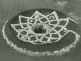

  
[Intangible Textual Heritage](../../../index)  [Native
American](../../index)  [California](../index)  [Index](index) 
[Previous](roli10)  [Next](roli12) 

------------------------------------------------------------------------

  
*The Religion of the Luiseño Indians of Southern California*, by
Constance Goddard DuBois, \[1908\], at Intangible Textual Heritage

------------------------------------------------------------------------

p. 100

## MOURNING CEREMONIES.

### THE IMAGE CEREMONY.

Both the Luiseños and the Diegueños have had a commemorative ceremony
for the dead from early times; but with what tribe the manufacture of
images made to represent the dead person originated, must be matter of
speculation. [41](#fn_45)

The Luiseño ritual is especially complete in the exactness with which
the song series are performed; and the Chungichnish worship may be said
to be founded upon the thought of the spirit, embodied in such
abstractions as Wanawut, Chum Towi, Kwinamo, all of these being
different words to express either the spirit of man or the spirit above.

The following account of the Image mourning ceremony is given by Lucario
Cuevish:

When people die, the chief will collect food and valuables and notify
the other leading men that he is going to have the Image dance. The
others make ready to perform the ceremony. One chief out of four or five
parties will do this, and the others will assist.

They sing all night long, then go off to a place a little distant to
make the images, for this is not done before everyone. The images are
dressed as in life. In old days the women's figures would be clothed in
the short skirts of fringe made from elders or willows. Hair is put upon
the head. The eyes are made of abalone shell. Nose, mouth, and sometimes
ears are made.

When all is ready at this place, the chief goes to the main place of the
ceremony and digs as many holes as there are images to stand them in. He
first calls out three times and the others answer him; then, carrying
the images, they march to the sacred enclosure of brush, singing the
solemn recitative: "Towish chokya, the spirit appears." [42](#fn_46) They stand the images in the holes

p. 101

while the women among the relatives place gifts of valuables where they
can be accepted by those performing the ceremony, who sing the songs of
Tochinish, [43](#fn_47) the Image ritual, while
standing near the images.

The men and women of the visiting party have their faces painted, but
the relatives do not paint or sing or take any part in the ceremony.

The singing without dancing goes on for a certain length of time. Then
the chief takes a whirling-board, or bull-roarer, mumlapish. [44](#fn_48) Instead of telling them to stop singing,
he whirls the board three times. The images are then again lifted up,
and carried back in procession to the more distant place. The dancers
now paint themselves and put on the feather head-dresses. The
whirling-board is swung again as a signal, and they come again carrying
the images and marching around the sacred enclosure, bringing the
turtle-shell rattle. [45](#fn_49) In the sacred
enclosure they dance to a long series of songs.

Then they burn the images, sometimes burning the clothes and decorations
with them; but the visitors have the right to take off the clothes and
keep them, the relatives furnishing others for the burning. While the
images are burning, the men and women dance around the fire singing
Sungamish, [46](#fn_50) the finishing songs.
Other songs called Topasish [47](#fn_51) are
sung while only the men dance. They sing one or two of these songs and
half a dozen or so will dance.

A whirling dance with an eagle-feather skirt is danced at this ceremony.
They sing and dance all night, and may end the ceremony by noon the next
day.

The songs of Pikmakvul, [48](#fn_52) death, are
sung while they burn the clothes, and during the burning they have a
recitative describing

p. 102

the burning of Ouiot. This recitative tells how thin and sick Ouiot
grew. Every song of Pikmakvul tells about Ouiot, and they change from
one to the other.

Then they march around the fire carrying some of the possessions of the
dead person, and burn these things, telling how the First People burned
Ouiot. Many dance and a few carry the things. Then they stop and sit
down for awhile.

They now make an invocation to the sky three times, breathing, groaning,
indescribable sounds, and put the things on the fire. They sing: "No
towi, no towi, my spirit, my spirit." These are the songs of Chum towi,
our spirit. They sing two or three of these songs while they burn the
possessions of the dead. Then they stop. The relatives bring out baskets
and valuables and those performing the ceremony divide them among
themselves.

When all is over they sing the songs from the most important song
series, as follows:

First are sung the songs of Pikmakvul, the Ouiot songs of death.

Then some of the series called Temenganesh, songs of Seasons. Then some
of the series called Chum towi, our spirit, the same as Kwinamish.

Then some of the series called Kamalum, our sons or children, mentioning
the children of the Earth-mother, the mountains that were First People,
and so on.

Then follows the series called Kish, the house, about the house of the
dead man. There are only a few of these.

Then some of the series called Anut, the ant, which was used in ancient
times as an ordeal in a sort of sequel to the toloache ceremony to train
the young men.

Then some of the series called Nokwanish, [49](#fn_53) songs in memory of the dead. The little
rabbit, Tovit, was the first man to sing in the original ceremony for
the dead when they burned Ouiot, so they sing the Nokwanish songs which
the rabbit sang.

Then follow some of the series called Totowish. [50](#fn_54) These mention the spiders, rattlesnakes,
and the sun, the avengers of Chungichnish.

p. 103

Then some of the series called Munival, [51](#fn_55) songs of places or landmarks.

Last of all are sung some songs from the series Nyachish, song of the
people, in which they load their enemies with indecent epithets and
allusions. Family feuds or small fights arose chiefly from land claims.
They seldom or never had wars or battles as we understand the words.
Each man in the mountains would have a patch of oaks, perhaps a hundred
acres or so, and no one else was allowed to go there and gather acorns.
Fighting arose over this. So they sing against each other. Even the
women sing these songs.

This ends Lucario's account of the Image fiesta. [52](#fn_56)

------------------------------------------------------------------------

### Footnotes

[100:41](roli11.htm#fr_48) Mourning ceremonies
with images to represent the dead are not confined to Southern
California. Professor Dixon has recently described an elaborate form in
his "The Northern Maidu," Bull. Am. Mus. Nat. Hist., XVII, 245, 254.—Ed.

[100:42](roli11.htm#fr_49) Towish, spirit,
corpse, 'devil'; choxya (x German ch), perfect tense of choxi, to be
born.—S.

[101:43](roli11.htm#fr_50) Tauchanish.—S.

[101:44](roli11.htm#fr_51) A flat disk of wood
attached to a string and whirled in the air to make a dull humming
sound, still used at Mesa Grande. Mr. Sparkman gives momlaxpish (x
German ch).

[101:45](roli11.htm#fr_52) Paiayut; paiala,
turtle. (Paayat, paila.—S.)

[101:46](roli11.htm#fr_53) Shangamish, songs,
also a dance, at the ceremony at which clothing is burned.—S.

[101:47](roli11.htm#fr_54) Tapa’sash.—S.

[101:48](roli11.htm#fr_55) Pi’mukvul, death,
also songs at mourning ceremony; pi’mukvul is singular past; pi’makish,
singular present.—S.

[102:49](roli11.htm#fr_56) Nokwanish, general
name for men's songs.—S.

[102:50](roli11.htm#fr_57) Totawish, a dancer of
the morahash ceremony.—S.

[103:51](roli11.htm#fr_58) Monival, verbal noun
from moni, to go, come, journey; denotes past action of verb, tracks,
where something passed; there are songs of monival, where one's
ancestors traveled.—S.

[103:52](roli11.htm#fr_59) According to the
Diegueños, the Mohave people first made mourning images at Wikami, a
wonderful mountain, level on top, where all the religious ceremonials
originated. Humkahap, the Mohaves, were the youngest, that is, the last
made of the related tribes, and always stayed in the home place.

The Diegueño Image ceremony has been briefly described in the American
Anthropologist, N.s. VII, 625, 1905.

------------------------------------------------------------------------

[Next: The Notish Ceremony](roli12)
