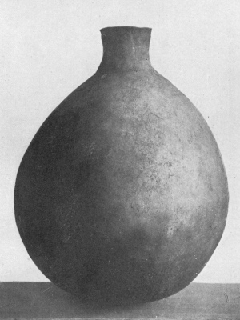

  
[Intangible Textual Heritage](../../../index)  [Native
American](../../index)  [California](../index) 

------------------------------------------------------------------------

<table width="75%">
<colgroup>
<col style="width: 50%" />
<col style="width: 50%" />
</colgroup>
<tbody>
<tr class="odd">
<td width="50%" data-valign="TOP"> 
Diegueño Funeral Jar, Pl. 23 (Public Domain Image)</td>
<td width="50%" data-valign="CENTER"><h1 id="religious-practices-of-the-diegueño-indians" data-align="CENTER">Religious Practices of the Diegueño Indians</h1>
<h2 id="by-t.-t.-waterman" data-align="CENTER">by T. T. Waterman</h2>
<h4 id="section" data-align="CENTER">[1910]</h4></td>
</tr>
</tbody>
</table>

------------------------------------------------------------------------

[Contents](#contents)    [Start Reading](rpdi00)    [Page
Index](pageidx)    [Text \[Zipped\]](rpditxt.zip)

------------------------------------------------------------------------

This is one of the few ethnographic studies of the original religious
practices of the Native American residents of San Diego county. Called
Diegueño by Europeans after the mission which named the city, they today
call themselves *Kumeyaay*, a term of unknown meaning. Waterman wrote
that his consultants called themselves *Kawakipai*, or 'Southern
People.' This monograph includes songs with text in Diegueño and
English, descriptions of ceremonies, ceremonial objects, gambling games,
sand paintings and origin myths. This text will be of immense value to
contemporary Native Californians as well as scholars and students.

Of note is what appears, in hindsight, to be an early description of the
UFO activity that continues over southern California to this day ([p.
342](rpdi25.htm#page_342)). Waterman, with nothing to compare it to,
decided that the being called *Tcaup* was actually ball-lightning.
However, here is his description of the native accounts: "The being
described in the myths is widely thought to be accompanied by
thunderings, to have a 'bright' or 'beaming' appearance, and to fly
about close to the surface of the ground."

------------------------------------------------------------------------

 [Title Page](rpdi00)  
[Contents](rpdi01)  
[Introduction](rpdi02)  
[Customs Concerning Birth and Adolescence](rpdi03)  
[Girls’ Adolescence Ceremony](rpdi04)  
[Bad Songs](rpdi05)  
[Conclusion of the Girls’ Ceremony](rpdi06)  
[Boys’ Adolescence Ceremony](rpdi07)  
[The Ground-Painting](rpdi08)  
[Conclusion of the Boys’ Ceremony](rpdi09)  
[Mourning Ceremonies](rpdi10)  
[The Clothes-Burning Ceremony](rpdi11)  
[The Feather Ceremony](rpdi12)  
[The Whirling Dance, Tapakwirp](rpdi13)  
[Conclusion of the Feather Ceremony](rpdi14)  
[The Image-Burning](rpdi15)  
[The Eagle Ceremony](rpdi16)  
[The “War” Dance](rpdi17)  
[The Fire Ceremony](rpdi18)  
[Other Ceremonial Matters](rpdi19)  
[Gambling](rpdi20)  
[Colors and Direction](rpdi21)  
[Ceremonial Numbers](rpdi22)  
[Tobacco](rpdi23)  
[Diegueño Beliefs Concerning Origin](rpdi24)  
[Creation Myth](rpdi25)  
[Conclusion](rpdi26)  
[Plates](rpdi27)  
