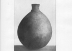

  
[Intangible Textual Heritage](../../../index)  [Native
American](../../index)  [California](../index)  [Index](index) 
[Previous](rpdi03)  [Next](rpdi05) 

------------------------------------------------------------------------

  
*Religious Practices of the Diegueño Indians*, by T.T. Waterman,
\[1910\], at Intangible Textual Heritage

------------------------------------------------------------------------

### GIRLS’ ADOLESCENCE CEREMONY.

The Atanuk, or girls’ adolescence ceremony, will be found to correspond
closely with the Wukunish ceremony of the Luiseño. There is no internal
evidence, however, of a Luiseño source, since the songs throughout are
in the Diegueño language. The ceremony is not however mentioned in
Diegueño mythology as far as this mythology is known at the present
time. The ceremony is the same as that described briefly by Rust [31](#fn_34) and others as the "roasting of girls."

p. 286

Several girls undergo the ceremony at the same time. At least one of
them has to be in the actual period of adolescence, while the others may
be either older or younger. A pit, lopop, is
dug, large enough to accommodate all of the girls when stretched out at
full length. This excavation is lined with stones and a large fire
kindled in it. When the stones become very hot, the fire is taken out
and the pit filled with green herbs. Three kinds are used, white sage or
biltai, thistle sage, *Salvia carduacea*, or
alolo, and common ragweed, *Ambrosia psilostachya*, or xawoxa. The girls are then brought to the edge of the pit
and seated, in the presence of all the people of the village. At a
signal the entire company motion upward three times, expelling the
breath each time. The leader then fills a basketry cap, npurl, with water, and mixes in
it crumbled native tobacco, up. Each girl then takes a large drink of
the liquid. If there were anything evil or morbid inside of the girl,
this drink, it is thought, would cause her to vomit it out, and she
would never thereafter be troubled by it. Whatever the case among the
Luiseño, [32](#fn_35) this ceremony is not
considered by the Diegueño to be an ordeal. They strive rather after a
benign physiological effect. After the girls have drunk this mixture,
they are placed at full length, face-downward on the bed of herbs, and
covered with a blanket, wūkwil, of rabbitskin.
Sage-brush, biltai, is then piled over them. The
heat of the rocks causes a fragrant steam to rise about the girls. This
is kept up by occasionally renewing the herbs and putting in new hot
rocks. The girls remain in this pit with as little movement as possible
as long as they can stand the strain of confinement, except as mentioned
below. This is usually about one week, though girls who are not of a
nervous disposition stand it for three or four. The longer the
confinement, the greater the benefit is supposed to be.

A ceremonial crescent-shaped stone, atulku, ([pl. 21, fig.
1](rpdi27.htm#img_pl21)), is warmed at the fire and placed in turn
between the legs of each girl close against her body. [33](#fn_36) The supposed effect was to warm and
soften the abdominal muscles. The quality imparted by

p. 287

this means was thought to last through life, and to make future
motherhood easier for the girls. A garland or "hat" of ragweed, xawoxa, wrapped with tule, asok, is placed on each girl's
head. This garland is renewed every day while they remain in the pit.
They also wear on their wrists, throughout the "roasting," bracelets
made of human hair. Their faces are painted black each morning with
straw-charcoal.

Certain restrictions are placed on the girls during the progress of this
ceremony and for some time afterward. They are required in the first
place, as already noted, to stay in the pit with as little movement as
possible, leaving it only for short periods at a time. If they moved
about or were restless they would through after life be nervous and
discontented. Once every day they are taken out, carefully wrapped in
blankets, [34](#fn_37) while the pit is lined
with hot rocks and filled with fresh brush. During this period and for
as long as possible afterward, the girls abstain absolutely from meat
and salt. They are however given plenty of sage-seed mush and drinking
water. They are not supposed to look at people, especially at men. [35](#fn_38) They are carefully warned not to touch
their hair with their hands. If they do so it will come out. For this
reason each girl is given two "scratchers" of shell, or of late years
two small sticks of wood, which she uses should scratching become
necessary. It is noticeable both in this and the following features that
the Diegueño do not show the fear concerning the phenomena of menstrual
life in women, which is common among primitive races. The restrictions
prescribed during menstruation and during the period of adolescence
spring usually among savage peoples from the belief that the glance or
touch of a woman in that condition will have a harmful effect on other
people or on the world. Among the Diegueño however the restrictions, at
least as far as indicated by their adolescence ceremonies, seem to refer
rather to the well-being of the girl herself. Outside of the enforced
inaction the ceremony under discussion seems to have been rather

p. 288

pleasant than otherwise. The time between chatting, laughing, and
sleeping passed very cheerfully.

The girls are placed in the pit usually in the afternoon towards sunset.
When they are comfortably fixed, the matrons of the village gather
around them, each woman holding a small branch of white sage. At a
signal they wave these branches up and down. Meanwhile two of the older
women chant:

<table data-border="0">
<colgroup>
<col style="width: 50%" />
<col style="width: 50%" />
</colgroup>
<tbody>
<tr class="odd">
<td data-valign="top" width="327">
wutcaitci wutcaitci 
asamaiya kamavairo 
    eu!
</td>
<td data-valign="top" width="327">
cover cover 
brush fine 
    eu!
</td>
</tr>
</tbody>
</table>

\[paragraph continues\] This song is
repeated for quite a long time. Then the branches are dipped in water
and the girls sprinkled. The same two women sing:

<table data-border="0">
<colgroup>
<col style="width: 50%" />
<col style="width: 50%" />
</colgroup>
<tbody>
<tr class="odd">
<td data-valign="top" width="327">
lilmalilmalila lilmalilmalil 
xawoxa malila pilyatai malil
</td>
<td data-valign="top" width="327">
sprink-sprink-sprinkle 
ragweed sprinkle sage-brush sprinkle
</td>
</tr>
</tbody>
</table>

\[paragraph continues\] When the sun gets
low, all the women join hands in a circle about the pit. Then they dance
around in a line from left to right. Each woman holds her arms out from
her sides and raises first one hand and then the other in time to the
music. The men sing the following song while the women dance:

<table data-border="0">
<colgroup>
<col style="width: 50%" />
<col style="width: 50%" />
</colgroup>
<tbody>
<tr class="odd">
<td data-valign="top" width="327">
yuliyu yuliyu timana 
yuliyu yuliyu timana 
    eu!
</td>
<td data-valign="top" width="327">
low-down he-is-flying (or sailing) 
low-down he-is-flying 
    eu!
</td>
</tr>
</tbody>
</table>

\[paragraph continues\] "Yuliyu" is said
of a bird when he is flying or sailing low, near the ground. The song is
said to refer to the sun.

When the sun has gone down, the dancers circle in the opposite direction
(that is, contrary to the course of the sun), while the men sing:

<table data-border="0">
<colgroup>
<col style="width: 50%" />
<col style="width: 50%" />
</colgroup>
<tbody>
<tr class="odd">
<td data-valign="top" width="327">
kwutukwaik kwutukwaik 
    eu!
</td>
<td data-valign="top" width="327">
circle-the-other-way circle-the-other-way 
    eu!
</td>
</tr>
</tbody>
</table>

\[paragraph continues\] The custom is for
these dances to continue all night. A great many songs are known, of
which the following are samples:

<table data-border="0">
<colgroup>
<col style="width: 50%" />
<col style="width: 50%" />
</colgroup>
<tbody>
<tr class="odd">
<td data-valign="top" width="327">
ki-ima ki-ima 
myu-wiw kaya 
    eu!
</td>
<td data-valign="top" width="327">
dance! dance! <a href="#fn_39">36</a> 
let-us see (you) now! 
    eu!
</td>
</tr>
</tbody>
</table>

p. 289

<table data-border="0">
<colgroup>
<col style="width: 50%" />
<col style="width: 50%" />
</colgroup>
<tbody>
<tr class="odd">
<td data-valign="top" width="327">
yaka alolo kewaiya timayaka 
xalasi kewaiya kewaiya 
timayaka otca kama ali 
timayaka otca kabasiw 
    eu!
</td>
<td data-valign="top" width="327">
lying thistle-sage under she-is-lying <a href="#fn_40">37</a> 
willow under under 
She-is-lying (under) that-which ... 
She-is-lying (under) that-which (is) green 
    eu!
</td>
</tr>
<tr class="even">
<td data-valign="top" width="327">
 
</td>
<td data-valign="top" width="327">
 
</td>
</tr>
<tr class="odd">
<td data-valign="top" width="327">
yoyokanaitc yoyokanaitc 
mariyoi mariyoi 
    eu!
</td>
<td data-valign="top" width="327">
you-must-sing you-must-sing <a href="#fn_41">38</a> 
you-are-embarrassed you-are-embarrassed 
    eu!
</td>
</tr>
</tbody>
</table>

After a number of songs of this character, the dancers no longer hold
hands, but each woman dances by herself. The following are specimens of
the songs sung during this second period:

<table data-border="0">
<colgroup>
<col style="width: 50%" />
<col style="width: 50%" />
</colgroup>
<tbody>
<tr class="odd">
<td data-valign="top" width="327">
mai katcyiw 
ipaka tcawam 
kto kaltco yiwaka 
waikatca waikatca 
    eu!
</td>
<td data-valign="top" width="327">
where! shall-we-start-to sing 
here we-will-start 
... ... ... 
... ... 
    eu!
</td>
</tr>
<tr class="even">
<td data-valign="top" width="327">
 
</td>
<td data-valign="top" width="327">
 
</td>
</tr>
<tr class="odd">
<td data-valign="top" width="327">
wiyam tcwa no 
wiyam tcwa nomeskwa 
opwiyam wesolke 
yipexai wiyam 
    eu!
</td>
<td data-valign="top" width="327">
he went for 
he-went for feather-case-made-of-tule 
he-went (for) elder-bark-skirt 
feather-skirt he-went (for) 
    eu!
</td>
</tr>
</tbody>
</table>

When the sun rose they sang the following song:

<table data-border="0">
<colgroup>
<col style="width: 50%" />
<col style="width: 50%" />
</colgroup>
<tbody>
<tr class="odd">
<td data-valign="top" width="327">
inya-tcopuk amiyo 
inya-tcopuk tcamico 
yolami yolami 
kwakwar kwinyor 
    eu!
</td>
<td data-valign="top" width="327">
sunrise I-menstruate <a href="#fn_42">39</a> 
sunrise ... 
... ... 
... red 
    eu!
</td>
</tr>
</tbody>
</table>

On the second and following days of this ceremony it is the custom for
the people of neighboring villages to come and join in the ritual. The
following song was sung when a party of strangers was seen approaching:

<table data-border="0">
<colgroup>
<col style="width: 50%" />
<col style="width: 50%" />
</colgroup>
<tbody>
<tr class="odd">
<td data-valign="top" width="327">
pok nyawiyeu 
wa xohapi 
    eu!
</td>
<td data-valign="top" width="327">
there they-are-coming <a href="#fn_43">40</a> 
house they-join-us 
    eu!
</td>
</tr>
</tbody>
</table>

During the progress of this ceremony each of the girls is tattooed on
the face. The process is performed with a cactus thorn and powdered
charcoal, and therefore requires some little

p. 290

time. A little is done every day until the whole is completed. One of
the old women begins it on the second day of the "roasting". The usual
design is a stripe downward from each corner of the mouth, with
sometimes a third stripe down the middle of the chin. [41](#fn_44) A small disc is sometimes tattooed
between the eyes. If this tattooing were not done, it is believed that
the girls would turn into beetles when they die.

------------------------------------------------------------------------

### Footnotes

[285:31](rpdi04.htm#fr_34) H. N. Rust, "A
Puberty Ceremony of the Mission Indians," Am. Anthr., n.s. VIII, 28,
1906. For Luiseño accounts see DuBois, op. cit., pp. 93, 174, 224; Am.
Anthr., n.s. VII, 625, 1905.

[286:32](rpdi04.htm#fr_35) DuBois, op. cit., pp.
94, 178.

[286:33](rpdi04.htm#fr_36) Rust, op. cit.

[287:34](rpdi04.htm#fr_37) Beyond the covering
of blankets, the girls in this ceremony seem to have worn no clothing.
One informant at Campo, however, said that they wore short skirts of
willow-bark, fastened to belts made of milkweed fibre.

[287:35](rpdi04.htm#fr_38) Cf. above, [p.
277](rpdi02.htm#page_277).

[288:36](rpdi04.htm#fr_39) University of
California phonograph record 744(2).

[289:37](rpdi04.htm#fr_40) *Ibid*., 745.

[289:38](rpdi04.htm#fr_41) *Ibid*.,
746(1).

[289:39](rpdi04.htm#fr_42) *Ibid*.,
747(1).

[289:40](rpdi04.htm#fr_43) *Ibid*.,
744(1).

[290:41](rpdi04.htm#fr_44) Few women show this
tattoo at the present day.

------------------------------------------------------------------------

[Next: Bad Songs](rpdi05)
