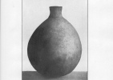

  
[Intangible Textual Heritage](../../../index)  [Native
American](../../index)  [California](../index)  [Index](index) 
[Previous](rpdi19)  [Next](rpdi21) 

------------------------------------------------------------------------

  
*Religious Practices of the Diegueño Indians*, by T.T. Waterman,
\[1910\], at Intangible Textual Heritage

------------------------------------------------------------------------

### GAMBLING.

Gambling among the Diegueño as among many primitive peoples has so much
of the formal in it, and so many "charms" connected with it, that it
becomes almost a religious observance.

  [  
Click to enlarge](img/fig03.jpg)  
Figure 3.—Diegueño women's dice from Campo. Mus. No. 1-14483.  

p. 330

\[paragraph continues\] The Diegueño play
at the present time several gambling games. Some of these have been
introduced by the Mexicans and Americans. A four-dice game ([fig.
3](#img_fig03)) is said to have been learned from the Mohave. The large,
flat wooden "dice "with which it is played are found only among the
southern Diegueño, who are nearest the influence of the Mohave and other
eastern tribes of the Yuman family. A gambling game with stick and hoop,
in which the player tries to throw the stick through the hoop while
rolling, is mentioned in Diegueño mythology. [123](#fn_135) This game is no longer played. There
is a game played by the Diegueño at the present day, however, which is
believed by them to be of ancient origin. This game, called "peon," in
Diegueño homarp, is mentioned in the Chaup
myth. [124](#fn_136) It is the only game among
the Diegueño which is played ceremonially. [124a](#fn_137)

The game is played by two sides of four players each. Each individual is
provided with two small cylindrical objects of bone or wood, similar
except that one has a black band around the middle. These cylinders or
"peons," in Diegueño nyumumarpai, are clasped
one in each fist of the player. One side guesses in which hand the other
side hold their white peons.

These guessing bones are of course a familiar gambling device along the
whole Pacific coast. In the method of play, however, followed by the
Diegueño, the players are not considered as individuals. The side only
is considered in the guessing. The players making the guess agree
together, and one man offers the resulting conclusion as their joint
guess. So also the other side is looked upon not as individuals but as a
unit. The "guess" applies to all equally. At the beginning of the game
lots are drawn to determine which side is to begin the guessing and
which side shall act on the defensive. After that, every player who is
correctly guessed must surrender his peons for the time being to the
player opposite him. When all the pairs of peons have been won from the
players of the first side, the losing side must begin to guess, the
winning side taking the

p. 331

defensive. For every bad guess, the players acting on the defensive get
one point.

The peons are adjusted to the wrists of the players by means of leather
thongs, to prevent any sleight-of-hand work at the critical moment. When
adjusting the peons the players cover their hands with a blanket, the
edge of which they hold in their teeth. Before dropping the blanket they
fold their arms, to hide the peons still further. The guessing is
indicated by pointing. Pointing with one finger indicates that the white
peon is believed to be in the hand pointed at. Pointing with two fingers
implies that the peon is believed to be in the opposite hand. The guess
is merely a "trial," however, unless the player commits himself to it by
a spoken word.

The method followed in play is to point at a player in silence, and then
endeavor to read from his expression whether the guess thus indicated is
or is not the correct one. It is a fact that some men always betray
themselves at the first "point" to the beady scrutiny of the opposing
players. Others can assume such a wooden expression that they may be
wrongly guessed five or six times in succession. Since each poor guess
represents a point won, such players are much in demand as partners. In
order to hide or cover all facial expression, each player yelps and
throws himself about, folding his arms and keeping his hands out of
sight. In actual practice the members of the guessing side go over the
opposing players separately, clapping their hands and pointing until the
location of the peons is thought to be understood. They then compare
notes, and one of them, speaking for all, claps his hands with a gesture
and calls out the guess. Every one of their opponents who is caught must
give up his peons. But for every bad guess a point is lost. This goes on
until all of the peons have passed to the guessing side, or until all of
the points in the game have been won by the opposing side. As soon as
all of the peons are won, the guessing, as already indicated, reverts to
the opposite side.

The winning of fifteen points constitutes the game. Points are
represented by fifteen long wooden counters, eselkwak. At the beginning of the game these counters,
together with the stakes which are wagered, are placed in the hands of
an umpire, who

p. 332

sits at the end of the "alley" between the two rows of players. He doles
out the counters as points are won by each side. After they have all
left his hands, the players pass them back and forth directly as points
are lost or won. The stakes in this game often used to amount to one
hundred dollars. Two or three days are sometimes required to bring a
game to a close.

The game is primarily inter-village in character. This trait has been
somewhat obscured in late years, though "teams" are still to some degree
identified with certain rancherias. The women gather behind the side
which represents their particular locality and sing songs to bring luck
while the play is in progress. Specimens of these songs are the
following:

|     |                                                          |
|-----|----------------------------------------------------------|
| 1\. | tcītcīnai yūwinī [125](#fn_138) |
|     | tcītcīnai yūwana                                         |
|     | hya-a yūwinī                                             |
|     | hya-a yūwana                                             |
|     |                                                          |
| 2\. | hakē waiyūma                                             |
|     | hatra lemē wiyōna                |
|     |                                                          |
| 3\. | haōko melume [126](#fn_139)     |
|     | hakō melume                                              |
|     | haēwila mēnēwila                                         |
|     | melume                                                   |

Certain religious practices accompany this game. The flowers of an
umbelliferous herb, in Spanish chuchupate, are dried and made into a
powder. This powder is rubbed over the face and breast of a player, and
a little of it thrown furtively on the fire which burns to one side.
This is held to bring luck. Players sometimes chew a little of this
chuchupate, or a little dried jimson-weed. Occasionally the tails of
small snakes are cut off, dried, and pounded into a "powder." This
powder is thrown on the fire. It is thought to poison the other side "a
little," making them "give up the peons" quickly. Black spiders
(tarantulas or trap-door spiders) also are used in this way.

------------------------------------------------------------------------

### Footnotes

[330:123](rpdi20.htm#fr_137) Journ. Am.
Folk-Lore, XIX, 157, 1906.

[330:124](rpdi20.htm#fr_138) *Ibid*., XVII,
239, 1904.

[330:124a](rpdi20.htm#fr_139) For an account of
this game, see Stewart Culin, "Games of the North American Indians,"
Ann. Rep. Bur. Am. Ethn., XXIV, 323-325.

[332:125](rpdi20.htm#fr_140) University of
California phonograph record 701.

[332:126](rpdi20.htm#fr_141) *Ibid*., 702.

------------------------------------------------------------------------

[Next: Colors and Direction](rpdi21)
