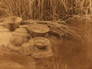

  
[Intangible Textual Heritage](../../../index)  [Native
American](../../index)  [California](../index)  [Index](index) 
[Previous](yat12)  [Next](yat14) 

------------------------------------------------------------------------

[Buy this Book at
Amazon.com](https://www.amazon.com/exec/obidos/ASIN/B002EQALSY/internetsacredte)

------------------------------------------------------------------------

  
*Yana Texts*, by Edward Sapir, \[1910\], at Intangible Textual Heritage

------------------------------------------------------------------------

### XIII. THE FINDING OF FIRE.  [268](#fn_105)

(Translated from Curtin's "Creation Myths of Primitive America," pp.
365-70.)  [259](#fn_106)

p. 170

In the beginning Au Mujaupa had fire very far down south on the other
side of a big river. The people in this country had no real fire; they
had a kind of fire, but it wasn't good. It just warmed a little; it
wouldn't cook like the fire we have now. People killed deer and fished,
but they had to eat fish and venison raw.

p. 171

In the west people had fire, but it wouldn't cook. In the north there
were many people, and in the east; but they had no fire that would cook.

"There must be fire in some place," said the people at Pawi; "how can we
find it?"

"I will go out to-night to look," said Ahalamila.

That night he went to look for fire. He went to the top of Wahkanopa,
looked east and west, saw no fire in either place. Next he looked north;
no fire in the north. He looked south; saw no fire anywhere.

Ahalamila came home and talked to the chief and people. "I saw no fire,"
said he; "I could not see any, but I will go to a better place the next
time and take some one with me. I will go to-morrow night to the top of
Wahkalu. Who here has a good head, who has a sharp eye to see fire? I
want to look for fire to-morrow night from the top of Wahkalu; from that
place I will look all around the whole world to find fire."

"We have a man here," said the chief, "who can see through a tree, who
can see down through the earth to bed rock, who can see through a
mountain. You can take him to-morrow night with you. He is Siwegi."

Ahalamila went to Siwegi. "Will you go to-morrow night to look for
fire?" asked he.

"I will go if the way is not too long."

"Oh," said Ahalamila, "it will not be long. I will shorten it."

Siwegi agreed to go; and when the time came, they started. Ahalamila
doubled up the trail and made it short; in an hour they were on the top
of Wahkalu, both ready now to look for fire. The night is very dark;
they can see the smallest fire easily.

They look to the east, look with great care, look a good while, see no
fire; they look to the north in the same way, see no fire; they look to
the west, no fire there. Now Ahalamila looks south, looks a long time,
and sees nothing; he looks half an hour to the south, sees a little
glimmer like a light very far away. '

"Siwegi," said he, "I see a small light down south; it seems like fire
far away. I think it is fire."

p. 172

"Look again," said Siwegi, "look sharply. Maybe it is fire." "I have
looked enough, I think it is fire," said Ahalamila; "but I want you to
see it, I want you to look now."

Siwegi looked a little while. "Yes, that is fire," said he.

"Well," said Ahalamila, "we see fire, we know that it is far off in the
south."

Ahalamila made the road short, and they were back at Pawi in an hour.
"We have found fire," said Ahalamila to the chief and the people. "We
know where fire is, we can have fire now."

"We must have that fire," said the people.

"There is no way to get the fire but to go for it," said Ahalamila.

"Well," said the chief, "since Ahalamila saw the fire he will go for it;
but the road is long. Who will go and help him? Who will go for fire
with Ahalamila?"

About fifty men offered to go, and they started next morning. The
journey was long and very hard. Soon two or three men were tired and
went home; not long after more were tired, and when they had gone far
down to a great river, just north of where the fire was, of the fifty
who started only three were left,--Ahalamila, Metsi, and old Shushu
Marimi.

Just south of the great river Au Mujaupa had a very big village, and in
the village a large sweat-house. In that house he kept the fire, and had
a great crowd of people living in the country outside who served him,
and kept every one in the world from stealing his fire. These people
were Patcha, Chil Wareko, Chil Daiauna, Sabil Keyu, Juhauju, Juwaju,
Jukami, Jukilauju.

The three, Ahalamila, Metsi, and old Shushu Marimi, were at the northern
end of the bridge, and sat there watching till all at the sweat-house
was quiet. The bridge was very narrow and slippery; so Ahalamila put
pitch on his feet and hands, and on Metsi's and Shushu's feet and hands.
All three crossed without slipping, and found every one asleep in the
sweat-house.

The old chief, An Mujaupa, had covered the fire well with ashes. All was
silent within and without. Ahalamila, Metsi, and Shushu. crept onto the
sweat-house quietly, and looked in. All were asleep.

p. 173

"I will go down first," said Metsi.

"No, I will go first," said Ahalamila. "I will get the fire and reach it
to you; you take it and run very fast."

Ahalamila slipped down. Metsi and Shushu remained on the roof. Ahalamila
opened the fire carefully, took out a good piece and handed it to the
old woman. She put it in her ear. He handed her another; she put it in
her other ear, slipped down from the top of the sweat-house, ran across
the bridge, and hurried away.

Ahalamila gave Metsi two pieces. He put them in his two ears and
started. Ahalamila filled his own ears and followed.

The three had run over two mountains when Au Mujaupa woke up and saw
that the ashes had been opened, and that fire had been taken, that a
coal had fallen near the central pillar. He sprang up, went to the top
of the sweat-house, shouted, called to all his people,--

"Fire has been stolen! Fire has been stolen! Go, you, and follow!"

Now Patcha, Chil Wareko, Chil Daiauna, Sabil Keyu, and all the wind
people rose up and followed, raced and stormed in every direction. So
much rain came that the whole country was covered with water.

Now Juwaju was ahead of all Au Mujaupa's people chasing the three
robbers. Chil Wareko came too, and fell upon the three furiously; he
drenched and chilled them. Next came Jukami and Patcha, who nearly froze
them.

Metsi was almost dead; the fire went out in both his ears. Ahalamila
lost his fire too. Chil Wareko, Juwaju, and Patcha quenched it, then he
let it fall.

Old Shushu. was behind a good way, but she ran all the time. She kept
her hand on one ear as she ran. She lost the fire out of her other ear,
and when the piece fell out it broke in two and fell apart. Chil Wareko
picked up the fire and took it back; he found six pieces, thought that
he had all. He and the others stopped following.

Ahalamila and Metsi ran ahead, left old Shushu to get on the best she
could, and reached home first. They were wet, very cold, and tired.

p. 174

"Where is your fire?" asked the chief.

"I have none; Chil Wareko took my fire," said Ahalamila.

"Where is your fire?" asked the chief.

"Chil Wareko took it," said Metsi.

The chief was very sorry, and all the people were sorry. The old woman
did not come, and the people said, "She must be frozen dead."

At sundown old Shushu came back; she came very slowly, was terribly
tired, but courageous. She reached the sweat-house, came in, said
nothing, lay down wet and cold.

"Where is the fire?" asked she; "did not Ahalamila and Metsi bring fire?
They are young and strong, and had plenty of fire."

After a while she stood up, drew some wood-dust together, then sat down,
opened her ear and held it over the dust; a big piece of fire came out.
Wood was brought quickly, and soon the whole sweat-house was warm. The
people who were cold before were warm now and glad.

"Bring meat and we will try how it tastes when 'tis roasted, said the
chief.

He cut some venison and roasted it. One and another tasted the meat. "It
is very good," said they; a third one said, "I'll try it,", and Gagi
took a taste. "Oh, it is sweet, very good," said Gagi.

Each one roasted meat and ate heartily. Next day all went to hunt, and
had a great feast in the evening. A chief from another place came to the
feast and got fire, and took it home with him. Soon all people had fire;
every one had fire in all parts of the country.

------------------------------------------------------------------------

### Footnotes

[160:268](yat13.htm#fr_108) By the courtesy of
Mrs. Curtin and Little, Brown, and Company permission was received to
reprint Jeremiah Curtin's myth entire. No changes have been made in his
spelling of Indian names, but the Indian translation gives them in more
strictly phonetic form.

[160:259](yat13.htm#fr_109) Curtin's version
was read to Betty Brown and translated by her sentence by sentence. It
is of considerable linguistic interest to see how a connected English
myth appears when translated back into the Indian.

------------------------------------------------------------------------

[Next: XIV. Indian Medicine-Men](yat14)
