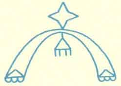

  
[Intangible Textual Heritage](../../../index)  [Native
American](../../index)  [Hopi](../index) 

------------------------------------------------------------------------

<table width="75%">
<colgroup>
<col style="width: 50%" />
<col style="width: 50%" />
</colgroup>
<tbody>
<tr class="odd">
<td data-valign="CENTER" width="50%"></td>
<td data-valign="CENTER" width="50%"><h1 id="truth-of-a-hopi" data-align="CENTER">TRUTH OF A HOPI</h1>
<h5 id="stories-relating-to-the-origin-myths-and-clan-histories-of-the-hopi" data-align="CENTER">Stories Relating to the Origin, Myths and Clan Histories of the Hopi</h5>
<h2 id="by-edmund-nequatewa" data-align="CENTER">by Edmund Nequatewa</h2>
<h4 id="copyright-not-renewed" data-align="CENTER">[1936, copyright not renewed]</h4></td>
</tr>
</tbody>
</table>

------------------------------------------------------------------------

[Contents](#contents)    [Start Reading](toah00)

------------------------------------------------------------------------

This is one of the rarest types of ethnographic documents, one actually
written by a native American. Mr. Nequatewa ably relates some of the
mythological stories also covered by [Voth](../toth/index). However, the
bulk of this book--by far the most valuable section--covers the
historical legends of the Hopi, from a Hopi viewpoint. The Hopi 'theory'
(Nequatewa's word) was that the 'Bahana' (the white people) emerged from
the under-world alongside the Hopi, and went off in search of the truth.
Someday they would return and live in harmony with the Hopi, bringing
wisdom and great abundance.

So what is the truth of a Hopi? The return of the Bahana didn't work out
quite that way. The Hopi resisted enculturation, sometimes through armed
resistance, at other times through nonviolent resistance (as when they
hide the children from the policeman coming to take them to the boarding
schools). However, all the while they apparently kept their good natured
belief that someday their ironic 'theory' of the inherent goodness of
the whites would work out.

Throughout, Nequatewa relates incidents and characterizations of Hopis
that go far beyond the 'Noble Savage' sterotypes of brave warriors and
laconic wisemen. The Hopi who occupy these pages are all too human, and
that alone is a drop of truth that is missing from accounts of the Hopi,
even to the present day.

--J.B. Hare

------------------------------------------------------------------------

[Title Page](toah00)  
[Foreword](toah01)  
[Contents](toah02)  
[Chapter I. How The People Came Out Of The Underworld](toah03)  
[Chapter II. Masauwu](toah04)  
[Chapter III. How the Mocking Bird Gave the People Many
Languages](toah05)  
[Chapter IV. The Hopi Decide to Seek a New Home. How Certain Clans
Received Their Names](toah06)  
[Chapter V. How the Hopi Selected Shung-opovi For Their Home](toah07)  
[Chapter VI. How the Crow Clan Arrived and Settled at
Mishongnovi](toah08)  
[Chapter VII. How a Family Quarrel Led to the Founding of
Oraibi](toah09)  
[Chapter VIII. How the Spaniards Came to Shung-opovi, How They Built a
Mission, and How the Hopi Destroyed the Mission](toah10)  
[Chapter IX. Return of the Spaniards to Hopi Country. Shipaulovi Founded
as a Sanctuary](toah11)  
[Chapter X. The Return of the Bahana, the White Man](toah12)  
[Chapter XI. How The Hopi Marked the Boundary Line Between Their Country
and That of the Navajo](toah13)  
[Chapter XII. How Some Hopis Resisted Sending Their Children to School
and the Trouble That Resulted](toah14)  
[Chapter XIII. How Hotevilla And Bakabi Were Founded](toah15)  
[Chapter XIV. Youkioma](toah16)  
[How the Crow Clan Became Also the Kachina Clan](toah17)  
[The Legend of Palotquopi](toah18)  
[Yaponcha, the Wind God](toah19)  
[The Kana-a Kachinas Of Sunset Crater](toah20)  
[The Ladder Dance At Old Shung-opovi](toah21)  
[The Ladder Dance At Pivahonkiapi](toah22)  
[Dr. Fewkes and Masauwu](toah23)  
[Notes](toah24)  
[Bibliography](toah25)  
