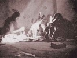

  
[Intangible Textual Heritage](../../../index)  [Native
American](../../index)  [Hopi](../index)  [Index](index) 
[Previous](toth153)  [Next](toth155) 

------------------------------------------------------------------------

[Buy this Book at
Amazon.com](https://www.amazon.com/exec/obidos/ASIN/B002DUCNKA/internetsacredte)

------------------------------------------------------------------------

  
*The Traditions of the Hopi*, by H.R. Voth, \[1905\], at Intangible
Textual Heritage

------------------------------------------------------------------------

## 41.--THE SHONGÓPAVI MAIDEN WHO TURNED INTO A DOG.

In Shongópavi lives a handsome youth whom all maidens ask for.
Bad-looking maiden grinds coarse meal, puts it into tray and sings while
throwing it to chíro birds. In evening birds assemble at mána's house
and after that mána always feeds them. Youth also makes tray and hands
it to maidens saying that Who opens it shall get him. No one can open
it. Tray comes to bad-looking maiden and Spider Woman tells her to sing.
So, secretly singing, maiden opens it and owns youth. Pretty maidens are
sad and angry. Youth takes maiden to his house. His mother bathes her
and she becomes pretty. They make her bridal costume and she goes home,
youth following. They sleep there twice, and second time she does not
get up. Mother of maiden goes and tells them to get up, Maiden has
turned into dog, which jumps down and runs away.

------------------------------------------------------------------------

[Next: 42.--The Blind Man and the Lame Man.](toth155)
