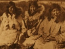

  
[Intangible Textual Heritage](../../../index)  [Native
American](../../index)  [Inuit](../index) 
[Siberian](../../../asia/index.htm#siberia)  [Index](index) 
[Previous](eos02)  [Next](eos04) 

------------------------------------------------------------------------

[Buy this Book at
Amazon.com](https://www.amazon.com/exec/obidos/ASIN/B002EQAB3E/internetsacredte)

------------------------------------------------------------------------

  
*The Eskimo of Siberia*, by Waldemar Bogoras, \[1913\], at Intangible
Textual Heritage

------------------------------------------------------------------------

### 2. The Carrier of Seaweed.

   An old woman lived with her grandson, a young orphan. One day the lad
walked along the shore, gathering edible seaweed. He sang, "I am walking
along the shore, gathering seaweed. I will put it into the fold of my
shirt, and I will carry it home." He gathered a heavy load of it and
carried it home. Then he entered into the outer house, and called to the
old woman, "Halloo!" — "Ho!" — "How shall I bring it into the
sleeping-room?" The sleeping-room was ever so small. "I do not know.
Come in as through the eye of a needle!" — "Which needle's eye?" — "This
one." She thrust a needle out of the sleeping-room, and he passed
through along with his load. So skilful are the people of Uñi´sak. That
is all.

Told by Ñịpe´wġi, an Asiatic Eskimo man, in the village of Uñi´sak, at
Indian Point, May, 1901.

------------------------------------------------------------------------

[Next: 3. The One without Arms.](eos04)
