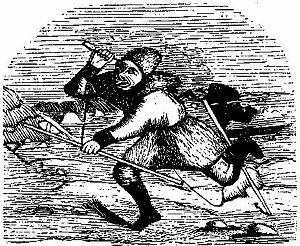

[Sacred-Texts](../../../index) [Native
American](../../index) [Inuit](../index)  
[Index](index) [Previous](tte2-037) [Next](tte2-039)

------------------------------------------------------------------------

### 38. USSUNGUSSAK OR SAVNIMERSOK.

\[This tale, taken from two of the older
manuscripts, is given here on account of its apparent mythological
reference; otherwise it will be found to be somewhat fragmentary and
obscure.\]

A NUMBER of people once lived together in a large house. Among them was
a man named Ussungussak, who generally came home empty-handed, when all
the others returned with what they had caught, for which his wife used
to scold him. One night she had gone on rating him worse than usual, and
in the morning he had disappeared. He kayaked along shore, and having
rounded a point he saw a man standing on the beach. At first he was
frightened; but then he thought a little, and finally concluded, "Why
should I be afraid at the very moment I have resolved to go and lead a
solitary life all by myself?" When the man on shore called him, he
alternately approached and again turned back; but when he had come
pretty close to the beach, the other threw out a trap, by which he drew
him in, and ordered him to follow to the inland. They now wandered along
together and came to the gulf of the earth. There, poor Ussungussak
began to whine and p. 256 howl; but the
inlander put a cord round his neck, straining it so hard that he was
nearly choked; when he again untied him, however, they had safely passed
the fearful precipice. Having next crossed a beautiful meadow, they
gained the house of the inlander, who had a wife but no children. In the
morning Ussungussak was ordered to remain at home, while the master of
the house went away himself, and returned very noisily in the evening
with what he had taken. In this way several days went by; but at length
Ussungussak got desirous to see his own home, and the inlander
accompanied him on the way. This time they did not see the precipice;
but arriving at the coast they saw a great many killed seals on the
beach, being those which the inlander, standing on shore, had caught in
his trap. When Ussungussak was about to take leave, the inlander said,
"Henceforth thou canst take some of these seals, but mind, thou art not
to be too greedy: thou mayst take one at a time to begin with;
afterwards thou mayst take two." Ussungussak then returned to his
homestead and housemates, who were having good hunting at the time. The
next day he again disappeared, but in the evening returned with two
seals. The following day he brought home three; the others asked him
whereabouts he had got them. He answered, "Out at the most seaward
place;" and they demanded of him whether they might not accompany him
thither. But when he had carried away the very last of the lot, he one
night returned without anything at all, and was again scolded by his
wife. The day after he left as before, and kayaking along shore he at
length turned a point, and again beheld the inlander. This time he
willingly approached him when he was called, and went along with him;
but when they had gained the precipice, he did not get over this time,
but was fairly strangled. When Ussungussak's relations and housemates
had been expecting him in vain for five days, one p.
257 of the kayakers went out in search of him. He encountered the
inlander, and asked him whether he had not see a man. "To be sure I
have, and I killed him myself!" At this the other thrust his harpoon at
him, and he ran on with the hunting-bladder dragging behind him, and
thus disappeared. The coastman now took his spear and bladder-arrow,
following him swiftly,

and found him drawing out the point; but he now lanced another spear at
him, while the inlander kept running on so fast that the bladder flew up
high in the air. Finally, he flung his arrow at him. and this at last
did for him, and he expired; upon which the pursuer cut him up, and put
his knee on the nape of his neck.

------------------------------------------------------------------------

[Next](tte2-039)

 

 

 

 

 

 

 

 

 

 

 

 

 

 

 
