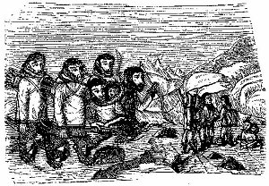
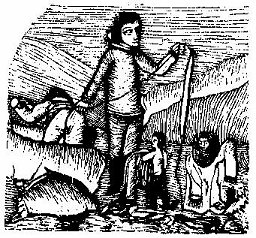

[Sacred-Texts](../../../index) [Native
American](../../index) [Inuit](../index)  
[Index](index) [Previous](tte2-075) [Next](tte2-077)

------------------------------------------------------------------------

### 76. INUARUTLIGAK—WHOSE CHRISTIAN NAME WAS PETER RANTHOLL.

\[A tale from North Greenland.\]

In times far back, the ancestors of this same Inuarutligak (viz.,
fabulous dwarf-islander or mountain-elf) p.
401 are said to have lived at the southernmost point of the
country, at a place called Kutserfik; and this was before they had
learned to be shy of human beings. Just about that time a lasting enmity
sprang up between them on account of an Inuarutligak being killed by a
man; and ever after, they say that the gnomes have resorted to desert
places, making hollows in the earth for their abodes, and shunning the
society of man. Thirsting for vengeance, they in return killed a man
whom they chanced to meet with on one of their excursions. Being sadly
in want of proper arms, they found a large willow-bush on the sunny side
of the Kutserfik-mount. Its form was like a man bending down on his
knees and supporting his hand against the ground. From one of its roots
they made a weapon not larger in size than a closed fist, shaped like a
pistol; and at the end they put a little black stone, with a little red
one on the top of it. This instrument, when finished, they named the
*pointing weapon*. Knowing and fearing its killing powers for their own
kith and kin, they are said always to have carried it in their hand. At
this time the Inuarutligak of our tale was born. His father's name was
Malerke; that of the eldest son Kinavina; of the second, Kook; of the
third, Asarfe; and of the fourth, Sersok, of whom we are going to tell.
Being given to moving about, his parents and relatives set out on a
journey to the north, and travelled on for several years successively,
always passing the winter in hollows in the earth, and starting again in
the early spring. It is told that they once met with some singular
people, whose upper limbs were those of human beings, but below the
waist they were shaped like dogs. These creatures were armed with bows,
and dreadful to behold, and could catch the scent of man and beast
against the wind like animals. One winter they covered the whole inside
of their abode under ground with a single skin—that of the large beast
called *kilivfak*, the one with six p. 402
legs. The story goes that when they had eaten the flesh of this animal,
the bones were covered anew with flesh, but only up to the sixth time;
and despite its strength and size, they killed it with the
above-mentioned instrument, by merely pointing at it. They also

knew how to diminish the distance from one place to another, by drawing
the various parts of the country closer, and performed this by merely
kneeling down together and spreading their arms out towards the
mountain-tops; but finding some of them too high to spread their arms
over, the foremost crossed the already contracted parts with one long
stride, the others one by one following in his tracks. Whenever one of
them was unfortunate enough to make a false step, several of them were
left far behind for a long time.

After a journey of several years, they arrived at Ikerasarsuak (at the
mouth of Wygat Straits), a place where lived Inuarutligaks, as well as
*Inoruseks*. There they settled to wait till the frost should cover the
ground with ice and make it possible to join those on the other p. 403 side. Starting again in spring, and passing
several winters at different places, they at length reached Noosak on
the continent, and came to their long-wished-for relatives, and there
they lived for many winters. People say that at the beginning of the
journey to the north the high mountains were still without ice, and
Ikerasarsuak without any glacier.

These elves had two different ways of clothing themselves—one suit they
had fitting their natural size, and the other was large enough to fit a
man. During their wandering they wore their own proper clothes, carrying
the large ones with them, ready to put on in case they should get some
heavy load to carry. They could then, by beating themselves, reach human
size. Their way of

regaining their natural appearance was by bending down to enter their
cave, and hitting the crown of their heads against the roof, on which
they dwindled down to their ordinary smallness.

An angakok at Noosak, whose wife was childless, wanted to buy a child
from the Inuarutligaks, and offered to pay for him with three knives, a
piece of bearskin, and some whalebones already twisted into
fishing-lines. Malerke, on seeing them, grew very desirous of these
p. 404 things; and having got them, he gave
the knives to his three sons, but the fourth and youngest he sold in
exchange for them. His new father brought him home, and went to hide him
behind the house. At night, however, he got inside, and at once slipped
into the womb of his mother, on which account it was said that he was in
a state of perfect consciousness while he remained in his mother's womb.

These elves were long in turning old; their youth was renewed five times
over. On getting old the first time, they let themselves fall headlong
down a precipice, and in this way regained the vigour and elasticity of
youth. After repeating this five succeeding times, it was useless to try
a sixth. This practice of letting themselves fall down they called
*Inutsungnartok*. They never die young, but only after having undergone
their five separate ages, excepting those who are killed by snowslips.

------------------------------------------------------------------------

[Next](tte2-077)

 

 

 

 

 

 

 

 

 

 

 

 

 

 

 
