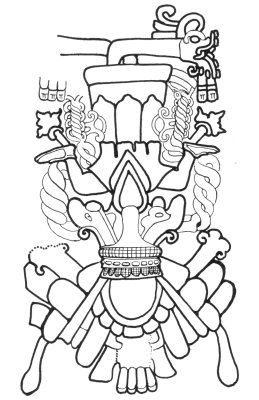

[Intangible Textual Heritage](../../../index)  [Native
American](../../index)  [Maya](../index)  [Index](index) 
[Previous](cbc05)  [Next](cbc07) 

------------------------------------------------------------------------

p. 63

# TRANSLATION

## I

### (THE RITUAL OF THE FOUR WORLD-QUARTERS)

/

|         |
|---------|
| p\. 1 C |

 [1](#fn_28) the first man of the Canul
family. [2](#fn_29) The white *guaje*, [3](#fn_30) the *ixculun* &lt;and&gt; the
gumbo-limbo [4](#fn_31) are his little
hut, [5](#fn_32)... The logwood tree is the hut
of Yaxum, [6](#fn_33) the first of the men of
the Cauich family.

 

   

FIG. 1 *a*--Ah Muzencab, the Maya bee god. (After Lothrop.) [7](#fn_34) *b*, A bee.  
(Codex Tro-Cortesianus, p. 83.)

 

p. 64

The lord of the people of the south is the first of the men of the
Noh [1](#fn_35) family. Ix-Kan-tacay [2](#fn_36) is the name of the first of the men of the
Puch family. They guard nine rivers; they guard nine mountains [3](#fn_37)

The red flint stone is the stone of the red Mucencab. [4](#fn_38) The red ceiba tree of abundance [5](#fn_39) is his arbor [6](#fn_40) which is set in the east. The red
bullet-tree [7](#fn_41) is their tree. The red
zapote . . . The red-vine [8](#fn_42) . . .
Reddish are their yellow turkeys. Red toasted &lt;corn&gt; is their
corn.

The white flint stone is their stone in the north. The white ceiba tree
of abundance is the arbor of the white Mucencab. White-breasted are
their turkeys. White Lima-beans are their Lima-beans. White corn is
their corn.

The black flint stone is their stone in the west. The black ceiba tree
of abundance is their arbor. Black speckled corn is their corn. Black
tipped camotes are their camotes. Black wild pigeons are their turkeys.
Black *akab-chan* [9](#fn_43) is their green
corn. Black beans are their beans. Black Lima-beans are their
Lima-beans.

The yellow flint stone is the stone of the south. The ceiba tree of
abundance, the yellow ceiba tree of abundance, is their arbor. The
yellow bullet-tree is their tree. &lt;Colored like&gt; the yellow
bullet-tree are their camotes. &lt;Colored like&gt; the yellow
bullet-tree are the wild pigeons which are their turkeys. Yellow green
corn is their green corn. Yellow-backed are their beans . . . /

|         |
|---------|
| p\. 2 C |

p. 65

\[paragraph continues\] 11 Ahau was the katun when they carried
&lt;burdens&gt; on their backs. Then the land-surveyor first came; [1](#fn_44) this was Ah Ppizte [2](#fn_45) who measured the leagues. Then there came
the *chacté* shrub [3](#fn_46) for marking the
leagues with their walking sticks. Then he came&lt;to&gt;
Uac-hab-nal} [4](#fn_47) to pull the weeds along
the leagues, when Mizcit Ahau came to sweep clean the leagues, when the
land-surveyor came. These were long leagues that he measured.

Then a spokesman was established at the head of the mat.

Ix Noh Uc presides to the east. Ox Tocoy-moo presides to the east. Ox
Pauah Ek presides to the east. Ah Miz presides to the east.

Batun presides to the north. Ah Puch presides to the north. Balam-na
presides to the north. Ake presides to the north.

Iban presides to the west. Ah Chab presides to the west. Ah Tucuch
preside to the west.

Ah Yamas presides to the south. Ah Puch presides to the south. Cauich
presides to the south. Ah Couoh presides to the south. Ah Puc presides
to the south. [5](#fn_48)

The red wild bees [6](#fn_49) are in the east. A
large red blossom is their cup. The red Plumeria is their flower.

The white wild bees are in the north. The white pach¢a [7](#fn_50) is their flower. A large white blossom is
their cup.

The black wild bees are in the west. The black laurel flower [8](#fn_51) is their flower. A large black blossom is
their cup.

The yellow wild bees are in the south. A large yellow blossom [9](#fn_52) is their cup . . . is their flower./

|         |
|---------|
| p\. 3 C |

p. 66

Then they swarmed at <u>¢</u>ecuzamil [1](#fn_53) in great numbers among the magueys [2](#fn_54) of the land, the calabash trees of the
land, the ceiba trees of the land and the *chulul* trees of the
land. [3](#fn_55) Kin Pauahtun [4](#fn_56) was their priest. He commanded the
numerous army which guarded Ah Hulneb [5](#fn_57) at Tantun in Cozumel, &lt;also&gt; Ah
Yax-ac, [6](#fn_58) Chinab, [7](#fn_59) and Kinich Kakmo. [8](#fn_60)

------------------------------------------------------------------------

### Footnotes

[63:1](cbc06.htm#fr_28) One folio is missing
from the beginning of the book.

[63:2](cbc06.htm#fr_29) Martinez H. translates
this sentence: "the first figure or idol is that of Ah Canul" (Martinez.
H. 1921).

[63:3](cbc06.htm#fr_30) Maya, *uaxim*, *Leucæna
glauca* Benth. Botanical identifications will be found in Standley 1930
and Roys 1931.

[63:4](cbc06.htm#fr_31) Maya, *chacah*, *Bursera
simaruba* Sarg. Spanish *palo mulato*.

[63:5](cbc06.htm#fr_32) Maya, *pazel*, a
temporary shelter consisting of a single-pitched roof and open at one
side, used for camping out.

[63:6](cbc06.htm#fr_33) Yax-um, literally the
green bird, the quetzal. Um or *un* is an obsolete word for bird,
surviving only in compounds of names of birds, such as *pic~~h~~um*,
*ucum*, *yuyum*, *chahum*, etc. *Cf.* Quiche, *Rax-on*, quetzal, and um,
a certain black bird. (Ximenez, Tesoro, etc.)

[63:7](cbc06.htm#fr_34) Copy of the stucco
figure at Tulum known as the Diving god. (Lothrop 1924, pl. 23.) Besides
its obvious resemblance to the insect in the Codex Tro-Cortesianus
identified by Tozzer and Allen as a bee, it seems possible to recognize
the pulvilli, ungues and metanotum, while the wings somewhat suggest the
battered membranes of a bee's wings. A similar Diving God has been found
at Cobá, where the Muzencabob are still believed to dwell (Thompson,
Pollock, Charlot 1932, p. 84; Redfield letter).

[64:1](cbc06.htm#fr_35) Noh, a common family
name, resembles *nohol*, which means south.

[64:2](cbc06.htm#fr_36) Lit. yellow *tacay*, the
Mexican large-billed tyrant. *Cf.* Roys 1931, p. 339.

[64:3](cbc06.htm#fr_37) Maya, Bolonppel-uitz,
probably a place-name in the south. The name may survive in that of
Salinas de los Nueve Cerros on the Chixoy River.

[64:4](cbc06.htm#fr_38) This name is spelled
Muzencab in the Tizimin manuscript, so Mucencab is probably intended for
Muçencab. Cab means hive or honey. As shown in Appendix A, the bees are
closely connected with the Bacabs and the four world-quarters, and Dr.
Redfield finds the Muzencabs invoked in the *u hanli cab* ceremony which
is propitiatory of the gods of the bees. One native priest explained
that "the *Mulzencab-ob* were a class of supernatural bees dwelling at
Cobá. They report to Nohyumcab (Great-lord-of-the-hive), their superior,
everything that happens in the apiary." Another native priest, or
*h-men*, stated that the Nohyumcab and the Ah Muzencab were two gods in
the form of large bees who governed all the bees (Letter from Dr. Robert
Redfield).

[64:5](cbc06.htm#fr_39) Maya, *imix yaxche*.
Imix is one of the Maya day-names, and the yaxche is the ceiba tree, the
green tree and the first tree of the world. Seler shows that Imix has
much the same significance as Cipactli, the corresponding Aztec
day-name. It is the symbol of fertility and abundance, and among the
Cakchiquels it is closely associated with the ceiba tree (Seler 1902, p.
499). Beyer 1931, p. 204.

[64:6](cbc06.htm#fr_40) This arbor may
correspond to the arch of leaves and branches set up in connection with
the New Year's ceremonies (Landa 1929, p. 20).

[64:7](cbc06.htm#fr_41) Maya, *pucté*, *Bucida
buceras* L.

[64:8](cbc06.htm#fr_42) Maya, *chac-ak*, the
name of an unidentified vine, used medicinally.

[64:9](cbc06.htm#fr_43) *Akab-chan* is probably
a dark variety of maize (Martinez letter). The Maya have corn of various
colors, and there is a large vocabulary relating to maize (Standley
1930, p. 211).

[65:1](cbc06.htm#fr_44) This appears to the
translator to be a legend of the occupation of the country in ancient
times. People came in bearing their household goods on their backs, as
we know they had no beasts of burden. Then they were supposed to have
surveyed and divided the land, after which they laid out the roads,
cleared and cleaned them.

[65:2](cbc06.htm#fr_45) A Maya pun: a man who
measures or a man of the Ppizte family.

[65:3](cbc06.htm#fr_46) Probably a shrubby form
of the chacté, or brazil tree is meant (*Cæsalpinia platyoba* Wats.). It
is a well-known dye wood, and Landa tells us that the Maya made staffs
of it.

[65:4](cbc06.htm#fr_47) It seems likely that
Uuc-yab-nal is intended. This is a place-name associated with "the mouth
of the well" in the prophecy for Katun 4 Ahau on page
[133](cbc23.htm#page_133). In another prophecy for Katun 4 Ahau on page
[161](cbc27.htm#page_161) the name Chichen Itzá is substituted for
Uuc-yab-nal, so it is possible that the latter was the ancient name for
Chichen Itzá before the Itzá came and named it Chichen Itzá, "the mouth
of the well of the Itzá."

[65:5](cbc06.htm#fr_48) Of the above names Uc,
Batun, Balam, Ake, Cauich, Couoh and Puc are well known family names in
Yucatan. Ah Puch is one of the names of the Maya death-god (Morley 1915,
p. 17). Tucuch and Yiban Can are two of the Lords of the thirteen katuns
(Morley 1920, p. 472, and Chilam Balam of Kaua, pp. 167 and 189). Ah
Yamaz may be intended for Ah Yamazi who is mentioned on page 71. Ah Chab
is the Maya name of the three-toed ant-eater.

[65:6](cbc06.htm#fr_49) Here the word for wild
bees, *ix chuuahcab-ob*, has the feminine prefix. In the Motul
Dictionary it is given as *ah chuahcab* with the masculine prefix.

[65:7](cbc06.htm#fr_50) There is little doubt
that here the pah¢a is meant, which has been identified as *Commelina
elegans* H. B. K. Here, however, the closely related *Callisia repens*
L. with its white flowers may be intended.

[65:8](cbc06.htm#fr_51) The Ix-laul, called
laurel in Spanish, is *Stemmadenia insignis* Miers, the flowers of which
are white, not black.

[65:9](cbc06.htm#fr_52) *Kan-lol*, literally a
large yellow blossom, also the name of *Tecoma stans* H. B. K.

[66:1](cbc06.htm#fr_53) <u>¢</u>ecuzamil means
Little Cozumel and may refer either to the Island itself or some place
on the mainland of the east coast of Yucatan. Oy-cib was another name
for Cozumel (Motul), and *cib* means beeswax.

[66:2](cbc06.htm#fr_54) Maya, *u ciil cab*; it
could also mean the sweet things of the land.

[66:3](cbc06.htm#fr_55) The *chulul* has been
identified as *Apoplanesia paniculata* Presl.

[66:4](cbc06.htm#fr_56) Probably Kan Pauahtun,
the wind-god of the south, is intended. *Cf.* Appendix A.

[66:5](cbc06.htm#fr_57) Ah Hulneb, the Archer,
was one of the principal deities of Cozumel which was a center of
pilgrimage not only from every part of Yucatan but from Tabasco as well.
*Cf.* Cogolludo, Book 4, Chap. 8.

[66:6](cbc06.htm#fr_58) Ah *Yax-ac*. *Yax* means
green or first. *Ac* could mean turtle, dwarf, boar-peccary or a certain
tall grass.

[66:7](cbc06.htm#fr_59) *Chinab* means the
distance from the tip of the forefinger to that of the thumb. Ah
<u>¢</u>un Chinab was the name of one of the nobles who accompanied the
embassy of Ah Mochan Xiu to Montejo.

[66:8](cbc06.htm#fr_60) Kinich Kakmo means
sun-eyed fire macaw. He was one of the founders of Izamal and was
afterwards deified (Relaciones de Yucatan, I, p. 269). His shrine was
visited by sufferers from pestilence, whom he cured. It is of interest
to note that yellow fever patients are still given the ashes of a red
parrot's feathers as a remedy (Roys 1931, p. 63).

------------------------------------------------------------------------

[Next: II. The Rise of Hunac Ceel to Power](cbc07)
