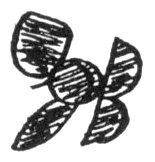
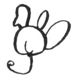
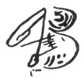
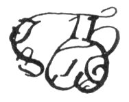
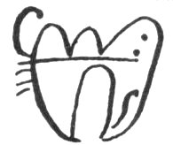
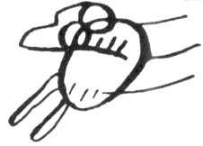
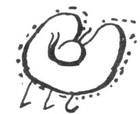
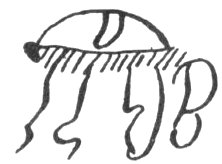
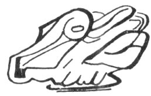

[Intangible Textual Heritage](../../../index)  [Native
American](../../index)  [Maya](../index)  [Index](index) 
[Previous](cbc10)  [Next](cbc12) 

------------------------------------------------------------------------

# VI

### (NOTES ON THE CALENDAR)

|                                                                                                       |                                            |
|-------------------------------------------------------------------------------------------------------|--------------------------------------------|
| The beginning of Katun 11 Ahau was in the year                                                        | 1513 [4](#fn_219) |
| Then it ended.                                                                                        |                                            |
| Tihoo (Merida) was begun in the year                                                                  | 1519 [5](#fn_220) |
| (The convent of) San Francisco was founded at Santiago [6](#fn_221) in Tihoo | 1519                                       |
| The principal church was founded in the center of the town of &lt;Ti&gt;hoo in the year               | 1540                                       |
| The months in a year are twelve                                                                       | 12                                         |
| The count of the days in one year                                                                     | 365                                        |
| The count of the nights in one year [7](#fn_222)                             | 365                                        |
| The count of weeks in one year                                                                        | 52                                         |
| The number of Sundays in one year                                                                     | 53                                         |
| The count of the days in the first six months (of the year)                                           | 181 / \[p. 22 C\]                          |

 

p. 85

|                                                                                                       |     |
|-------------------------------------------------------------------------------------------------------|-----|
| The count of days in the second six months which complete the year                                    | 184 |
| This is the count of days in a week: seven days in one week is the total of this count. / \[p. 23 C\] |     |
| The count of the uinals [1](#fn_223) in one year.                            |     |

 

 

|                                                                                                                                                                                              |                                                                                                                                                         |
|----------------------------------------------------------------------------------------------------------------------------------------------------------------------------------------------|---------------------------------------------------------------------------------------------------------------------------------------------------------|
|   Poop--July 16th.                                                                                                                             |   Yaax--January 12th. The time is good for gathering the ears of corn.                                    |
|   Uoo--August 5th.                                                                                                                             |   Zac.--February 1st, when the white &lt;flowers&gt; bloom.                                               |
|   Zip-August 25th.                                                                                                                             |   Ceeh--February 21st.                                                                                    |
|   Zo¢--September 14th.                                                                                                                         |   Mac--March 13th when the turtles lay their eggs.                                                        |
|   Zec--October 4th.                                                                                                                            |   Kankin--April 2d.                                                                                       |
|   Xul--October 24th, when the fish spawn.                                                                                                      |   Muan--April 22nd, when there is a ring around the sun in the sky. [4](#fn_226) |
|   <u>¢</u>eyaxkin [2](#fn_224)--November 13th. The corn-stalks are bent double. [3](#fn_225) |   Paax--May 12th.                                                                                         |
|   Mol--December 3rd.                                                                                                                           |   Kayab--June 1st.                                                                                        |
|   Cheen--December 23rd.                                                                                                                        |   Cumku--June 21st. The five days&lt;called&gt;Uayabhaab.                                                 |

FIG. 5--The Maya months, or uinals.  
(Chumayel MS.) / \[p. 24 C\]

 

Chumayel, 28, is born the god-daughter, Micaela Castañeda [5](#fn_227) /

|          |
|----------|
| p\. 25 C |

------------------------------------------------------------------------

### Footnotes

[84:4](cbc11.htm#fr_220) It is generally agreed
that Katun 11 Ahau began some time during the last half of the fourth
decade of the Sixteenth Century. There was, however, a school of Maya
writers during the Eighteenth Century who taught that the katun was
composed of 24 years of 365 days each. They believed that a certain
Katun 4 Ahau ended in 1752; and counting back to Katun 11 Ahau by their
assumed katuns of 24 years, they came to the conclusion that it began in
a year 10 Cauac which fell in 1512.

[84:5](cbc11.htm#fr_221) Cortez landed in
Cozumel in 1519.

[84:6](cbc11.htm#fr_222) Santiago was a suburb
of Merida occupied by the Nahua allies of the Spaniards (Cogolludo Bk. 7
Chap. 4).

[84:7](cbc11.htm#fr_223) It is significant to
note that the Maya still preserved the idea of a night-count at this
late date.

[85:1](cbc11.htm#fr_224) The uinal was the Maya
month of twenty days.

[85:2](cbc11.htm#fr_226) Literally Little
Yaxkin. Yaxkin is the usual name of this uinal.

[85:3](cbc11.htm#fr_227) The ear is left on the
stalk, which is bent double so that the husk will completely shed the
rain. Until the fall rains are over, the corn is said to keep better in
this manner than in the granary.

[85:4](cbc11.htm#fr_225) Probably due to the
smoke from the fields which are burned over at this time.

[85:5](cbc11.htm#fr_228) Written in a different
hand. The rest of the page is blank.

------------------------------------------------------------------------

[Next: VII: The Armorial Bearings Of Yucatan](cbc12)
