[Intangible Textual Heritage](../../../index)  [Native
American](../../index)  [Maya](../index)  [Index](index) 
[Previous](cbc13)  [Next](cbc15) 

------------------------------------------------------------------------

# IX

### (THE INTERROGATION OF THE CHIEFS)

This is the language of Zuyua [1](#fn_234) and
the understanding for our lord, Señor Governor Mariscal, [2](#fn_235) who has settled at Tzuc-uaxim to the
east of Ichcanziho (Merida). This is the land where his garden and
homestead were, where he settled. Then the day will come when his period
of office shall end also. The command of the head-chief comes. Vigorous
is his command, when he arrives, and red is his garment also.

p. 89

<table data-align="LEFT">
<colgroup>
<col style="width: 100%" />
</colgroup>
<tbody>
<tr class="odd">
<td data-valign="CENTER"> 
FIG. 10--The lord of the katun(Chumayel MS.).</td>
</tr>
</tbody>
</table>

 [1](#fn_236) On this day, in the language of
Zuyua, this is the question asked by the head-chief of the town; then
the day shall arrive when the law of Katun 3 Ahau shall end, when
another katun shall be set &lt;in its place&gt;, Katun 1 Ahau, as stated
below.

<table data-align="LEFT">
<colgroup>
<col style="width: 100%" />
</colgroup>
<tbody>
<tr class="odd">
<td data-valign="CENTER">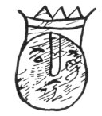 
FIG. 11--The lord of the katun (Chumayel MS.).</td>
</tr>
</tbody>
</table>

This katun today is Katun 3 Ahau. The time has come for the end of its
rule and reign. It is finished. Another one &lt;takes its place&gt; for
a time.

<table data-align="LEFT">
<colgroup>
<col style="width: 100%" />
</colgroup>
<tbody>
<tr class="odd">
<td data-valign="CENTER">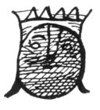 
FIG. 12--The lord of the katun (Chumayel MS.).</td>
</tr>
</tbody>
</table>

This is Katun 1 Ahau, which is set within the house of Katun 3
Ahau. [2](#fn_237) There it is its guest, while
it is given its power by Katun 3 Ahau. Things are shameful, they say,
&lt;in [the](errata.htm#0) place&gt; where they dwell./ [3](#fn_238)

|          |
|----------|
| p\. 29 C |

<table data-align="LEFT">
<colgroup>
<col style="width: 100%" />
</colgroup>
<tbody>
<tr class="odd">
<td data-valign="CENTER">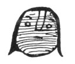 
FIG. 13--The lord of the katun (Chumayel MS.).</td>
</tr>
</tbody>
</table>

This is the examination [4](#fn_239) which
takes place in the katun which ends today. The time has arrived for
examining the knowledge of the chiefs of the towns, &lt;to see&gt;
whether they know how the ruling men came, whether they have explained
the coming of the chiefs, of the head-chiefs, whether they are of the
lineage of rulers, whether they are of the lineage of chiefs, that they
may prove it. [5](#fn_240)

<table data-align="LEFT">
<colgroup>
<col style="width: 100%" />
</colgroup>
<tbody>
<tr class="odd">
<td data-valign="CENTER">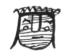 
FIG. 14--The lord of the katun (Chumayel MS.).</td>
</tr>
</tbody>
</table>

This is the first question which will be asked of them: he shall ask
them for his food "Bring the sun." This is the word of the head-chief to
them; thus it is said to the chiefs. "Bring the sun, &lt;my&gt; son,
bear it on the palm of your hand to my plate. A lance is planted, a
lofty cross, in the middle of its heart. A green jaguar is seated over
the sun to drink its blood." Of Zuyua is the wisdom. This is what the
sun is which is demanded of them: a very large fried egg. This is the
lance and the lofty cross planted in its heart of which he speaks: it is
the benediction. [6](#fn_241) This is what the
green jaguar is which is set

p. 90

over it to drink its blood: it is a green chile-pepper, is the jaguar.
This is the language of Zuyua.

<table data-align="LEFT">
<colgroup>
<col style="width: 100%" />
</colgroup>
<tbody>
<tr class="odd">
<td data-valign="CENTER">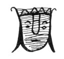 
FIG. 15--The lord of the katun (Chumayel MS.).</td>
</tr>
</tbody>
</table>

This is the second question that will be asked of them: let them go and
get the brains of the sky, so the head-chief may see how large they are.
"It is my desire to see them; let me see them." This is what he would
say to them. This is what the brains of the sky are: it is copal
gum. [1](#fn_242) Zuyua &lt;language&gt;. /

|          |
|----------|
| p\. 30 C |

<table data-align="LEFT">
<colgroup>
<col style="width: 100%" />
</colgroup>
<tbody>
<tr class="odd">
<td data-valign="CENTER">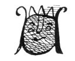 
FIG. 16--The lord of the katun (Chumayel MS.).</td>
</tr>
</tbody>
</table>

This is the third question which will be asked of them: let them
construct a large house. [2](#fn_243) Six
*thils* [3](#fn_244) is its length., one such
&lt;measure&gt; is that of its upright timbers. This is what the large
house is: it is a very large hat set on the floor. He shall be told to
mount a very large white horse. White shall be his mantle and his cape,
and he shall grasp a white rattle in his hand, while he rattles it at
his horse. There is coagulated blood on the rosette [4](#fn_245) of his rattle, which comes out of it.
This is what the white horse is: it is a stirrup [5](#fn_246) of henequen fiber. This is the white
rattle mentioned, and the white cape: they are a Plumeria flower
&lt;and&gt; a white wreath. This is the coagulated blood on the rosette
of the rattle, which is demanded of them: it is the gold in the middle,
because it is blood which comes from the veins of the fatherless and
motherless orphan.

<table data-align="LEFT">
<colgroup>
<col style="width: 100%" />
</colgroup>
<tbody>
<tr class="odd">
<td data-valign="CENTER">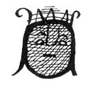 
FIG. 17--The lord of the katun (Chumayel M.S.).</td>
</tr>
</tbody>
</table>

This is the fourth question which will be asked of them: Let them go to
his house and then they shall be told: "When you come, you shall be
visible at midday. You shall be children again, you shall creep
&lt;again&gt;. When you arrive, your little dog shall be just behind
you. This little dog of yours carries with its teeth the soul of our
holy mistress, [6](#fn_247) when you come with
it." This is what the second childhood at midday is, which is mentioned
to him. He shall go where he casts a shadow, this is what is called
creeping. Then he shall come to the house of the head-chief. This is
what his little dog is which is demanded of him: it is his wife. This is
what the soul of our holy mistress is: it is an enormous thick wax
candle. &lt;This is&gt; the language of Zuyua./

|          |
|----------|
| p\. 31 C |

p. 91

<table data-align="LEFT">
<colgroup>
<col style="width: 100%" />
</colgroup>
<tbody>
<tr class="odd">
<td data-valign="CENTER"> 
FIG. 18--The lord of the katun (Chumayel MS.).</td>
</tr>
</tbody>
</table>

This is the fifth question which will be asked of them. They shall be
told to go and get the heart of God the Father in heaven. "Then you
shall bring me thirteen layers [1](#fn_248)
wrapped up in a coarse white fabric." This is the heart of God the
Father, of which they are told: it is a bead of precious stone. This is
what the covering of thirteen layers is, which is mentioned. It is an
enormous tortilla. Thirteen layers of beans are in it. This is what the
coarse white fabric is, it is a white mantle. This shall be demanded of
them, as signified &lt;in the language&gt; of Zuyua.

<table data-align="LEFT">
<colgroup>
<col style="width: 100%" />
</colgroup>
<tbody>
<tr class="odd">
<td data-valign="CENTER">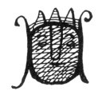 
FIG. 19--The lord of the katun (Chumayel MS.).</td>
</tr>
</tbody>
</table>

This is the sixth question which will be asked of them: to go and get
the branch of the *pochote* tree, [2](#fn_249)
and a cord of three strands, and a living liana. This he will relish.
"My food for tomorrow. [3](#fn_250) It is my
desire to eat it." It is not bad to gnaw the trunk of the *pochote*
tree, so they are told. This is what the trunk of the *pochote* tree is:
it is a lizard. [4](#fn_251) This is the cord
of three strands, the tail of an iguana. This is the living liana, it is
the entrails of a pig. This is the trunk of the *pochote* tree, the base
of the tail of a lizard. The language of Zuyua.

<table data-align="LEFT">
<colgroup>
<col style="width: 100%" />
</colgroup>
<tbody>
<tr class="odd">
<td data-valign="CENTER">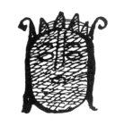 
FIG. 20--The lord of the katun (Chumayel MS.).</td>
</tr>
</tbody>
</table>

This is the seventh question which will be asked of them. They shall be
told: "Go and gather for me those things which plug [5](#fn_252) the bottom of the cenote, two white
ones, two yellow ones. I desire to eat them." These are the things which
plug the bottom of the cenote, which are demanded of them. They are
&lt;two&gt; white and two yellow jícamas. [6](#fn_253) These are the things to be understood in
order to become chiefs of the town, when they are brought before the
ruler, the first head-chief. /

|          |
|----------|
| p\. 32 C |

These are the words. If they are not understood by the chiefs of the
towns, ill-omened is the star adorning the night. Frightful is its
house. Sad is the havoc [7](#fn_254) in the
courtyards of the nobles. Those who die are those who do not understand;
those who live will understand it. This competitive test shall hang over
the chiefs of the towns; it has been copied so that the severity may be
known in which the reign is to end. Their hands are bound before them to
a wooden collar. They are pulled along with the cord. They are taken to

p. 92

the house of the ruler, the first head-chief. This is the end of the
chiefs. This shall hang over [1](#fn_255) the
unrestrained lewd ones of the day and of the katun. They shall feel
anguish when the affairs of the chiefs of the towns shall come to an
end. This shall occur on the day when the law of the katun shall come to
an end, when Katun 3 Ahau shall terminate. The chiefs of the towns shall
be seized because they are lacking in understanding. /

|          |
|----------|
| p\. 33 C |

 [2](#fn_256)

<table data-align="LEFT">
<colgroup>
<col style="width: 100%" />
</colgroup>
<tbody>
<tr class="odd">
<td data-valign="CENTER">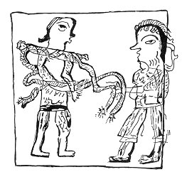 
FIG. 21--''The chiefs of the towns shall be 
seized because they are lacking 
in understanding'' (Chumayel MS.).</td>
</tr>
</tbody>
</table>

Thus shall occur the seizure of the chiefs of the towns. This is the
memorandum so that they may give the first head-chief his food, when he
demands his food of them. They shall be hung by the neck; the tips of
their tongues shall be cut off: their eyes shall be torn out. On this
day the end shall come.

But those who are of the lineage shall come forth before their lord on
bended knees in order that their wisdom may be made known. Then their
mat [3](#fn_257) is delivered to them and their
throne as well. The test is to be seen as it is copied here. Those of
the lineage of the first head-chief here in the land are viewed with
favor. They shall live on that day, and they shall also receive their
first wand of office. Thus are those of the lineage of Maya men
established again in the Province of Yucatan. God shall be first, when
all things are accomplished here on earth. He is the true ruler, he
shall come to demand of us our government, those things which we hold
sacred, precious stones, precious beads; and he shall demand the planted
wine, the *balché*. [4](#fn_258) He who has
none shall be killed. He who obeys, godly is his action according to the
law. But perhaps God will not desire all the things which have been
written to come to pass. /

|          |
|----------|
| p\. 34 C |

So, also, these are the nobility, the lineage of the chiefs, who know
whence come the men and the rulers of their government. The discretion
with which they govern their subjects shall be viewed with favor. Their
mat and

p. 93

<table data-align="LEFT">
<colgroup>
<col style="width: 100%" />
</colgroup>
<tbody>
<tr class="odd">
<td data-valign="CENTER">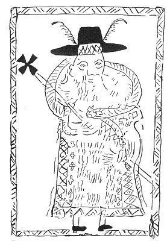 
FIG. 22--The examining head-chief, 
or <em>halach-uinic</em> 
(Chumayel MS.).</td>
</tr>
</tbody>
</table>

 [1](#fn_259) their throne shall be delivered
to them by our lord, the first head-chief. This is their mat and their
throne. &lt;But&gt; the unrestrained upstart of the day and katun, the
offspring of the mad woman, the offspring of the harlot, the son of
evil, the two-day occupant of the mat, the two-day occupant of the
throne, the rogue of the reign, the rogue of the katun, he shall be
roughly handled, his face covered with earth, trampled into the ground,
and befouled, as he is dragged along. [2](#fn_260) &lt;On the other hand&gt;, the ruling
men of noble lineage have walked abroad in Katun 3 Ahau; &lt;they
are&gt; placated in the fullness of their hearts when they are told to
go and take the chiefs of the towns. Then let them go and take them.

"Son, go and bring the flower [3](#fn_261) of
the night to me here." This is what will be said. Then let him go on his
knees before the head-chief who demands this of him. "Father, here is
the flower of the night for which you ask me; I come with it and with
the vile thing of the night. There it is with me." These are his words.

"Then, &lt;my&gt; son, if it is /

|          |
|----------|
| p\. 35 C |

with you, have you with you the first captive [4](#fn_262) and the great álamo tree?" [5](#fn_263) "Father, they are with me. I have come
with them."

"Then, &lt;my&gt; son, if you have come with them, go and call your
companions to me. These are an old man with nine sons and an old woman
with nine children." "Father," he says when he replies, "I have come
with them. Here they are with me. First they came to me, and then I came
to see you."

"Then, &lt;my&gt; son, if they are here with you, go and gather for me
stones of the savannah and come with them." He gathers them to his
breast when he

p. 94

comes. "Are you a head-chief? Are you of the lineage of the ruler here
in the land?" The language of Zuyua.

This is the flower of the night which is demanded of him: a star in the
sky. This is the vile thing of the night: it is the moon. [1](#fn_264) This is the first woman captive and the
great álamo tree: it is the town official, [2](#fn_265) named "he who falls to the ground." This
is the old man with nine sons who is demanded of him: it is his great
toe. This is the old woman demanded of him: it is his thumb. These are
the stones of the savannah which are sought for and which his son is to
gather to his breast: they are quails. [3](#fn_266)

"Also, &lt;my&gt; son, where is the smooth green thing of which you were
told? You were not told to look at its face." Here it is with me,
father." "Then, &lt;my&gt; son, go and bring to me here the placenta of
the sky. When you come from the east, you shall come with something
close behind you." "So be it, father," he says.

This is what the smooth green thing is, which is with him when he
arrives: it is the rind of a squash. [4](#fn_267) This is the placenta of the sky which is
demanded of him: it is moulded copal-gum shaped into thirteen layers.
This is what is said to come close behind him: it is the shadow at his
back early in the afternoon.

"&lt;My&gt; son, you are a head-chief; you are a ruler also. Go and get
me the green beads with which you pray." /

|          |
|----------|
| p\. 36 C |

These are the green beads which are demanded of him: it is a bead of
precious stone. Then he shall be asked how many days he prays. "Father,"
he says, "for one day I pray, and for ten days I pray." "On what day
does your prayer arise?" "Father, on the ninth day and on the thirteenth
day. It is to Bolon-ti-ku and Oxlahun-ti-citbil [5](#fn_268) that I count my beads."

"&lt;My&gt; son, go and get me your loin-cloth that I may perceive its
odor here with the wide spread odor of my loin-cloth, the odor of my
mantle, the odor of my censer, [6](#fn_269) the
supreme odor at the center of the sky, at the center of the clouds,
&lt;also&gt; that which glues together my mouth, it is in a white carved
&lt;cup&gt;. &lt;Do this&gt; if you are a head-chief." "Father, I will
bring them," he says.

This is the odor of the loin-cloth which he asks for, this is the
supreme odor at the center of the sky: it is copal gum set on fire
&lt;so that&gt; it burns. This is what first glues together his mouth:
it is ground cacao, chocolate.

"Then, &lt;my&gt; son, go bring me the green blood of my daughter, also
her head, her entrails, her thigh, and her arm; also that which I told
you to enclose in an

p. 95

unused jar, as well as the green stool of my daughter. Show them to me.
It is my desire to see them. I have commissioned you to set them before
me, that I may burst into weeping." "So be it, father." He &lt;is to&gt;
come with the left ear of a wild bee. Then let him go.

This is the green blood of his daughter for which he asks: it is Maya
wine. These are the entrails /

|          |
|----------|
| p\. 37 C |

of his daughter: it is an empty bee-hive. [1](#fn_270) This is his daughter's head: it is an
unused jar for steeping wine. [2](#fn_271) This
is what his daughter's green stool is: it is the stone pestle [3](#fn_272) for &lt;pounding&gt; honey. This is what
the left ear of the wild bee is: it is &lt;a drop of&gt; the moisture of
the wine. This is what the bone of his daughter is: it is the flexible
bark of the balché. This is the thigh of which he speaks: it is the
trunk of the *balché* tree. This is what the arm of his daughter is: it
is the branch of the *balché*. This is what he calls weeping: it is a
drunken speech. Then let him go and give these &lt;things&gt; to him.
Let him seat himself tranquilly; let him wait for him to speak; let him
salute him as his lord when he arrives.

"Father, here is your daughter whom you put in my care. of whom you
speak. You are the father, you are the ruler." This is what his son says
to him.

"Oh son, my fellow head-chief, my fellow ruler! You have remembered; it
is sufficient. You know; it is sufficient," he says. "This, then, is the
blood of my daughter for which I ask you." Thirteen times the blood of
his daughter flows, while he weeps for his daughter, lying there in the
courtyard. Perchance, then he weeps, while he looks at her, bowed down,
while he says: "Oh son!" he says while he weeps, "you are a head-chief.
Oh son, you are a ruler also. Oh my fellow head-chief, I will deliver
your mat and your throne and your authority to you, son; yours is the
government, yours is the authority also, &lt;my&gt; son."

Thus, then, the chiefs of the towns are to obey [4](#fn_273) him when they depart with the
first/head-chief, there at the head [5](#fn_274) of the province. Then let them

|          |
|----------|
| p\. 38 C |

go to his house. There they are at his house, when they give his food to
the head-chief, and when he asks them for his food, as he shall specify
in its order.

"Son, bring me four cardinals [6](#fn_275)
which are at the mouth of the cave. They are to be set over [7](#fn_276) the first thing which glues together my
mouth. It is to be red, that which I call the crest over the first thing
which glues together my mouth, when it shall be brought before me." "It
is well, father." What he asks for are little cakes of achiote. [8](#fn_277) This is the crest of which he speaks: it
is the froth on the chocolate.

p. 96

\[paragraph continues\] This is what first glues together his mouth: it
is cacao which has been ground. &lt;The language of&gt; Zuyua.

"Son, bring me the bird of the night and the drilled &lt;stone&gt; of
the night, and with them the brains of the sky. Great is my desire to
see them here." "It is well, father." What he wants is a stick used to
scrape [1](#fn_278) copal gum &lt;from the
tree&gt;. This the drilled &lt;stone&gt; of the night for which he asks,
a bead of precious stone. The brains of the sky are copal gum. Language
of Zuyua.

"Son, bring me the bone of your father whom you buried three years ago.
Great is my desire to see it." "It is well, father." This is what he
wants, it is cassava baked in a pit. Then let him go and give it to the
head-chief.

"Son, bring me an old man whose coat [2](#fn_279) is not buttoned, Homtochac [3](#fn_280) is his name." "It is well, father." What
he asks for is a nine-banded armadillo, a female armadillo.

"Son, bring me three segments split from the sky. I desire to eat them."
"Even so, father." /

|          |
|----------|
| p\. 39 C |

This is what he demands, it is *atole* shaken to a froth, the froth of
*atole* (maize gruel). Everything is asked in the language of Zuyua.

"Son, bring me a stock of maguey, the thick stalk of the maguey without
branches. Do not remove its tip. Also bring with it three strands of
ravelled cord." "It is well, father." This is what he asks for, a
hog's [4](#fn_281) head baked in a pit. Then he
shall go and give it to him. The tip of which he speaks is its tongue,
because its tip is fresh and tender. [5](#fn_282)

"Son, bring me the hawks [6](#fn_283) of the
night for me to eat." It is well, father." What he asks for are
chickens, cocks.

"Son, say to the first female captive, called Otlom-cabal, to bring me a
basket of blackbirds [7](#fn_284) caught
beneath the great álamo tree, heaped up there in the shadow of the
álamo." "Even so, father." What he asks for are some black beans that
are in the house of the town official, that is, the so-called first
female captive and the thing which falls limply to the ground of which
he speaks. [8](#fn_285) Language of Zuyua.

"Son, go and catch the jaguar of the cave, so that by means of you it
may give savour to my food. I desire to eat the jaguar." "It is well,
father." This is the jaguar for which he asks, it is an agouti. [9](#fn_286) The language of Zuyua.

"Son, bring me seven coverings of the fatherless &lt;orphan&gt;. It is
my desire to eat them at the time when they should be eaten." "Even so,
father." This is what he asks for, it is the pressed &lt;leaves of
the&gt; chaya. [10](#fn_287)

"Son, bring me the green gallants here. Let them come and dance, that I
may look on with pleasure. Let them come with drum and rattle, fan and
drum-stick. I am expecting them." [11](#fn_288)
"Even so, father." What he asks for is a turkey-cock.

p. 97

\[paragraph continues\] The drum is its crop. The rattle is its head.
The fan is its tail. The drum-stick is its leg. The language of Zuyua.

"Son, bring me the fanciful desire [1](#fn_289)
of the district. I desire /

|          |
|----------|
| p\. 40 C |

to eat it." What he asks for is clarified honey. &lt;The language of&gt;
Zuyua.

"Son, bring me a stone from burned over land, it is burning hot. Bring
with it the liquor for me to extinguish it, so it will crack here before
me." What he wants is a *macal* [2](#fn_290)
baked in a pit. The liquor to extinguish it is clarified honey. The
language of Zuyua.

"Son, bring me the firefly of the night. Its odor shall pass to the
north and to the west. Bring with it the beckoning tongue [3](#fn_291) of the jaguar." "It is well, father."
What he asks for is a smoking tube filled with tobacco. [4](#fn_292) The beckoning tongue of the jaguar for
which he asks is fire.

"Son, bring me your daughter that I may see her. Pale is her face and
very beautiful. White are her head-covering and her sash. I greatly
desire her." tilt is well, father." What he asks for is a white calabash
cup &lt;filled&gt; with atole. The language of Zuyua.

"Son, bring me the thing called *zabel*. Fragrant is its odor." "Even
so, father." This is what he asks for, it is a melon.

"Son, bring me the green curved neck, it is bright green along the back.
I desire to eat it." "It is well, father." What he asks for is the neck
of a turkey-cock. &lt;Language of&gt; Zuyua.

"Son, bring me a woman with a very white and well rounded calf. Here
will I tuck back the skirt from her calf." "It is well, father." He
wants a jícama. This is what tucking back the skirt is: it is peeling
the skin.

"Son, bring me a very beautiful woman with a very white countenance. I
greatly desire her. I will cast down her skirt and her loose dress
before me." "It is well, father." This is what he asks for, it is a
turkey-hen for him to eat. Casting down her skirt /

|          |
|----------|
| p\. 41 C |

and loose dress means plucking its feathers. Then let it be roasted for
eating. The language of Zuyua.

"Son, bring to me here a farmer, an old man. I wish to see his face."
"Even so, father." What he asks for is a *cucut-macal* [5](#fn_293) to eat. &lt;This is&gt; the
questionnaire.

"Son, bring me a farmer's wife, an old woman, a dark colored person. She
is seven palms across the hips. It is my desire to see her." What he
wants is the green fruit of a squash-vine. [6](#fn_294) The language of Zuyua.

The day shall come.

On this day our lord, the first head-chief, trampled them under foot,
when he arrived here in the land, in the land of Yucalpeten. [7](#fn_295) He calls the chiefs, and the chiefs
shall come. They are called by our lord, the first head-chief. "Are you
chieftains?" "We are, &lt;my&gt; lord." These are their words.

"Sons, if you are head-chiefs here in the land," they shall be told, "go
and get the winged jaguar, and then come and give it to me to eat. Put
his bead collar on him properly, put on his crest properly, and come and
give him to me to eat. Go immediately today, and come soon. Sons, I
greatly desire to eat him. You are &lt;my&gt; sons, you are
head-chiefs." Those who are ignorant shall be sad at heart

p. 98

and in countenance. They shall say nothing. But those who know shall be
cheerful when they go to get the winged jaguar. Then he shall come with
it. "Is it you, son?" "It is I, father." "Are you of the lineage, son?"
"Indeed I am, father." "Where are your companions, son?" "Father, they
are in the forest seeking the jaguar." The jaguar, as they call it, does
not exist, /

|          |
|----------|
| p\. 42 C |

but let him bring it before him. This jaguar for which he asks is the
chief's horse which he wishes to eat. It is a horse raised about the
house. This is the bead collar: it is its little bells. This is its
crest: it is a red thread. It is to be completely saddled and bridled.
The language of Zuyua. [1](#fn_296)

------------------------------------------------------------------------

### Footnotes

[88:1](cbc14.htm#fr_235) Zuyua is Nahuatl, a
mythical place-name associated with the "Seven Caves" believed to be the
origin of the Nahuas (Brinton 1882, p. 110).

[88:2](cbc14.htm#fr_236) Probably Don Carlos de
Luna y Arellano, governor of Yucatan from 1604 to 1612. Cogolludo Bk. 8,
Chap. 12. His period of office was, however, in Katun 5 Ahau, and not 3
Ahau as stated here.

[89:1](cbc14.htm#fr_237) This and the other
blurred crowned heads in this chapter seem to represent the so-called
"ruler" of the katun-prophecies in Chapter XXII. It is of especial
interest to find these heads pictured in connection with the present
questionnaire, and it suggests that we have here an important ceremony
associated with the establishment of a new katun-marker. The crowned
head probably represents the glyph Ahau.

[89:2](cbc14.htm#fr_238) When a katun was half
finished, the idol of the succeeding katun was set up and also
worshipped (Landa 1929, p. 98).

[89:3](cbc14.htm#fr_239) Probably a reference
to the erotic religious practices of which the early Spanish
missionaries complained.

[89:4](cbc14.htm#fr_240) Lit.: the demand for
knowledge or understanding.

[89:5](cbc14.htm#fr_241) See Appendix E.

[89:6](cbc14.htm#fr_242) It is not known what
sort of a blessing the pagan Maya recited over their ordinary meals.
Here the usual Christian benediction is no doubt meant.

[90:1](cbc14.htm#fr_243) The gum of the copal
(*Protium copal* Engl.) was the principal incense used by the Maya. The
thick clouds of smoke may have suggested the convolutions of the brain.

[90:2](cbc14.htm#fr_244) Lit. let them bind a
large house.

[90:3](cbc14.htm#fr_245) *Thil* is the Maya
measure for the distance between the uprights of a house.

[90:4](cbc14.htm#fr_246) Mexican rattles were
certainly ornamented with rosettes. *Cf.* Seler 1904, pp. 674, 675 and
700. The Maya word here is *lol*, which usually means a large blossom.

[90:5](cbc14.htm#fr_247) Lit. a pierced shoe,
which suggests an old Spanish stirrup of the Arab type.

[90:6](cbc14.htm#fr_248) Our holy mistress (*ca
cilich colel*) is a term usually applied to the Holy Virgin.

[91:1](cbc14.htm#fr_249) Probably a reference
to the thirteen heavens of the Maya cosmos.

[91:2](cbc14.htm#fr_250) *Ceiba schottii*
Britt. & Baker.

[91:3](cbc14.htm#fr_251) Alternative
translation: odorous food.

[91:4](cbc14.htm#fr_252) *Chop*, a red and
black lizard. The term is also applied to the dried lizards used by the
native doctors.

[91:5](cbc14.htm#fr_253) Possible alternative
translation: tortoises.

[91:6](cbc14.htm#fr_254) *Pachyrhizus erosus*
(L.) Urban. The Maya name, *chicam*, appears to be derived from the
Nahuatl jícama, and this edible root may have been introduced by the
Toltecs.

[91:7](cbc14.htm#fr_255) *Bulcum*, a misfortune
frequently associated in these pages with swarming flies.

[92:1](cbc14.htm#fr_256) Alternative
translation: There shall be weeping among, etc.

[92:2](cbc14.htm#fr_257) Prisoners are also
portrayed as nude in one of the frescos of the Temple of the Warriors
(Morris, Charlot and Morris 1931, Pl. 139).

[92:3](cbc14.htm#fr_258) Here, as among the
Aztecs, the mat and throne are symbols of authority. Believing Cortez to
be the returning Quetzalcoatl, Montezuma greeted him with these words:
"My royal ancestors have said that you would come to visit your city and
that you would sit upon your mat and chair when you returned" (Seler
1923, p. 447).

[92:4](cbc14.htm#fr_259) An intoxicating drink
made of fermented honey and the bark of the *Lonchocarpus longistylus*
Pitt. and used in religious ceremonies.

[93:1](cbc14.htm#fr_260) This portrayal of the
*halach-uinic* dressed as a Spanish dignitary is probably due to an
effort to make it real to the Seventeenth or Eighteenth Century Maya
reader, rather than because of ignorance.

[93:2](cbc14.htm#fr_261) A very similar passage
on page [106](cbc15.htm#page_106) states that these usurpers who ruled
in Katun 3 Ahau were Itzá (who called themselves "the Zuyua people.")
This suggests that our questionnaire was originally a method by which
the Xius, a 'West Zuyua people," ousted Itzá chieftains from the towns
over which they (the Xius) had gained control. We shall see on page
[137](cbc24.htm#page_137) that the Itzá also had a questionnaire of
their own.

[93:3](cbc14.htm#fr_262) Lit.: a large flower.

[93:4](cbc14.htm#fr_263) Alternative
translation: the green weak one.

[93:5](cbc14.htm#fr_264) *Ficus cotinifolia* H.
B. K. The miter-like head-dress of the Maya chiefs, like those seen on
the sculptures of Chichen Itzá, was made of the bark of this tree
(Relaciones de Yucatan, I, P. 82).

[94:1](cbc14.htm#fr_265) We know little of the
Maya conception of the moon. It is certain, however, that in their later
history they were greatly influenced by the Mexicans among whom the moon
was associated with the rabbit, the symbol of drunkenness, and with
Tlaçolteotl, the goddess of sinful love.

[94:2](cbc14.htm#fr_266) Maya, *ah-cuch-cab*,
which could also mean the honey-bearer. The translator believes the town
official is meant because he was so subservient before any higher
authority.

[94:3](cbc14.htm#fr_267) The quail is also
associated with a stone on page [128](cbc21.htm#page_128).

[94:4](cbc14.htm#fr_268) Maya, *ca*, a certain
white and striped squash. The Maya word, *haan*, is variously defined as
something made smooth or scrubbed, father-in-law and son-in-law.

[94:5](cbc14.htm#fr_269) Lit.: nine gods and
thirteen fathers, probably the gods of the nine underworlds and the
thirteen heavens.

[94:6](cbc14.htm#fr_270) Written *yubak* in our
text and corrected to *yubkak*, which means censer.

[95:1](cbc14.htm#fr_271) The Maya bee-hive is
made of the hollow section of a log.

[95:2](cbc14.htm#fr_272) *Balché*, the native
wine is made by steeping the bark or root of the *balché* tree
(Lonchocarpus longistylus Pitt.) in a mixture of fermenting honey and
water.

[95:3](cbc14.htm#fr_273) The text reads "*couoh
tun*" (lit. tarantula stone) here, but it is assumed that *cocoh tun*
(stone hammer) is meant, and translated accordingly.

[95:4](cbc14.htm#fr_274) Alternative
translation: then ends the speech of the chiefs, etc.

[95:5](cbc14.htm#fr_275) Cumkal is called "the
head of the land" on pages [86](cbc12.htm#page_86) and
[126](cbc21.htm#page_126) of the Chumayel, so it is likely that the
territory of Ceh Pech is the source of this ritual.

[95:6](cbc14.htm#fr_276) Chac-¢i¢ib is
*Cardinalis cardinalis yucatanicus* Ridg. Bull. Mus. Comp. Zool.
Harvard, 50, p. 141. Its feathers are a cure for yellow fever (Libro del
Judío, p. 80).

[95:7](cbc14.htm#fr_277) The text reads: I am
set over, etc. Probably an error.

[95:8](cbc14.htm#fr_278) *Bixa orellana* L.,
the butter-color of commerce.

[96:1](cbc14.htm#fr_279) *Tocabal* could mean
either "removed" or "burned." In connection with *hoyob*, a stick for
scraping something, the former definition is applied here. It is
possible, ho ever, that a spoonlike censer is meant.

[96:2](cbc14.htm#fr_280) *Habon*, in the text,
is assumed to be a corruption of the Spanish *habito*. The Maya *hobon*,
hollow, may be intended.

[96:3](cbc14.htm#fr_281) *Hom-toch-ac* could
mean hollow stiff tortoise-shell.

[96:4](cbc14.htm#fr_282) *Keken* originally was
a large variety of peccary, but the term was later applied to European
swine.

[96:5](cbc14.htm#fr_283) *Ol* is a tender tip
or sprout. *Ak* means tongue, also something fresh or tender.

[96:6](cbc14.htm#fr_284) *Coz*, *Micrastur
melanoleucus* Viellot. Bull. Mus. Comp. Zool Harvard, 50, p. 121.

[96:7](cbc14.htm#fr_285) Pic~~h~~um, or
pic~~h~~: *Dives dives* Lichtenstein. Pueblo Blackbird. *Ibid*., 50, p.
141.

[96:8](cbc14.htm#fr_286) *Cf.* p. 94, note
 [2](#fn_265).

[96:9](cbc14.htm#fr_287) *Dasyprocta punctata
yucatana* Goldman. Mexican agouti, *haleu*.

[96:10](cbc14.htm#fr_288) *Chay*: *Jatropha
aconitifolia* Mill. "They eat the leaves of this tree much as they do
cabbages, but they are not as tasty ("Relaciones de Yucatan, I, p. 56).

[96:11](cbc14.htm#fr_289) Alternative
translation: they are useful to me.

[97:1](cbc14.htm#fr_290) Maya, *caz*. Probably
*çaz*, something clear, is intended.

[97:2](cbc14.htm#fr_291) *Xanthosoma yucatanse*
Engl.; also the yam, a European importation.

[97:3](cbc14.htm#fr_292) The Maya were
accustomed to make a furtive signal with the tongue. Motul.

[97:4](cbc14.htm#fr_293) A reference to puffing
tobacco smoke toward the four world-quarters.

[97:5](cbc14.htm#fr_294) This name is applied
to the imported taro, but here probably a form of *Xanthosoma* is meant
(Standley, 1930, p. 224).

[97:6](cbc14.htm#fr_295) <u>¢</u>ol. Certain
green flattish squashes, good and palatable. Motul.

[97:7](cbc14.htm#fr_296) *Yucalpeten* is an
attempt to turn Yucatan into a name comprehensible in Maya.

[98:1](cbc14.htm#fr_297) The frequent mention
of the language of Zuyua, a mythical place-name of the Nahua peoples,
suggests that this interrogatory once abounded in terms familiar to the
Toltec conquerors of Yucatan but not understood by the people of the
country. In any case it came eventually to mean only mysterious words
which were obscure to all but the ruling class. This example of the
questionnaire has no doubt sadly degenerated. Nevertheless the mention
of a number of things like the horse, known only to the Maya since the
Spanish Conquest, indicates that this interrogatory continued to develop
during the colonial period, although the Spanish rulers of the country
were entirely unaware of its existence. A discussion of the traditions
of caste and chieftainship among the Maya will be found in Appendix E.

------------------------------------------------------------------------

[Next: X: The Creation of the World](cbc15)
