[Intangible Textual Heritage](../../../index)  [Native
American](../../index)  [Maya](../index)  [Index](index) 
[Previous](cbc26)  [Next](cbc28) 

------------------------------------------------------------------------

# XXII

### (A BOOK OF KATUN-PROPHECIES)

(1. Frontispiece.)

<table data-cellspacing="0" data-border="0" data-cellpadding="9" width="798">
<colgroup>
<col style="width: 50%" />
<col style="width: 50%" />
</colgroup>
<tbody>
<tr class="odd">
<td width="50%" data-valign="TOP">
 <a href="img/fig29.jpg"> 
Click to view</a> 

</td>
<td width="50%" data-valign="TOP">
FIG. 29--The lords of the thirteen katuns. (Chumayel MS.). / [p. 84 C]

We have here a picture of the thirteen Lords of the Katuns.

The blurred faces may signify that they are blindfolded. The crowns, crosses and manner of drawing are purely European, but they doubtless represent the idols set up in honor of each katun. Unfortunately no pre-Conquest representation of these figures has come down to us. <em>Cf.</em> Landa 1929, PP. 94-Too, also Appendix D. After thirteen Katuns the same series will always recur.
</td>
</tr>
</tbody>
</table>

 

 [3](#fn_688) Today, Wednesday, April 4th,
1832, I have recorded the name of Maria Isidora, daughter of Andres
Balam and Maria Juana Xicum. [4](#fn_689)

Today, Sunday, December 22d, 1833, I have recorded the name of Tomas,
son of Andres Balam and Maria Xicum. God-father: José Maria Castañeda.
God-mother: Manuela Marin.

Cura

. . . Justo Balam, Secretary. (Rubrica)

 

p. 145

 [1](#fn_690) This is the day on which I
purchased the book: July 1st, 1838. It cost me one peso in &lt;my&gt;
poverty. This was the price &lt;I paid&gt; to the Señor Padre:
&lt;one&gt; peso. This is the year of the purchase ... I have recorded
it in order that it might be known that at this time it passed into my
hands by purchase.

I, Pedro de Alcantara Briceño, resident of San Antonio. /

|          |
|----------|
| p\. 85 C |

(2. Historical introduction to the katun-prophecies.)

In Katun 13 Ahau the ship of the foreigners first appeared at Campeche.
1541 was the name of the year when they brought the news that the Maya
men were to enter into Christianity, when the land of Tantun Cuzamil was
established. They were there for half a year. Then they went to the
seaport to the west and the people of Chikin-Chel [2](#fn_691) were put under tribute. It was the year
1542 when the district of Tihoo, Ichcanziho, [3](#fn_692) was established, in Katun 11 Ahau. The
first governor was the Adelantado Don Francisco Montejo who was to
appoint subjects [4](#fn_693) for the
foreigners, mighty men. In the year 1542 tribute was introduced. A. D.
1545 was the year when the Padres arrived, four years after the arrival
of the foreigners. Then it was that men were baptised from town to town
by &lt;the Padres&gt;. When they first arrived the towns were
distributed among them.

1544 was the year . . . six hundred years and seventy-five years after
the town of Chichen Itzá was depopulated, [5](#fn_694) after its settlements were depopulated.
&lt;It was&gt; eight hundred years and seventy years after the town of
Uxmal was depopulated, after the people were driven out of its
towns. [6](#fn_695)

In the year 1537, on a day named 9 Cauac, was when the nobles gathered
at the town of Mani to discuss fully whether they should go and bring
the foreigners to their settlements because the head-chief had been
killed. [7](#fn_696) These

p. 146

were their names: Ah Moochan Xiu, Nahau Ez, Ah <u>¢</u>un Chinab, Napoot
Cupul, Napot Che, Nabatun Itza, Ah-kin [1](#fn_697) Euan from Caucel, Nachan Uc from
<u>¢</u>ibilkal [2](#fn_698) Ah-kin Ucan from
Ekob, Nachi Uc, Ah-kul Koh, Nachan Motul, Nahau Coyi. These were the men
of importance who talked of bringing the foreigners to their town,
because the head-chief of the town, Ah &lt;<u>¢</u>un&gt; [3](#fn_699) Xiu was killed at Otzmal. /

|          |
|----------|
| p\. 86 C |

10 Kan [4](#fn_700) was the year-bearer when
the seeker for a town passed. He was called Montejo, he who wrote down
the towns. This was the year when the strangers in the land, the
foreigners who ate annonas, passed. They were the first to distribute
the towns. It was when the foreigners arrived that the "receivers"
received them. [5](#fn_701) When they assembled
at Campeche, when their ships came forth, then the nobles went to give
gifts to them. There were thirteen "receivers of the foreigners." [6](#fn_702) After that they came to Ichcanziho. 9
Ahau was the katun. [7](#fn_703)

✠ &lt;This is&gt; a record of the wisdom of the book in which is set
down the course of the katun. Here it is published in the land of
Nitun¢ala, Chactemal, Tahuaymil, Holtun Itzá, Chichinila, [8](#fn_704) in order that the charge of the course
of the katun may be known, of each katun, whether it is good or bad.
Thus it is written by the Holy Writer, the Evangelist, it is the word of
the Lord of heaven and earth . . . it comes from on high. This was given
to

p. 147

them ... at the beginning of the land, at the beginning of our humanity
... the true word in Holy Writ, in the book, the *Reportorio*. [1](#fn_705) It has no error; the seal [2](#fn_706) on the book [3](#fn_707) was carefully surveyed by them. These
were the four lineages from heaven, the substance of heaven, the
moisture of heaven, [4](#fn_708) the
head-chiefs, the rulers of the land: Zacaal Puc, Hooltun Balam,
Hoc~~h~~tun Poot, Ah Mex-Cue Chan. [5](#fn_709)

Behold, within seven score years Christianity will be introduced amid
the clamor of the rulers, those who violently seize land &lt;during&gt;
the katun. Then suddenly appears the wise man; then there is the
examination of the katun. [6](#fn_710)
Miserable is the face of Chac Chuen Coyi. [7](#fn_711) Then the Lord of the Church shall come.
It is in the middle of the town of Tihoo. [8](#fn_712) It shall come from the East, from the
North, from the West, from the South; the word of Christianity shall be
heard in the 17th tun in order that Christianity may truly arise. /

|        |
|--------|
| p\. 87 |

The Padres shall arrive; the Bishop shall arrive, the Holy Inquisition,
the word of God. &lt;These things&gt; shall be accomplished. No one
shall cause them to cease. Amen.

(3. The katun-prophecies.) [9](#fn_713)

The Chapter of the year, the katun.

First: 11 Ahau, when the foreigners first established the country.

The first: Katun 11 Ahau was the beginning of the katun-count, the first
katun. The katun was established at Ichcaanzihoo when the foreigners
arrived. Red were the beards of the children of the sun, the bearded
ones from

p. 148

the east, when they arrived here in our land. The strangers to the land
are white men, red men, [1](#fn_714) . . . a
beginning of carnal sin [2](#fn_715) . . . Oh
Itzá! . . . make ready. There cometh a white circle [3](#fn_716) in the sky, the fair-skinned boy from

<table data-cellspacing="0" data-border="0" data-cellpadding="9" width="798">
<colgroup>
<col style="width: 50%" />
<col style="width: 50%" />
</colgroup>
<tbody>
<tr class="odd">
<td width="50%" data-valign="TOP">
 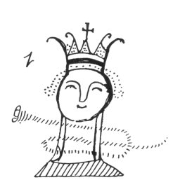
</td>
<td width="50%" data-valign="TOP">
FIG. 30--The lord of the katun. (Chumayel MS.).

Each prophecy of this series is headed by an illustration similar to this one. It consists of a crowned head, and the crown is surmounted by a cross. It evidently represents a so-called "ruler" mentioned in a number of the prophecies, but there is some uncertainty as to the function of his personage in connection with each new katun. In the Tizimin (p. 22) and Mani (Code. Perez, p. 120) manuscripts we read of a certain Katun 8 Ahau that "the ruler of the people of Uxmal was painted." It is possible that this means that a picture of this ruler headed the prophecy for the katun: but Katun 8 Ahau "was established" at Izamal and not Uxmal according to the present series of katun-prophecies.
</td>
</tr>
</tbody>
</table>

 

heaven, the white wooden standard [4](#fn_717)
that shall descend from heaven. A quarter of a league, a league
away, [5](#fn_718) it approaches. You shall see
the dawn of a new day, you shall see the *mut*-bird. [6](#fn_719) Oh! how there shall be intercession for
us when they come. There shall come multitudes who gather stone and
wood, [7](#fn_720) the worthless rabble [8](#fn_721) of the town. Fire shall flame up at the
tips of their hands. There shall be sufficient poison and also ropes to
hang their lords. [9](#fn_722) Oh Itzá! Your
worship is of no avail with the true God who has descended. It is false
in word and teaching. Niggard is the katun; scanty are its rains. Who
would be the priest, who would be the prophet who would understand

p. 149

it when he came to Tancah Mayapan &lt;or&gt; to Chichen Itzá? Alas! The
&lt;burden&gt; laid upon the younger brothers; [1](#fn_723) it came in Katun 7 Ahau [2](#fn_724) through necessity, through misery, from
the tribute, from the time it was first imposed upon you down to the
tribute which you shall bear tomorrow and day after tomorrow in your
children's time. Prepare yourselves to endure the burden of misery which
is to come among your villages. This katun which has been established
is, /

|          |
|----------|
| p\. 88 C |

a katun of misery, a katun of the importunity [3](#fn_725) of the devil, when it is established in
Katun 11 Ahau. Receive your guests, the bearded men, the bearers of the
sign of God. Your elder brothers, the men of Tantun, [4](#fn_726) come. They shall ask of you an offering
to God with them. Their priest was named Ah Miznilacpe. Their faces were
&lt;like&gt; the puma, &lt;like&gt; Antichrist, on that day which is to
come, on that day which confronts you, alas, in much misery, &lt;my&gt;
sons. This is the word of our Lord: "It shall burn on earth, there shall
be a white circle in the sky, in that katun in time to come." It is the
true word from the mouth of God the Father. Alas, very heavy is the
burden of the katun that shall be established in Christianity. When it
comes there shall be slavish talk, slavish ... servile men. When it
comes, there shall be . . . you shall see. There shall come the
head-chiefs ... the two day occupants of the thrones and mats ... in the
&lt;five&gt; unlucky days at the end of the year, in the days of
penance. This only is the end of the word of God. 11 is the cup [5](#fn_727) &lt;of the katun&gt;. The news
&lt;regarding&gt; the aspect of its reign is gathered, all its
teachings, all its words. You shall die; you shall live; but you may not
understand the word of the living book. Ah Maypan [6](#fn_728) was his only son, his justice. He was
put in prison, he was taken out, then he was bound and whipped. After
that, when he was seated, the son was admonished. There was a hat on his
head and sandals on his feet. A cord was tied about his waist when he
came. /  [7](#fn_729)

|          |
|----------|
| p\. 89 C |

The second &lt;katun&gt;.

Katun 9 Ahau is the second katun of the count. The katun was established
at Ichcaanzihoo. Then it was that the foreigners to the land received
their tribute. Then it was that the fathers of our souls arrived. The
scattered

p. 150

<table data-align="LEFT">
<colgroup>
<col style="width: 100%" />
</colgroup>
<tbody>
<tr class="odd">
<td data-valign="CENTER">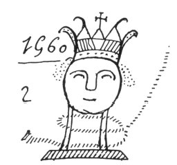 
FIG. 31--The lord of the katun. (Chumayel MS.).</td>
</tr>
</tbody>
</table>

divisions of the towns under their local chieftains [1](#fn_730) were gathered together. They began to
teach the holy faith and baptise us. [2](#fn_731) The foundations of the holy Cathedral
were laid, the public house of God, the widely extended house of God the
Father. Then the seven sacraments were established to take away &lt;our
sins&gt; . . . There began to be much labor in the center of the town .
. . the misery of the world. Then there was set up . . . the word of
God, which shall also come from the mouth of God the Father. Then the
fair complexioned boy [3](#fn_732) arrives, he
comes from heaven. The Virgin, as she is called, is the mother of the
seven planets. [4](#fn_733)

 

 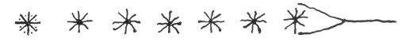  
FIG. 32--The seven planets. (Chumayel MS.).

 

It was in the ninth year of &lt;Katun&gt; 9 Ahau that they served [5](#fn_734) Christianity, just as it was written by
the prophet Chilam Balam on the stone of nine seals in heaven. 13
E¢nab [6](#fn_735) was the day there in heaven
as well as here on earth. &lt;There was&gt; the heavenly staff, the
heavenly fan. [7](#fn_736) The cord descended,
the word of God which came from on high all over the entire world. Nine
was its plate, nine was its cup. Oh make ready, Itzá. Nowhere shall

p. 151

you offer &lt;provocation&gt; to your guests. You shall give them food
to eat, and they shall also give you food to eat when they come. /

|          |
|----------|
| p\. 90 C |

The third &lt;katun&gt;.

<table data-align="RIGHT">
<colgroup>
<col style="width: 100%" />
</colgroup>
<tbody>
<tr class="odd">
<td data-valign="CENTER">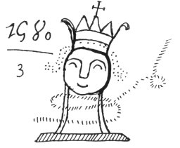 
FIG. 33--The lord of the katun. (Chumayel MS.)</td>
</tr>
</tbody>
</table>

Katun 7 Ahau is the third katun. The katun is established at
Ichcaanzihoo. [1](#fn_737) Yaxal Chac [2](#fn_738) is the face &lt;of the katun in the
heavens&gt; [3](#fn_739) to its ruler, to its
wise man, [4](#fn_740) while the drum
&lt;resounds&gt; below and the rattle &lt;resounds&gt; above. The
Plumeria is its bread, the Plumeria [5](#fn_741) is its water, the burden &lt;of the
katun&gt;. [6](#fn_742) Then begins the
lewdness of the wise men, [7](#fn_743) the
beckoning of carnal sin, the beckoning of the katun. The katun begins to
limp; it is all over the world. &lt;Carnal sin&gt; is its garment,
carnal sin is its face, carnal sin is its ... carnal sin is its sandal,
carnal sin is its head, carnal sin is its gait. They twist their necks,
they twist their mouths, they wink the eye, they slaver at the mouth, at
men, women, chiefs, justices, presiding officers, clerks, choir-masters,
&lt;everybody both&gt; great and small. [8](#fn_744) There is no great teaching. Heaven and
earth are truly lost to them; they have lost all shame. Then the
head-chiefs of the towns, the rulers of the towns, the prophets of the
towns, the priests of the Maya men are hanged. Understanding is lost;
wisdom is lost. Prepare yourselves, oh Itzá! Your sons shall see the
mirth of the katun, the jesting of the katun. Dissolute is the speech,
dissolute the face of the rogue to the rulers, to the head-chiefs. Seven
is the plate, seven the cup [9](#fn_745)

p. 152

\[paragraph continues\] &lt;of the katun&gt;, it is the word of God.
Much hanging &lt;of men&gt; is the charge [1](#fn_746) of the katun. /

|          |
|----------|
| p\. 91 C |

The fourth &lt;katun&gt;.

<table data-align="LEFT">
<colgroup>
<col style="width: 100%" />
</colgroup>
<tbody>
<tr class="odd">
<td data-valign="CENTER">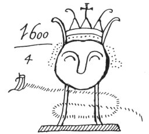 
FIG. 34--The lord of the katun. (Chumayel MS.)</td>
</tr>
</tbody>
</table>

Katun 5 Ahau is the fourth katun. The katun is established at
Ichcaanzihoo. Harsh is its face, harsh its tidings, to the ruler. There
is affliction [2](#fn_747) of the offspring of
woman and man, when it comes. Then begins the vexation by the devil in
the world. Then &lt;came&gt; the blinding of &lt;the face of the
god&gt;, [3](#fn_748) the face of Kauil, [4](#fn_749) in the four changing heavens, the four
changing roads. [5](#fn_750) Then hanging comes
to the world. The red &lt;rattlesnake&gt; [6](#fn_751) raises its head to bite; the
*holil*-&lt;*och*&gt; [7](#fn_752) raises its
head &lt;to bite&gt;. Men and women have few children. Then came ... the
end of the cigar, [8](#fn_753) after the lord
of the world was created ... he heard the dance. . . [9](#fn_754) There is the red flowered thing, the red
*xulab*, [10](#fn_755) the red
*uayah-cab*, [11](#fn_756) the accessory of the
rattle of the giver of our hearts in tribute through misery

p. 153

and vexation. It is the opossum chieftain, the fox chieftain, the
*ah-pic* chieftain, [1](#fn_757) the
&lt;blood-&gt;sucking chieftain, the avaricious ones of the town. He is
set up perchance, and then it is that your drum is beaten, my younger
brother &lt;my&gt; elder brother. He who lies in wait for you on all
fours is among you, the *tolil-och*. [2](#fn_758) &lt;It is&gt; his katun. The Plumeria
flower is his chair, as he sits on his throne. He is publicly seen in
the market-place on his mat, the two-day occupant of the throne, the
two-day occupant of the mat. 

<table data-align="LEFT">
<colgroup>
<col style="width: 100%" />
</colgroup>
<tbody>
<tr class="odd">
<td data-valign="CENTER"> 
FIG. 35--The lord of the katun. (Chumayel M.S.)</td>
</tr>
</tbody>
</table>

They deceive the town, the two town officials, the chieftain opossum and
he who lies in wait on all fours. They bring the pestilence, &lt;they
are&gt; the cause of ...; there was little of it formerly. You then
called them the Itzá. The rattle of the katun is shaken; there is the
treachery of the katun at Tancah Mayapan. There is the great tribute of
Zuyua. The kinkajou [3](#fn_759) claws the back
of the jaguar amid the affliction of the katun, amid the affliction of
the year; they are greedy for dominion. Many hangings are the charge of
the katun, when the chiefs of the town are hung there. There is an end
to the misery of the Maya men /

|          |
|----------|
| p\. 92 C |

when suddenly the men of Uaymil come to take vengeance on the
world. [4](#fn_760)

The fifth katun. 1620.

Katun 3 Ahau was the fifth katun. The katun was established at
Ichcaanzihoo. Ek-Cocah-mut [5](#fn_761) was its
face to the rulers, to the wise men. Antichrist [6](#fn_762) was its face to the rulers. Fire shall
flame up at the horn of the brockett

p. 154

at Ichcaanzihoo. [1](#fn_763) The skin of the
jaguar shall be spread out in the marketplace. [2](#fn_764) The water-tank [3](#fn_765) is its tidings. There are rains of
little profit, [4](#fn_766) rains from a rabbit
sky, [5](#fn_767) rains from a parched sky,
rains from a woodpecker sky, high rains, rains from a vulture sky,
crested [6](#fn_768) rains, deer rains. Then
descends the thrice raised leaf of the *zil*-palm. [7](#fn_769) There is fighting; there is a year of
locusts. The diminished remainder &lt;of the population&gt; is
hanged. [8](#fn_770) They are defeated in
war. [9](#fn_771) Sad shall be the havoc at the
cross-roads. [10](#fn_772) There are the lords
of the army; [11](#fn_773) their souls cry out
at the opening up of the town ...  [12](#fn_774)

Behold, I am Katun 3 Ahau. My town of Ichcaanzihoo is founded. Behold, I
am Caesar Augustus. [13](#fn_775) . . . I
receive my donation in the heart of the forest /  [14](#fn_776)

|          |
|----------|
| p\. 93 C |

p. 155

<table data-align="LEFT">
<colgroup>
<col style="width: 100%" />
</colgroup>
<tbody>
<tr class="odd">
<td data-valign="CENTER">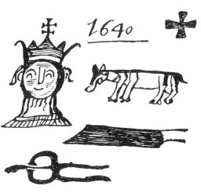 
FIG. 36--The lord of the katun. (Chumayel MS.)</td>
</tr>
</tbody>
</table>

The first &lt;katun&gt;. [1](#fn_777)

Katun I Ahau is the seventh [1](#fn_777) katun.
The katun is established at Emal. [2](#fn_778)
At that time Ix Puc-yola and Ox Ualacii [3](#fn_779) shall come. The rope shall descend, the
cord [4](#fn_780) shall descend. There comes
from heaven the word of the true path. Through it will come the
fulfilment of the word of the Lord of heaven, the true word.

The dog [5](#fn_781) is its tidings; the
vulture is its tidings. The flag is the second of the figures &lt;drawn
above&gt;. The opossum is its face to the rulers. Thrice impeded are
their thought and speech, thrice impeded their manhood, thrice impeded
their flint knife among the rulers, among the wise men. Then came
Hunpic-ti-ax [6](#fn_782) as an affliction, the
jaguar and Canul [7](#fn_783) for an
affliction. These were the eaters of their food, the destroyers of their
crops, the *boboch*, [8](#fn_784) the destroyer
of food. For seven years there is the affliction of Hunpic-ti-ax; for
seven years there is the affliction of Canul. Then the justice of our
Lord, God, shall descend upon carnal sin, upon the worthless rabble of
the town, [9](#fn_785) upon the lewd rogue, the
rascal. After that there shall come another word, another teaching, but
the Maya men shall not admit it to their hearts. The word of God, the
Father of Heaven, shall be sung among them that they may correct their
ways, that they may turn their backs upon their evil ways, the usages
among Maya men; but they will not wish /

|          |
|----------|
| p\. 94 C |

to listen to the word of God, when they should rather respect the judges
as their fathers. The hearts of the head-chiefs of the world shall be
sad. They believe little, nor do they even believe that. So you say. The
blessed among those in authority are set apart. Fire shall be kindled
with a fire-drill as a sign of the Maya Virgin. [10](#fn_786) Hunab-ku [11](#fn_787) is in his only virgin Church, [12](#fn_788) where he

p. 156

cries out. There is heard the word of the Lord of Heaven, the Lord on
earth. The entire world shall be sad when he comes. The wing of the land
shall shake, the center of the land [1](#fn_789) shall shake when he comes in his time.
Then there shall occur the obedience of the foreigners of Bentana [2](#fn_790) &lt;to&gt; the word of God. Thrice shall
the justice of our Lord descend to the world. Then a great army shall
descend upon the worthless rabble of the town, [3](#fn_791) that it may be known whether their faith
is truly firm. Then descended the governor. [4](#fn_792) There shall begin the tearing out of the
eyes: [5](#fn_793) of the rogue who incites
riot, [6](#fn_794) of the great rascal, of the
great hawk of the town, of the fox of the town. Then the eternal ruler
shall come to cut the cord from the burden of misery, the ruler who
appraises. [7](#fn_795) Then sickness, [8](#fn_796) the result of guilt, shall descend, the
punishment of all the world shall come from heaven, with it the drought.
At that time it shall be all over the world. The remainder of the
guardians of the sands, the guardians of the sea, shall be detained
together such as the people of Uaymil, [9](#fn_797) such as the people of Emal. [10](#fn_798) The rest of them shall be assembled in
great numbers by the sea at the end of the katun. Thus it is seen that
the fold [11](#fn_799) of the katun is brought
about. Then the flag shall be raised. [12](#fn_800) Then there is an end to the importunity
of the devil, of Antichrist. &lt;There is&gt; knife-thrusting strife,
purse-snatching strife, [13](#fn_801) strife
with the blow-gun, strife by trampling on

p. 157

people, stonethrowing strife. The fighting ends in the heart of the
forest [1](#fn_802) where Cæsar Augustus [2](#fn_803) receives his donation. &lt;There is&gt;
/

|          |
|----------|
| p\. 95 C |

sudden death with hunger; the vultures enter, the houses &lt;because&gt;
of the pestilence. There is sad havoc [3](#fn_804) with flies &lt;swarming&gt; at the
cross-roads, and at the four resting places &lt;at the four corners&gt;.
There is oppression of the younger brothers, [4](#fn_805) flaying [5](#fn_806) of the sons; it comes to the world. Then
arrives the ruler to propound the riddle [6](#fn_807) to them. His face is that of a
war-captain, of the son of God. After that there is the arrival of the
Bishop, the Holy Inquisition as it is called, and Saul. [7](#fn_808) They ask for penitence [8](#fn_809) and Christianity. There is an end to
greed, an end to vexation in the world. This shall be the end of its
prophecy: there is a great war. The Chan&lt;s&gt; shall rise up in war
with the five divisions of Chakan, [9](#fn_810)
an army of Chan&lt;s&gt; in Katun I Ahau. A parching whirlwind
storm [10](#fn_811) is the charge of the katun.
There is a series of rains, rain from a rabbit-sky [11](#fn_812) &lt;during&gt; the evil katun. There is
a sudden end to planting. Then the burden of legal summons descends;
tribute descends; the proof is sought, with seven fathoms . . ., [12](#fn_813) when the serving of God is strongly
urged.

p. 158

\[paragraph continues\] It is the end of receiving the money of
Antichrist. Antichrist does not come, our Lord God does not desire it.
The katun is not ruined [1](#fn_814) here in
our land by the natives of our land. This was the origin of Antichrist,
it was avarice; [2](#fn_815) but before the
coming of the mighty men [3](#fn_816) there was
no robbery by violence, there was no greed and striking down one's
fellow man in his blood, at the cost [4](#fn_817) of the poor man, at the expense [4](#fn_817) of the food of each and every one. In
time to come there shall be five fruits of the tree for the food of the
kinkajou, [5](#fn_818) the man of
Bentena. [6](#fn_819) Alas, there is sorrow in
the heart of the Lord of Heaven. Smallpox [7](#fn_820) is the end of the prophecy of the katun.
An army shall come forth from Havana &lt;with&gt; a fleet of thirteen
ships. [8](#fn_821) /

|          |
|----------|
| p\. 96 C |

The second &lt;katun&gt;.

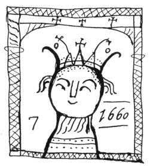  
FIG. 37--The lord of the katun. (Chumayel MS.)

Katun 12 Ahau is the eighth [9](#fn_822) katun
of the count. The katun is established at Zaclahtun. [10](#fn_823) Yaxal Chuen [11](#fn_824) is his face, Buleu-caan-chac [12](#fn_825) is his face to the rulers. He shall
manifest himself. He is in the sky by day; he is in the sky by night.
The great artisan, [13](#fn_826) the wise man
&lt;shall come&gt;. There are kind head-chiefs, kind chiefs; kindness
and joy is the law of the entire world. Poor men become rich. Abundance
of bread is the word of the katun. It is a rich year; there is an
accumulation of wealth also. The katun is good. The rains are good ones;
the fruit will form. Then they come forth from among the rocks to
Christianity, [14](#fn_827)

p. 159

where God is. There shall be neither the fox nor the kinkajou that will
bite. [1](#fn_828) Then penitence is sought of
the town officials, &lt;with the opening of&gt; the golden gates and the
town marriages in the official building. [2](#fn_829) Then our 

<table data-align="LEFT">
<colgroup>
<col style="width: 100%" />
</colgroup>
<tbody>
<tr class="odd">
<td data-valign="CENTER">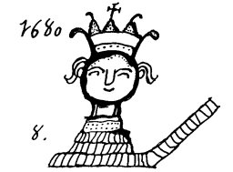 
FIG. 38--The lord of the katun. (Chumayel MS.)</td>
</tr>
</tbody>
</table>

sandals are sought for, [3](#fn_830) in the
time of our Christianity. This is a new day which dawns for us; this is
what you tell of today. This shall be the end of the katun of carnal
sin. [4](#fn_831) Soon [5](#fn_832) shall it end. The law of the ruler
comes. Then there shall come the Seven Mountains, [6](#fn_833) the Red Star, [7](#fn_834) and in the wind-swollen sky &lt;there
shall be&gt; the House of Storms, [8](#fn_835)
in the 17th tun. /

|          |
|----------|
| p\. 97 C |

The third &lt;katun&gt;.

Katun 10 Ahau, the katun is established at Chable. [9](#fn_836) The ladder [10](#fn_837) is set up over the rulers of the land.
The hoof shall burn; the sand by the seashore shall burn; the bird's
nest shall burn. [11](#fn_838) The rocks shall
crack &lt;with the heat&gt;; drought is the charge of the katun. It is
the word of our Lord God the Father and of the Mistress of Heaven, [12](#fn_839) the portent [13](#fn_840) of the katun.

p. 160

\[paragraph continues\] No one shall arrest the word of our Lord God,
God the Son, the Lord of Heaven and earth. There shall not be lacking
that which shall, through his power, come to pass all over the world.
Holy Christianity shall come bringing with it the time when the stupid
ones who speak our language badly [1](#fn_841)
shall turn from their evil ways. No one shall prevent it; this then is
the drought. Sufficient is the word for the Maya priests, the word of
God.

8 Ahau is the &lt;next&gt; fold, the fourth &lt;katun&gt;. /

|          |
|----------|
| p\. 98 C |

The fourth &lt;katun&gt;.

<table data-align="LEFT">
<colgroup>
<col style="width: 100%" />
</colgroup>
<tbody>
<tr class="odd">
<td data-valign="CENTER"> 
FIG. 39--The lord of the katun. (Chumayel MS.).</td>
</tr>
</tbody>
</table>

Katun 8 Ahau is the ninth katun. The katun is established at Izamal.
There is Kinich Kakmo. [2](#fn_842) The shield
shall descend, the arrow shall descend &lt;upon Chakanputun&gt; [3](#fn_843) together with the rulers of the land.
The heads of the foreigners to the land were cemented &lt;into the
wall&gt; [4](#fn_844) at Chakanputun. [5](#fn_845) There is an end of greed; there is an
end to causing vexation in the world. It is the word of God the Father.
Much fighting shall be done by the natives of the land.

p. 161

The fifth &lt;katun&gt;.

<table data-align="RIGHT">
<colgroup>
<col style="width: 100%" />
</colgroup>
<tbody>
<tr class="odd">
<td data-valign="CENTER">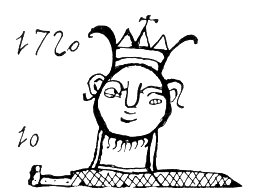 
FIG. 40--The lord of the katun. (Chumayel MS.)</td>
</tr>
</tbody>
</table>

Katun 6 Ahau is the tenth katun according to the count. The katun is
established at Uxmal. &lt;The katun monuments&gt; are set up on their
own bases. [1](#fn_846) Shameless is his
speech, shameless his face [2](#fn_847) to the
rulers. They shall be the inventors of lewd speech, [3](#fn_848) and then God the Father [4](#fn_849) shall descend to cut their throats
because of their sins. Then they shall be regenerated; the judgment of
our Lord God shall unite them until they enter into Christianity with
their families. As many as are born here on earth shall enter into
Christianity. /

|          |
|----------|
| p\. 99 C |

The first &lt;katun&gt;. [5](#fn_850)

<table data-align="RIGHT">
<colgroup>
<col style="width: 100%" />
</colgroup>
<tbody>
<tr class="odd">
<td data-valign="CENTER">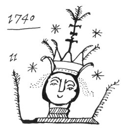 
FIG. 41--The lord of the katun. (Chumayel MS.)</td>
</tr>
</tbody>
</table>

Katun 4 Ahau is the eleventh katun according to the count. The katun is
established at Chichen Itzá. The settlement of the Itzá shall take place
&lt;there&gt;. [6](#fn_851) The quetzal shall
come, the green bird shall come. [7](#fn_852)
Ah Kantenal [8](#fn_853) shall come.
Blood-vomit shall come. [9](#fn_854)
Kukulcan [10](#fn_855) shall come with them for
the second time. &lt;It is&gt; the word of God. The Itzá shall come.

p. 162

The second &lt;katun&gt;.

<table data-align="LEFT">
<colgroup>
<col style="width: 100%" />
</colgroup>
<tbody>
<tr class="odd">
<td data-valign="CENTER">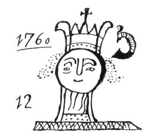 
FIG. 42--The lord of the katun. (Chumayel MS.)</td>
</tr>
</tbody>
</table>

Katun 2 Ahau is the twelfth katun. At Maya \[uaz\] Cuzamil [1](#fn_856) the katun is established. For half
&lt;the katun&gt; there will be bread; for half &lt;the katun&gt; there
will be water. &lt;It is&gt; the word of God. For half of it there will
be a temple [2](#fn_857) for the rulers. &lt;It
is&gt; the end of the word of God. /

|           |
|-----------|
| p\. 100 C |

The third &lt;katun&gt;.

The judgment. [3](#fn_858)

<table data-align="LEFT">
<colgroup>
<col style="width: 100%" />
</colgroup>
<tbody>
<tr class="odd">
<td data-valign="CENTER">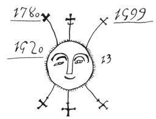 
FIG. 43--The lord of the katun. (Chumayel MS.)</td>
</tr>
</tbody>
</table>

It is Katun 13 Ahau according to the count. The katun is established at
Kinchil Coba, [4](#fn_859) the thirteenth
katun. The bouquet of the rulers of the world shall be displayed. [5](#fn_860) There is the universal judgment of our
Lord God. Blood shall descend from the tree and stone. Heaven and earth
shall burn. It is the word of God the Father, God the Son and God the
Holy Spirit. It is the holy judgment, the holy judgment [3](#fn_858) of our Lord God. There shall be no
strength in heaven and earth. Great cities shall enter into
Christianity, any settlements of people whatever, the great towns,
whatever their names are as well as the little towns, all over our land
of Maya Cuzamil Mayapan. &lt;It shall be&gt; for our two-day men,
because of lewdness . . . [6](#fn_861) the sons
of malevolence. At the end of our blindness and shame our sons shall be
regenerated from carnal sin. There is no lucky day for us. It is the
cause of death from bad blood, [7](#fn_862)
when the moon rises, when the moon sets, the entire moon, &lt;this
was&gt; its power; &lt;it was&gt; all blood. So it was with the good
planets &lt;which were&gt; looked upon as good. It is the end of the
word of God. The

p. 163

waters of baptism shall come over them, the Holy Spirit. They receive
the holy oil without compulsion; it comes from God. There are too many
Christians who go to those who deny the holy faith, . . .  [1](#fn_863) &lt;to&gt; the Itzá and the
*balams*. [2](#fn_864) There is then an end to
our losing/

|           |
|-----------|
| p\. 101 C |

. .

(Page 101 is left blank in the Chilam Balam of Chumayel. It contains a
note in a modern hand stating that a page of the book is missing here.)
/

|           |
|-----------|
| p\. 102 C |

------------------------------------------------------------------------

### Footnotes

[144:3](cbc27.htm#fr_691) Written in a
different hand on a blank page.

[144:4](cbc27.htm#fr_692) Women retain their
maiden names after marriage in Yucatan.

[145:1](cbc27.htm#fr_693) Written in still
another hand.

[145:2](cbc27.htm#fr_694) Chikin-chel (lit.
west woods) was the native province immediately to the south of Rio de
Lagartos. Its chief city was Chauachá, a name also given to the entire
province (Relaciones de Yucatan, II, p. 7).

[145:3](cbc27.htm#fr_695) Merida was founded on
the site of an ancient city named Ichcanziho in the older narratives. At
the time of the Spanish conquest it was called Tihoo, which still
continues to be the Maya name of the capital.

[145:4](cbc27.htm#fr_696) Maya *chinam*, a word
probably borrowed from the Nahuatl. It is defined by Pio Perez as
"town," but it can also mean subjects, as in the *Carta de diez
caciques*: "*a chinamob tulacal cech ah-tepale*," "all the subjects of
Your Majesty" (Martinez, Ed. 1930, p. 59). The reference is probably to
the establishment of *encomiendas*, but the towns may be meant.

[145:5](cbc27.htm#fr_697) Here probably a tun
of 360 days is meant instead of a year of 365 days, although the latter
is stated. No mention of the inhabitants of Chichen Itzá being driven
out at this time has yet been noted.

[145:6](cbc27.htm#fr_698) This suggests the
conquest of some ancient city at Uxmal long before the Xiu occupation of
the site, but we know nothing of either conquerors or conquered.

[145:7](cbc27.htm#fr_699) In spite of the
statement as it stands we believe that by 9 Cauac the name of the year
is intended. As we have previously noted, the Xiu head-chief was
murdered in a year 8 Cauac which lasted from the middle of 1536 to the
middle of 1537. The following year was 9 Kan. This paragraph has been
translated and there is a full discussion of the matter in Morley 1920,
pages 478-487. Yucatan had been abandoned by the Spaniards, and in 1537
a small expedition under Godoy returned to Champoton (Molina Solís 1896,
p. 551).

[146:1](cbc27.htm#fr_700) Ah-kin Euan, the
priest Euan.

[146:2](cbc27.htm#fr_701) Montejo established
his headquarters for a time at <u>¢</u>ibilkal, four leagues west or
southwest of Merida, just prior to capturing the latter site in 1541.
The mention here of an emissary from this town and the neighboring
Caucel indicates that the assembly took place in 1541 and not in 1537.
Molina Solís states that an embassy was sent from Mani to
<u>¢</u>ibilkal at this time (Molina Solís 1896, p. 624).

[146:3](cbc27.htm#fr_702) Where the edge of the
page is torn, the title or official name of Tutul Xiu has been supplied
from the Crónica de Oxkutzcab, page 66, apud Morley 1920, page 507. Here
it is given as Ah Dun Tutul Xiu.

[146:4](cbc27.htm#fr_703) The year 10 Kan
(*lahun Kan*) began in 1525 prior to Montejo's arrival and could not
recur for fifty two years. Probably 13 Kan (*oxlahun Kan*) is intended.
The latter year began in July 1541.

[146:5](cbc27.htm#fr_704) Nakuk Pech tells of
accompanying such an embassy to the Spaniards at Campeche (Brinton 1882,
p. 219).

[146:6](cbc27.htm#fr_705) The council at Mani
which discussed going to meet the Spaniards was also composed of
thirteen members. Possibly they were to be the actual ambassadors. Among
the Maya thirteen had a symbolic meaning.

[146:7](cbc27.htm#fr_706) The events mentioned
here occurred in Katun 11 Ahau and not in 9 Ahau.

[146:8](cbc27.htm#fr_707) Chactemal and
Tahuaymil are both names given to the native province better known as
Chetumal. It lies just north of British Honduras. *Ah-uaymi* is defined
as an animal resembling the opossum (Motul). Holtun Itzá might be
translated as "the gate of the Itzá." The district was the embarking
point for considerable commerce with what is now the Republic of
Honduras. *Cf.* Relaciones de Yucatan, II, page 179. There is a town
named Chichimila a few miles south of Valladolid. There was also a town
of Chactemal, or "Chetemal," located by Cogolludo (Bk. 9, Chap. 6) on
what is now Chetumal Bay, three leagues east of the mouth of the Rio
Hondo, called *Nohukum* by the Maya. This town was the capital of the
native province of the same name and the residence of Nachan Can, the
ruler or one of the rulers of the province (Herrera 1726, Dec. 3, book
4, chap. 2).

[147:1](cbc27.htm#fr_708) Written "Repuldoryo"
in the text. Evidently the writer knew little Spanish.

[147:2](cbc27.htm#fr_709) The idea of a seal on
a book was probably taken from the Spaniards, but the Maya were familiar
with clay stamps used to decorate pottery and possibly also to mark
designs on the human body.

[147:3](cbc27.htm#fr_710) This is the book
mentioned on pages 13 and 29 of the Tizimin MS. and on page 115 of the
Codex Perez. This book is stated to have been either written or copied
on a day 11 Chuen, 18 Zac, February 15th, 1544.

[147:4](cbc27.htm#fr_711) *Cf.* page 131, note
 [3](cbc22.htm#fn_609).

[147:5](cbc27.htm#fr_712) Mention has already
been made in this book of Holtun Balam and Ah Mex-cue. They appear to
have been contemporaries of Hunac Ceel (*Cf.* pp.
[69](cbc07.htm#page_69) and [74](cbc07.htm#page_74)). Zacal Puc is
probably the "Cacal Puc" referred to in the famous Valladolid law-suit
of 1618 (*Cf.* Brinton 1882, p. 117). He was one of several leaders who
came to found towns at Chichen Itzá, Bacalar and on the coast of Yucatan
to the north. It is specifically stated that these men came from Mexico,
and that they ruled in Yucatan for a long time. The period of their
arrival is not recorded here, but we find the statement elsewhere that
the Maya had been subject to certain Mexicans six hundred years prior to
the Spanish Conquest (Aguilar 1892, p. 92).

[147:6](cbc27.htm#fr_713) *Cf.* p. 89, note
 [4](cbc14.htm#fn_239). The reference is to the catechism which the
chiefs were obliged to undergo every katun to prove that they held their
positions legitimately.

[147:7](cbc27.htm#fr_714) Nothing is known of
this personage. Coyi is a well-known family name among the Maya.

[147:8](cbc27.htm#fr_715) The Maya name for
Merida.

[147:9](cbc27.htm#fr_716) Here we have the
second and later series of katun-prophecies described in Appendix D.

[148:1](cbc27.htm#fr_717) A reference to the
red beards of some of the Spaniards.

[148:2](cbc27.htm#fr_718) Maya, *nicté*,
literally the Plumeria flower, and figuratively the carnal sin for which
it was the symbol. *Cf.* page 104, note  [15](cbc15.htm#fn_360).

[148:3](cbc27.htm#fr_719) Here instead of the
Maya word for circle, a ring is drawn. There is a stereotyped expression
in Maya meaning the same thing: *zac petahom* canal, which frequently
occurs in the prophecies and is usually associated with drought ([p.
164](cbc28.htm#page_164)). Here, as in Christian legends, it appears to
be a halo encircling a celestial vision, the child Jesus, "the
fair-skinned boy."

[148:4](cbc27.htm#fr_720) Maya, *uaom che*. The
Spanish missionaries translated this as cross (Villagutierre 1701, p.
37). It was probably the symbolic tree of Maya mythology. According to
the prophecy of Chilam Balam a bird was perched on it (*Cf.* [p.
167](cbc29.htm#page_167)).

[148:5](cbc27.htm#fr_721) Literally, the
distance a cry can be heard, the distance after which the traveler sets
down his pack and rests.

[148:6](cbc27.htm#fr_722) Maya, *mut*, may mean
either news, or an unidentified bird of the Cracidæ family (Maler 1908,
p. 132). In Chol, Chontal and Tzotzil *mut* is a general term meaning
bird (Stoll 1884, p. 54). *Cf.* page 100, note  [4](cbc15.htm#fn_318).

[148:7](cbc27.htm#fr_723) Probably a reference
to the construction of Spanish cities and churches with native labor.

[148:8](cbc27.htm#fr_724) Maya, *zac ibteelob*;
the translation is doubtful, but certainly it is a term of contempt.
Compare the use of the same expression on pages [155](#page_155) and
[156](#page_156).

[148:9](cbc27.htm#fr_725) Alternative
translation: their fathers.

[149:1](cbc27.htm#fr_726) A term probably
applied to the natives by the Toltec invaders. *Cf.* prophecy of Chilam
Balam, page 169, note  [1](cbc29.htm#fn_920).

[149:2](cbc27.htm#fr_727) Maya, *uuc Ahau*; 11
Ahau (*buluc Ahau*) appears to be intended.

[149:3](cbc27.htm#fr_728) Maya, *u tza cizin*,
a phrase often encountered. *Tza* is to harass with an importunate
demand or with a law-suit.

[149:4](cbc27.htm#fr_729) *Cf.* page 168, note
 [3](cbc29.htm#fn_907).

[149:5](cbc27.htm#fr_730) A figure of speech
meaning the coefficient of the day Ahau on which the katun ends.

[149:6](cbc27.htm#fr_731) Possibly *Ah
Mayapan*, the man of Mayapan, is intended.

[149:7](cbc27.htm#fr_732) We have already noted
a similar distortion of Christian teaching in these pages. *Cf.* page
107, note  [2](cbc16.htm#fn_384) and Appendix G.

[150:1](cbc27.htm#fr_733) Maya, *hool-poop*,
literally "he who sits at the head of the mat." These scattered hamlets
were destroyed by the missionaries after the Conquest and their
inhabitants forced to live together in the towns where they could more
easily be christianized. The practise was criticized in the reports of
the encomenderos, as it caused a serious diminution of the native
population. *Cf.* Relaciones de Yucatan, II, page 187.

[150:2](cbc27.htm#fr_734) Maya, *yocol haa tac
polob*, literally "the water entered to our heads."

[150:3](cbc27.htm#fr_735) The image of the
child Jesus, and not the Virgin, as the wording of the text might
suggest.

[150:4](cbc27.htm#fr_736) Maya, *chachac ek*,
the red stars. By *chac ek* the morning star is usually meant, probably
the planet Venus. In the Venus table of the Dresden Codex the glyph for
red is always prefixed to the Venus-sign. Here, however, the seven
planets of medieval astronomy are plainly intended: Sun, Moon, Mercury,
Venus, Mars, Jupiter and Saturn.

[150:5](cbc27.htm#fr_737) Maya, *taninah*. The
translator is not familiar with this word. The translation given is
based on its resemblance to *tanlah*, meaning to serve.

[150:6](cbc27.htm#fr_738) It has already been
noted on page 125, note  [4](cbc21.htm#fn_552), that the year preceding
1 Cuauac ended on a day 13 E¢nab, which could have fallen in 1568. This
would be approximately the ninth year after the date given above as the
beginning of Katun 9 Ahau.

[150:7](cbc27.htm#fr_739) On pages 8 and 9 of
the Crónica de Oxkutzcab the Tutul Xiu ruler holds a fan as a symbol of
authority.

[151:1](cbc27.htm#fr_740) Merida.

[151:2](cbc27.htm#fr_741) Yaxal Chac could be
translated: the green rain-god. "Chaac was similarly a giant who taught
agriculture, whom they afterward considered the god of bread, of water,
of thunder and lightning" (Motul).

[151:3](cbc27.htm#fr_742) Avendaño tells us of
similar katun-prophecies in the hieroglyphic books of the Itzá at
Tayasal. Each was associated with an "idol," a priest and a locality.
The so-called "face of the katun" is evidently that of the god himself
as he appears in the heavens, possibly a constellation. Among the gods
mentioned in a similar connection with the various katun-prophecies are
the familiar names of Ah-Cocah-mut, Itzamna, Kinich Kakmo, Ekchuuah and
Lahun Chan. *Cf.* Appendix D. The words supplied here are taken from
Codex Perez, page 157 and the Tizimin MS. page 23.

[151:4](cbc27.htm#fr_743) The wise man
mentioned here may be the priest of the katun-prophecy.

[151:5](cbc27.htm#fr_744) *Cf.* page 104, note
 [15](cbc15.htm#fn_360).

[151:6](cbc27.htm#fr_745) Supplied from Tizimin
page 29.

[151:7](cbc27.htm#fr_746) Landa describes
religious festivals at which the most unbridled license prevailed (Landa
1928, p. 156).

[151:8](cbc27.htm#fr_747) One of the
conquerors, Juan Farfan, witnessed a number of pagan festivals and tells
us that "as they went on dancing and singing, they gave to each of those
who danced and sang a small cup &lt;of *balché*&gt; to drink. They gave
it to them so frequently that they became drunk with it, and did and
said so many extravagant things and made such grimaces that it was a
sight to behold" (Relaciones de Yucatan, II, p. 188).

[151:9](cbc27.htm#fr_748) *Cf.* page 149, note
 [5](#fn_727).

[152:1](cbc27.htm#fr_749) The charge, or
burden, of the katun was its destiny, usually an unpleasant one.

[152:2](cbc27.htm#fr_750) Maya, *Chibil*, may
mean either pain and affliction or being eaten or bitten. Early reports
state that ceremonial cannibalism in connection with human sacrifice did
not exist in northern Yucatan, but Avendaño ascribes the practise to the
Itzá of Tayasal (Means 1917, p. 150).

[152:3](cbc27.htm#fr_751) Supplied from a
parallel version of this prophecy (Tizimin, p. 30). We have noted a
reference to the blindfolding of a god on page [99](cbc15.htm#page_99),
and the Dresden Codex, page 56, contains a picture of a blindfolded god.

[152:4](cbc27.htm#fr_752) Probably the name of
a divine patron of the crops. *Kauil* can mean food, and Itzamna-Kauil
was a well-known sky-god.

[152:5](cbc27.htm#fr_753) Alternative
translation: the four resting places at the four corners of the heavens,
like the four corners at the crossroads where travelers set down their
loads and rest. The same verb, *hel*, can mean either to change or to
rest.

[152:6](cbc27.htm#fr_754) Supplied from
Tizimin, page 30. The page is badly water-stained. The Motul dictionary
states that there were four varieties of rattlesnakes, red, white, black
and yellow.

[152:7](cbc27.htm#fr_755) Literally
hole-opossum, *Marmosa gaumeri* Osgood, an opossum which burrows under
stones and logs and has a small gray body. Like the other animals
mentioned here, it symbolized certain warrior chiefs. *Cf.* Roys 1931,
page 333, and Appendix F.

[152:8](cbc27.htm#fr_756) *Chamal*, a roll or
tube of tobacco for smoking (Motul). The modern Maya believe in four
supernatural protectors, the Balams, who move abroad at night. The
shooting stars are believed to be glowing stumps of the cigar smoked by
the Balams, which they throw away (Brinton 1890, p. 174). *Chamal-¢utan*
is a small comet (Motul).

[152:9](cbc27.htm#fr_757) A space in the text
indicates that the Maya compiler found the text he copied illegible. The
space is followed by the words *bot* (to pay) and *bat* (hatchet, hail)
which are not translated here.

[152:10](cbc27.htm#fr_758) *Xulab*: defined as
certain stinging ants (Motul). They move in batallions, have long legs,
are found in dry places and destroy the leaves of plants (Pacheco Cruz
1919, p. 50). Their sting caused an eclipse of the moon (Aguilar 1900,
p. 83).

[152:11](cbc27.htm#fr_759) *Chac uayah-cab*,
described as a red stinging ant which lives underground
([Pacheco](errata.htm#3) Cruz 1919, p. 50). The translator does not
understand the connection between these insects and the diviners rattle.
Compare the mention of "coagulated blood on the red rosette of the
rattle" on page [90](cbc14.htm#page_90) of the present work.

[153:1](cbc27.htm#fr_760) Ah-pic is a species
of Hemiptera (Martinez' note to Motul). It is described as a flying
cimex, so it appears to be a blood-sucking insect.

[153:2](cbc27.htm#fr_761) The meaning of this
expression is uncertain. *Och* is the opossum, and *tolil* difficult to
translate in this context. There was a certain dance called "*ix
tolil*."

[153:3](cbc27.htm#fr_762) For the figurative
use of the word, *kinkajou*, see Appendix F.

[153:4](cbc27.htm#fr_763) Alternative
translation: to collect the debts of the world. Uaymil was another name
for the native province of Chetumal, or Chactemal, in southeastern
Yucatan, just north of what is now British Honduras.

[153:5](cbc27.htm#fr_764) Literally, the Black
Cocah-mut. Yax-Cocah-mut was one of the regents of the Muluc Years
(Landa 1929, p. 28). The name is spelled Yax-Cocay-mut in the Tizimin
MS. (p. 25) which might be translated as "the green fire-fly bird."
Avendaño saw at Tayasal a mask set in a stone column which he identified
as Ah-Cocah-mut. "I came to recognize it, since I had already read about
it in their old papers and had seen it in their Anahtes, which they use,
which are books of the barks of trees, polished and covered with lime,
in which by painted figures and characters, they have foretold their
future events. By which means I knew that there was found in the said
Peten Itzá the said idol of Yaxchecab, that of Cocahmut, that of Ytzimna
(Itzamna) Kauil, which means "horse of the devil" (Bowditch, unpublished
translation p. 67. Avendaño, original MS., f. 29 r.). Yax-Cocah-mut is
probably one of the names of Itzamna. None of the hieroglyphic
prophecies has survived, but it is evident that the present series
follows the original model.

[153:6](cbc27.htm#fr_765) Written "Antachristo"
in the text.

[154:1](cbc27.htm#fr_766) Possibly a reference
to the firing of a pistol, which may have looked like the horn of a
brockett or that of a goat to the natives.

[154:2](cbc27.htm#fr_767) Maya, *haylahom u
keuel chac-bolay*. This expression evidently has the same figurative
meaning as that of *zin balam* (literally "spread the jaguar") which is
defined as "to fight or to go to war" (Motul).

[154:3](cbc27.htm#fr_768) The Maya word *pek*
primarily means a dog, and among its rather numerous secondary meanings
are water-tank, chills and fever, and a certain skin disease. We might
conclude that the "tidings," or fortunes, of the katun were chills and
fever; but the statement following that it was a period of drought
suggests rather that people were obliged to use the stagnant water of
the tanks, when the rains failed. It is also quite possible that *pek*,
the dog, had a symbolic meaning unknown to us, perhaps merely that the
news is bad.

[154:4](cbc27.htm#fr_769) Literally, white or
pale profit. "*Zac*, in composition with certain expressions, diminishes
their significance and denotes a certain imperfection" (Motul).

[154:5](cbc27.htm#fr_770) The precise
significance of these figures of speech is nowhere explained. We find it
rain from a rabbit sky" (*thul caan chacil*) associated with a period of
drought on page 1 of the Tizimin MS.

[154:6](cbc27.htm#fr_771) Maya *thelen chacil*.
*Thilen chacil* would mean interrupted rains.

[154:7](cbc27.htm#fr_772) The *zil* is reported
as an unidentified variety of palm (Martínez letter). ceremonial
significance is unknown, but the Tizimin version of this prophecy treats
it as a misfortune (Tizimin MS., p. 30).

[154:8](cbc27.htm#fr_773) *Ox c~~h~~uylah u
xuthen*, or *ox c~~h~~uilah xotem*, is a stereotyped phrase which
Brinton has translated: "three generations hang there" (on the tree). An
alternative translation would be: the diminished remainder are driven
far away. *Cf.* Brinton 1882, page 127.

[154:9](cbc27.htm#fr_774) Maya, *ox cuchlahom
yal max*, is another stereotyped phrase. *Cuch-chimal* means to be
defeated in war, i. e. to bear one's shield on one's back in retreat.
*Chimal*, however, is a borrowed Nahuatl word, and we find the original
Maya expression only in the verb, *maax-cinah*, to employ a shield in
defense, and its derivative *maax*, a man who defends himself well with
his shield. *Yal max* could be a little shield.

[154:10](cbc27.htm#fr_775) At a time of civil
disorder and revolution we found the "havoc" occurring in the courtyards
of the nobles (p. 91, note 7). Now, however, there is defeat in war.
Possibly the retreating soldiers are ambushed at a cross-road. The
Tizimin version adds the detail that flies swarm, presumably over the
corpses (Tizimin, p. 30).

[154:11](cbc27.htm#fr_776) Alternative
translation: the masters of the katun.

[154:12](cbc27.htm#fr_777) The text is
unsatisfactory and the translation here is uncertain. Also the
manuscript is water-stained. One mutilated sentence has been left
untranslated: "*nomal Ytza e . . . talii*."

[154:13](cbc27.htm#fr_778) Written "Ceçar
Agustoe" in the original. A discussion of the use of this name will be
found on page 157, note  [2](#fn_803).

[154:14](cbc27.htm#fr_779) There is a break in
the text here indicating that one or more pages are missing.

[155:1](cbc27.htm#fr_781) This is the sixth
katun. The reason for starting a new count here is not apparent.

[155:2](cbc27.htm#fr_782) On page 82 it was
implied that Emal was another name for Izamal, and the same city may be
meant here, but there is another Emal on the northern coast of Yucatan.

[155:3](cbc27.htm#fr_783) Written Ix Puc-yol-ha
and Ix Ual-icim on page 25 of the Tizimin MS.

[155:4](cbc27.htm#fr_784) Perhaps a reference
to the "living rope" (*cuxan zum*), which is a road suspended in the sky
and extending from Tulum and Cobá to Chichen Itzá and Uxmal (Tozzer
1907, p. 153).

[155:5](cbc27.htm#fr_785) *Cf.* p. 154, note
 [3](#fn_765).

[155:6](cbc27.htm#fr_786) Literally, eight
thousand warts. Possibly a disease and not a personage is meant.

[155:7](cbc27.htm#fr_787) Canul is probably a
reference to an important family of Nahua origin. They settled in the
province of Ah Canul after the fall of Mayapan. Landa. calls them
Mexican mercenaries.

[155:8](cbc27.htm#fr_788) The *boboch* is
identified by Pio Perez as a fabulous animal, but he gives no
particulars.

[155:9](cbc27.htm#fr_789) *Cf.* p. 148, note 8.

[155:10](cbc27.htm#fr_790) During the colonial
period the most famous shrine in Yucatan was that of the Virgin of
Izamal, where many cures were performed. Here, however, we are reminded
of Zubuy-kak, the Fire-Virgin, who was the goddess of little girls. She
was said to be the deified daughter of a ruler, a member of an order of
virgins or nuns who served the gods (Lizana 1893, ff. 39-40).

[155:11](cbc27.htm#fr_791) Hunab-ku was "the
only living and true god, also the greatest of the gods of the people of
Yucatan" (Motul 1930, p. 404).

[155:12](cbc27.htm#fr_792) Written "Yglesia" in
the text.

[156:1](cbc27.htm#fr_793) *Cf.* page 126, note
 [3](cbc21.htm#fn_557).

[156:2](cbc27.htm#fr_794) Maya, *ah bentana*,
and written *ah bentena* on page [158](#page_158). The name has not been
identified. Possibly the rendering should be: the obedience of the men
of Bentana &lt;to&gt; the foreigners &lt;and to&gt; the word of God.

[156:3](cbc27.htm#fr_795) This translation is
inferred from the three contexts in which it occurs. *Cf.* page 148,
note  [8](#fn_721), and page 155, note  [9](#fn_785).

[156:4](cbc27.htm#fr_796) Maya, *ah mektan*.
*Cf.* Brinton 1882, page 124, note  [3](cbc20.htm#fn_538). These
prophecies abound in references to a time when an avenging ruler will
come and punish certain immoral and oppressive chieftains who are
designated as birds or animals. *Cf.* Appendix F.

[156:5](cbc27.htm#fr_797) On page
[92](cbc14.htm#page_92) we have noted this punishment in connection with
the upstart chief who is not of the proper lineage. The Dresden Codex
(p. 3) depicts a bird tearing the eye from a sacrificial victim.

[156:6](cbc27.htm#fr_798) Maya, *u cuyil cab*,
literally the moth in the hive. Any bee-keeper is familiar with the
results of this phenomenon. A very similar phrase, *yilkil cah*, the
moth of the town, has the figurative meaning: "a great rascal, like the
moth of the town, who incites it to riot and destroys it" (Motul). It is
an interesting commentary on the vicissitudes of civic life in ancient
Yucatan.

[156:7](cbc27.htm#fr_799) Maya, *xotom ahau*,
the ruler who cuts, or the ruler who appraises and judges.

[156:8](cbc27.htm#fr_800) Maya, *koch*, which
means either guilt or the sickness which is the punishment of guilt. It
can also mean a burden or obligation.

[156:9](cbc27.htm#fr_801) Uaymil is another
name for the Province of Bacalar in southeastern Yucatan.

[156:10](cbc27.htm#fr_802) Here the town of
Emal on the north coast is evidently meant. We are reminded of the
mounds found on the seashore in that region.

[156:11](cbc27.htm#fr_803) Probably the end or
turn of the katun is meant.

[156:12](cbc27.htm#fr_804) Here the meaning of
the Maya phrase, *tix ucham ua pani*, is doubtful. It may be an archaic
expression, but it seems more like a corruption of the original text.

[156:13](cbc27.htm#fr_805) *Cf.* page 79, note
 [2](cbc08.htm#fn_171). These are all stereotyped phrases.

[157:1](cbc27.htm#fr_806) Among the Maya wars,
whether civil or foreign, appear to have ended by driving the conquered
into the forest.

[157:2](cbc27.htm#fr_807) We are unable to
explain this allusion, but it is of interest to note that in the Tizimin
version of the preceding prophecy we find the name of Ah Uuc-yol-zip
substituted for that of Cæsar Augustus in what is practically the same
statement; "*ti taliob tan yol che ti ual tu kamic u matan Ah
Uuc-yol-zip uale*." Tizimin, page 30. Ah Uuc-yol-zip might be the modern
Zip, or protector of the deer, to whom Dr. Redfield still finds the
hunters making offerings.

[157:3](cbc27.htm#fr_808) *Cf.* p. 91, note
 [7](cbc14.htm#fn_254).

[157:4](cbc27.htm#fr_809) *Cf.* p. 149, note
 [1](#fn_723).

[157:5](cbc27.htm#fr_810) Translation doubtful.
The text might be rendered either: *¢i-¢il*, flayed, or *¢i¢-il*,
overcome in a contest.

[157:6](cbc27.htm#fr_811) *Cf.* p. 89, note
 [5](cbc14.htm#fn_240). The use of this word is of ethnological
interest, as the riddle is supposed to have been absent from aboriginal
culture in America, and first introduced by Europeans. Already in the
Sixteenth Century Motul dictionary we find the word used here,
*naatal-nat*, defined: "*enigma, o que es cosi cosa dezirla*."

[157:7](cbc27.htm#fr_812) *Cf.* p. 123, note
 [8](cbc20.htm#fn_530).

[157:8](cbc27.htm#fr_813) Maya, *okolal*. It
seems likely that *ocolal* is intended, which would give the passage the
meaning: there is an inquiry into their faith.

[157:9](cbc27.htm#fr_814) Chakan was the name
of the native province or geographical division in which Merida was
founded. We have no record of any outstanding family ruling there, as
the Xius, Chels, Cocoms, Cupuls, Peches, Cochuahs and Canuls ruled in
other provinces. Nor do we know of any war in Chakan in a Katun 1 Ahau.
The battle fought by Montejo near Merida in 1541 took place in Katun 11
Ahau; also the actual fight was just over the border of Chakan in the
Province of Ceh Pech. The Can family is said to have been predominant in
the Province of Chetumal (Chactemal), and there was an uprising of the
natives there in 1636, which lasted all during the Katun 1 Ahau which
ensued. Very little fighting occurred, however (Cogolludo 1868, Book 11,
Chap. 12).

[157:10](cbc27.htm#fr_815) Maya, *kakal mozon
chac*, lit. parched or fiery whirlwind storm. Dr. Redfield reports that
the *kakal-mozon ik* (wind) is a disease bringing wind which comes from
cenotes and caves containing water. It is summoned by whistling to burn
the fields when cleared for planting.

[157:11](cbc27.htm#fr_816) *Cf.* p. 154, note
 [5](#fn_767).

[157:12](cbc27.htm#fr_817) The following two
words, *yibnel cab*, have not been translated. *Ibnel* is defined as "a
cloth or net, or else the placenta in which the fetus is wrapped at
birth. Item, the umbilical cord of the fetus at birth" (Motul). *Cab*
could mean honey, hive, town, region, world, low and red earth.

[158:1](cbc27.htm#fr_818) Alternative
translation: the army is not ruined, etc. This does not fit the context.

[158:2](cbc27.htm#fr_819) Maya, *¢utul¢util*.
The word also means peddling something from house to house. For a
reference to Antichrist, cf. page 79, note  [6](cbc08.htm#fn_175).

[158:3](cbc27.htm#fr_820) A term applied to the
Spaniards.

[158:4](cbc27.htm#fr_822) Maya, *tu muk*,
literally: at the suffering or endurance, etc.

[158:5](cbc27.htm#fr_823) *Cf.* Appendix F, for
the significance of this animal. The preceding reference is obscure.

[158:6](cbc27.htm#fr_824) *Cf.* page 156, note
 [2](#fn_790).

[158:7](cbc27.htm#fr_825) As noted on page
[120](cbc19.htm#page_120), this period was distinguished for its
epidemic of yellow fever rather than for any conspicuous outbreak of
smallpox.

[158:8](cbc27.htm#fr_826) Probably a reference
to the story of Antonio Martínez. *Cf.* [p. 123](cbc20.htm#page_123),
and p. 157, note  [7](#fn_808).

[158:9](cbc27.htm#fr_827) This katun is really
the seventh in the series.

[158:10](cbc27.htm#fr_828) This place-name has
survived only as the name of a hacienda in the Department of Izamal. It
is, however, frequently associated with Mayapan in these pages and may
be another name for this city.

[158:11](cbc27.htm#fr_829) Yaxal Chuen appears
to be an important deity and probably a constellation as well. The name
might be translated as the green or first artisan. We find on pp. 23, 24
of the Codex Peresianus a glyph composed of the elements, *yax* and
*chuen*, which may refer to this deity (Gates 1910, p. 30). These are
the pages containing the figures which represent the thirteen divisions
of the Maya zodiac.

[158:12](cbc27.htm#fr_830) The text appears to
be corrupt here.

[158:13](cbc27.htm#fr_831) Maya, *hunac
ah-menil*. Among the modern Maya *ah-men* means sorcerer.

[158:14](cbc27.htm#fr_832) As a result of the
five years of famine, 1650 to 1654, enormous numbers of Indians had left
their towns and were scattered in the forests. In 1652 an unsuccessful
attempt had been made by the Spanish authorities to bring them back to
their homes, but it seems likely that during the following katun they
gradually returned to their homes. *Cf.* Molina Solís 1910, p. 231.

[159:1](cbc27.htm#fr_833) *Cf.* Appendix F.

[159:2](cbc27.htm#fr_834) The golden gates (*u
puertail takin*) are probably the gilded gates to the chancel of the
church. The town marriages perhaps refer to the marriages of many people
at one time, when the people had returned to the towns after living for
some years in the forests and mating without ecclesiastical sanction.
Can-kaz-na, here translated as the official building, means literally
"the house of four apartments."

[159:3](cbc27.htm#fr_835) The return to the
towns meant also a return to the regulations governing the Indians. One
such law regarding dress reads: "that all shall manage to wear footgear,
at least hemp sandals" (Cogolludo 1868, book 5, chap. 19).

[159:4](cbc27.htm#fr_836) Maya, *nicte katun*,
literally the katun of the Plumeria flower. *Cf.* page 104, note
 [15](cbc15.htm#fn_360). This is the fourth katun-prophecy in which we
find this reference; the others were Katuns 11, 7 and 5 Ahau.

[159:5](cbc27.htm#fr_837) Maya, *conbil*, also
means that which is for sale.

[159:6](cbc27.htm#fr_838) We are reminded of
the "Nine Mountains" mentioned on page [139](cbc25.htm#page_139).

[159:7](cbc27.htm#fr_839) Maya, *chac ek*, the
morning star. (Motul.) *Cf.* p. 150, note  [4](#fn_733). In Mexican
mythology we find a close association between Quetzalcoatl and the
planet Venus.

[159:8](cbc27.htm#fr_840) The text reads *pa
hool chace*, which we have rendered as Pap-hool-chac and which is
probably the Ppappholchac mentioned by Lizana, who translates it "*casa
de las cabezas y rayos*." It was the name of one of the pyramids at
Izamal and was said to be the dwelling of the priests of the gods
(Lizana 1893, p. 5).

[159:9](cbc27.htm#fr_841) Chablé was a town of
some importance in the district of Bacalar at the time of the Conquest,
but it was already depopulated in Cogolludo's time (Cogolludo 1868, Book
2, chap. 6). Berendt lists a port of that name in Yucatan, also a town
in Tabasco (Berendt, Nombres proprios en lengua Maya). It is still a
family name in Yucatan.

[159:10](cbc27.htm#fr_842) A possible
alternative translation could be: the ladder is forcibly broken over,
etc. We do not know the significance of the ladder among the Maya,
possibly one is intended in the accompanying picture. We find a picture
of a ladder on page 34 of the Dresden Codex in connection with a
ceremony said to represent a human sacrifice.

[159:11](cbc27.htm#fr_843) Extensive forest
fires have never been reported from Yucatan, and we probably have here
only an exaggerated description of extreme heat and drought.

[159:12](cbc27.htm#fr_844) Maya, *u colel
caan*, a term usually applied to the Holy Virgin.

[159:13](cbc27.htm#fr_845) Maya, *u ye katun*,
literally, that which the katun sets before us. *U yekabtun* would mean
an offering of precious stone.

[160:1](cbc27.htm#fr_846) Maya, *ah nunob*, a
term applied several times to the Itzá in these pages. This would
indicate a foreign origin for the Itzá.

[160:2](cbc27.htm#fr_847) This reference to
Kinich Kakmo is capable of two explanations. It may be merely a
reference to the god of this name as the idol or presiding deity of the
katun. It is very possible, however, that it is a historical allusion to
the man, Kinich Kakmo, who was later deified. Gaspar Antonio Chi
collaborated with Cristóbal Sánchez in writing a report which states
that "in course of time the inhabitants of the said town (Izamal) were
conquered by Kak-u-pacal and a hundred valorous captains formerly of the
town of Mayapan, and that those who founded this place were called
Kinich-Kabul, Kinich Kakmo and others from whom descend the Xool, Mo and
Coyi &lt;families&gt;, Indians so named in this province" (Relaciones de
Yucatan, I, pp. 119-120). Mo or Moo (parrot) is still a common family
name among the Maya, and it will be noted that it is one of the elements
of the name, Kinich Kakmo, which means sun-eyed fire-parrot. *Cf.* p.
141, note  [2](cbc26.htm#fn_671).

[160:3](cbc27.htm#fr_848) Supplied from the
Tizimin version of this prophecy which is more complete (Tizimin p. 32).
One of the objects in the accompanying picture may be intended for a
shield and two arrows.

[160:4](cbc27.htm#fr_849) Supplied from Tizimin
(p. 32). The Maya *pak*, here translated as wall, can also mean a
water-tank. Motul, Spanish-Maya portion. This is the only mention of the
episode of cementing human heads into a wall that we find anywhere.
Possibly what is meant is that a tzompantli was erected, and the stakes
transfixing the heads were set in a wall of masonry.

[160:5](cbc27.htm#fr_850) For the accounts of
the sojourn of the Itzá at Chakanputun see page
[136](cbc24.htm#page_136) and page [141](cbc26.htm#page_141), note 4.
Chakanputun is generally believed to be the modern Champoton in
southwestern Yucatan. The translator is uncertain whether or not to
accept this identification, as excellent reasons could be cited both for
and against it.

[161:1](cbc27.htm#fr_851) It is suggested here
that at Uxmal they erected stelæ as katun monuments.

[161:2](cbc27.htm#fr_852) The reference is
probably to the idol of the katun.

[161:3](cbc27.htm#fr_853) Here doubtless
referring to the introduction of certain erotic religious festivals like
the one described by Landa (1928, p. 156).

[161:4](cbc27.htm#fr_854) The Tizimin version
of this prophecy substitutes the expression "*u kochob* (the punishment
of their guilt) shall descend," instead of "God the Father."

[161:5](cbc27.htm#fr_855) Here the count
recommences for no apparent reason. The feathers in the picture no doubt
represent Kukulcan, or Quetzalcoatl, the feathered serpent. The stars in
the picture may refer to the four Venus periods of the Dresden Codex. It
will be recalled that the Mexicans believed that Quetzalcoatl became the
planet Venus after his death.

[161:6](cbc27.htm#fr_856) This agrees with the
Maya chronicles which place the second occupation of Chichen Itzá by the
Itzá in a Katun 4 Ahau which fell in the Tenth Century A.D. (Appendix
H).

[161:7](cbc27.htm#fr_857) *Cf.* page 63, note
 [6](cbc06.htm#fn_33), and page 121, note  [4](cbc20.htm#fn_498).

[161:8](cbc27.htm#fr_858) Nothing is known of
this personage. *Kante* is a tree which yields a yellow dye.

[161:9](cbc27.htm#fr_859) *Cf.* page 133, note
 [11](cbc23.htm#fn_625).

[161:10](cbc27.htm#fr_860) This statement is
important as it enables us to date the beginning of the worship of
Kukulcan at Chichen Itzá which was accompanied by a number of new
architectural features at that city. *Cf.* Landa 1928, pages 62-68, and
Relaciones de Yucatan, I, page 121. The Tizimin version of this prophecy
is even more explicit than the Chumayel, for it says: "Kukulcan shall
come with the Itzá." Although Torquemada (Book 3, chap. 7) says that
Quetzalcoatl went to "Onohualco," a term comprising Tabasco, Campeche
and Yucatan, the writer is inclined to doubt that the Kukulcan who came
to Chichen Itzá in the Tenth Century was the actual culture-hero, who is
supposed to have lived about the Seventh Century. Like the Kukulcan
mentioned in the Tizimin (p. 23) in connection with the Hunac Ceel
episode about 1200 A.D., this was probably also a ruler who bore as a
title the name of the deified hero.

[162:1](cbc27.htm#fr_861) Probably Maya
Cuzamil, Mayapan, is intended as stated in the following prophecy.

[162:2](cbc27.htm#fr_862) Alternative
translation: Its bread, water and temple are halved.

[162:3](cbc27.htm#fr_866) Written *juicio* in
the text.

[162:4](cbc27.htm#fr_864) Kinchil Coba. *Cf.*
page 134, note  [5](cbc23.htm#fn_633).

[162:5](cbc27.htm#fr_865) *Cf.* page 77, note
 [5](cbc08.htm#fn_162).

[162:6](cbc27.htm#fr_867) A space is left in
the text indicating that the Maya compiler was unable to read a few
words in the manuscript which he was copying. What is meant by the
"two-day men" is uncertain. *Cf.* page 83, note  [6](cbc10.htm#fn_215).

[162:7](cbc27.htm#fr_868) Maya, *tu lobol kik*.
"Bad blood" is associated with dysentery in the Maya medical
manuscripts. *Cf.* Roys 1931, page 38.

[163:1](cbc27.htm#fr_869) The text is
water-stained and illegible here.

[163:2](cbc27.htm#fr_870) Literally, the
jaguars, probably a reference to the pagan priests of the Itzá. Many
renegade Christians fled to the Itzá at Tayasal during the Sixteenth and
Seventeenth Centuries.

------------------------------------------------------------------------

[Next: XXIII: The Last Judgment](cbc28)
