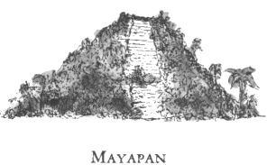
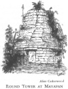

  
[Intangible Textual Heritage](../../../index)  [Native
American](../../index)  [Maya](../index)  [Index](index) 
[Previous](ybac09)  [Next](ybac11) 

------------------------------------------------------------------------

[Buy this Book at
Amazon.com](https://www.amazon.com/exec/obidos/ASIN/0486236226/internetsacredte)

------------------------------------------------------------------------

*Yucatan Before and After the Conquest*, by Diego de Landa, tr. William
Gates, \[1937\], at Intangible Textual Heritage

------------------------------------------------------------------------

p. 10

### SEC. VI. CUCULCAN. FOUNDATION OF MAYAPAN.

The opinion of the Indians is that with the Itzás who settled Chichén
Itzá there ruled a great lord named **Cuculcán**, as an evidence of
which the principal building is called Cuculcán.

[  
Click to enlarge](img/01000.jpg)  
THE PYRAMID OF KUKULCAN.  
As restored by the Mexican Government, under the direction of Don
Eduardo Martinez  

They say that he came from the West, but are not agreed as to whether he
came before or after the Itzás, or with them. They say that he was well
disposed, that he had no wife or children, and that after his return he
was regarded in Mexico as one of their gods, and called **Cezalcohuati**
\[Quetzalcóatl\]. In Yucatan also he was reverenced as a god, because of
his great services to the state, as appeared in the order which he
established in Yucatan after the death of the chiefs, to settle the
discord caused in the land by their deaths.

This Cuculcán, having entered into an agreement with the native lords of
the country, undertook the founding of another city wherein he and they
might live, and to which all matters and business should be brought. To
this end he chose a fine site eight leagues further inland from where
Mérida now lies, and some fifteen or sixteen from the sea. They
surrounded the place with a very broad wall of dry stone some eighth of
a league in extent, leaving only two narrow doorways; the wall itself
was 

|                           |
|---------------------------|
|  |

low. In the middle of the enclosure they

p. 11

built their temples, calling the largest Cuculcán, the same as at
Chichén Itzá. They built another circular temple, different from all
others in the country, and with four entrances; also

<table data-align="RIGHT">
<colgroup>
<col style="width: 100%" />
</colgroup>
<tbody>
<tr class="odd">
<td data-valign="CENTER"><a href="img/01100.jpg"> 
Click to enlarge</a> 
ROUND TOWER AT MAYAPAN. After Catherwood 
</td>
</tr>
</tbody>
</table>

many others about them, connected one with the other. Within the
enclosure they built houses for the lords alone, among whom the country
was divided, assigning villages to each according to the antiquity of
their lineage and their personal qualifications. Cuculcán did not call
the city after himself, as was done by the **Ah-Itzaes** at Chichén Itzá
(which means the 'Well of the Ah-Itzaes'), but called it Mayapán,
meaning the 'Standard of the Mayas,' the language of the country being
known as Maya. The Indians of today call it **Ich-pa**, meaning 'Within
the Fortifications.'

Cuculcán lived for some years in this city with the chiefs, and then
leaving them in full peace and amity returned by the same road to
Mexico. On the way he stopped at Champotón, and there in memorial of
himself and his departure he erected in the sea, at a good stone's throw
from the shore, a fine edifice similar to those at Chichén Itzá. Thus
did Cuculcán leave a perpetual memory in Yucatan.

[  
Click to enlarge](img/01101.jpg)  
CARACOL AT CHICHEN ITZA. As uncovered under the care of the Carnegie
Institution of Washington  

------------------------------------------------------------------------

[Next: VII. Government, Priesthood, Sciences, Letters and Books in
Yucatan](ybac11)
