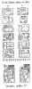
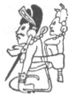
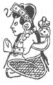

  
[Intangible Textual Heritage](../../../index)  [Native
American](../../index)  [Maya](../index)  [Index](index) 
[Previous](ybac35)  [Next](ybac37) 

------------------------------------------------------------------------

[Buy this Book at
Amazon.com](https://www.amazon.com/exec/obidos/ASIN/0486236226/internetsacredte)

------------------------------------------------------------------------

*Yucatan Before and After the Conquest*, by Diego de Landa, tr. William
Gates, \[1937\], at Intangible Textual Heritage

------------------------------------------------------------------------

### SEC. XXXII. CHASTITY AND EDUCATION OF THE INDIAN WOMEN OF YUCATAN. THEIR CHIEF QUALITIES AND THEIR HOUSEHOLD ECONOMY. THEIR DEVOTION AND THE SPECIAL OBSERVANCES AT THE TIME OF CHILDBIRTH.

The women vaunted themselves as chaste, and with reason, because before
they knew our nation they were such to a marvel; of this they have two
examples. The captain Alonso López de Avila, father-in-law of the
admiral Montejo, captured a handsome and graceful Indian girl during the
war at Bacalar. She, in fear of death for her husband, had promised him
never to yield herself to another, and for this nothing could persuade
her, even the fear of death, to consent to violation; so that they threw
her to the dogs.

As for myself, I once received the complaints of a baptized Indian
woman. against a baptised man who followed her impetuously for her
beauty; after she had repeatedly rejected him, without avail, he came
one night in her husband's absence and when his pleas and offer of gifts
remained without effect, attempted force, being a powerful man. For the
whole night she fought him off, with such grief to herself as that she
came to me; and it had been as she said.

The women were in the habit of turning their shoulders toward the men in
passing them, and of turning to the side on the roads; this also they
did in giving a man drink, until he had finished it. They taught their
daughters the things they knew, and raised them excellently in their
mode; they reprimanded them, instructed them and made them work; if they
misbehaved they punished them by boxing their ears or slapping their
arms. If they raise their eyes they reprove them severely, and put
pepper on them, which

p. 55

causes great pain; if they are immodest they whip them, and put pepper
on the other part, as a punishment and affront. It is also a grave
reproach to tell the young girls they are like women brought up without
a mother.

They are very jealous and at times lay hands on those women that have
aroused their suspicions; again they are quick to anger and irritation
on this score, though in other ways very mild; so that they are wont to
pull their husbands' hair for the least infidelity. They are great
workers and good in all the domestic economies, for on them rest the
most, and most important, work of alimentation, housekeeping and
education of their children, and the payment of the tributes; with all
this they bear heavier burdens if it is necessary, working the fields
and harvesting the crops. They are great economists, watching at night
in what time is left them after their domestic labors, attending the
markets to buy and sell their things.

They raise both Spanish and native fowls for sale, and for eating. They
raise birds for their pleasure and for the feathers for adornment on
their finer clothes; also raising other domestic animals, among these
even offering their breast to the deer, which they have so tame that
they never run away into the woods, even when they take them there and
back, and raise them there.

They help each other mutually in their working

<table data-align="RIGHT">
<colgroup>
<col style="width: 100%" />
</colgroup>
<tbody>
<tr class="odd">
<td data-valign="CENTER"><a href="img/05500.jpg"> 
Click to enlarge</a> 
 
</td>
</tr>
</tbody>
</table>

and spinning, paying for this work in the same way as do their husbands
on their farms; and while at this they ever have their jokes and tell
their stories, at times with a bit of grumbling. They hold it
disgraceful to look at the men and laugh at them, so this fact alone is
enough to cause trouble, and with no other grounds to bring them into
disrepute.

The most of their dances they do by themselves, although in some they
dance with the men; among these the **naual** dance, one not very
modest. Their fecundity is great, and they bear the children in good
time; they are excellent nurses, first because their hot morning drink
produces plenty of milk, and again because their constant grinding of
the maize without tying up the breasts causes them to grow large and
thus to hold a great deal of milk.

They also become intoxicated in their banquets, which they have among
themselves, but not so much as do the men. They desire many children,
and she who lacks them invokes their idols with gifts and prayers; and
today they pray to God for them. They are

p. 56

prudent and polite, and affable, with those who understand them; also
extremely generous. They cannot keep a secret; and they are not as clean
and proper in their persons and affairs as they should be, in spite of
their washing like the ermines. [\*](#fn_31)

They were very devout and pious, rendering many devotions to their
idols, burning incense before them, offering gifts of cotton, food and
drink; it was also their charge to prepare the offerings of food and
drink to be made during the ceremonies; but they did not share the
custom of drawing blood for the evil spirits, and never did so. Neither
were they allowed to come to the temples at times of the sacrifices,
except in a certain festival where certain

|                    |
|--------------------|
|  |

old women were admitted to take part therein. At the time of
accouchement they went to their sorceresses, who made them believe all
sorts of lies, and also put under their couch the image of an evil
spirit called **Ixchel**, whom they called the goddess of childbirth.

When the children were born, they bathed them at once, and then when the
pain of pressing the foreheads and heads was over, they took them to the
priest that he might cast their fate, declare the office the child

|                    |
|--------------------|
|  |

was to fill, and give him the name he was to retain during his
childhood; because they were accustomed to call the children by
different names until they were baptised or somewhat grown up;
afterwards they dropped these and called themselves after their fathers
until they were married. Then they took the names of both father and
mother.

------------------------------------------------------------------------

### Footnotes

[56:\*](ybac36.htm#fr_31) The text figures are
from the Dresden codex, and probably show the goddess Ixchel, in the
first as goddess of childbirth, or Lucina; in the second she bears the
signs of 'new day,' spring, renewal time. The wife of Itzamná, in the
Maya pantheon she corresponded to Isis.

------------------------------------------------------------------------

[Next: XXXIII. Funerals. Burials of the Priests. Statues to Preserve the
Ashes of the Chiefs, and the Honors They Paid to Them. Their Belief
Regarding a Future Life, with Rewards and Punishments](ybac37)
