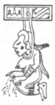

  
[Intangible Textual Heritage](../../../index)  [Native
American](../../index)  [Maya](../index)  [Index](index) 
[Previous](ybac36)  [Next](ybac38) 

------------------------------------------------------------------------

[Buy this Book at
Amazon.com](https://www.amazon.com/exec/obidos/ASIN/0486236226/internetsacredte)

------------------------------------------------------------------------

*Yucatan Before and After the Conquest*, by Diego de Landa, tr. William
Gates, \[1937\], at Intangible Textual Heritage

------------------------------------------------------------------------

### SEC. XXXIII. FUNERALS. BURIALS OF THE PRIESTS. STATUES TO PRESERVE THE ASHES OF THE CHIEFS, AND THE HONORS THEY PAID TO THEM. THEIR. BELIEF REGARDING A FUTURE LIFE, WITH REWARDS AND PUNISHMENTS.

This people had a great and excessive fear of death, and this they
showed in that in all their services they rendered to their gods were
for no other end than that they should give them health and life and
their subsistence. But when it came the time to die, it was a thing to
see what were the grief and lamentations they displayed for their
deceased, and the sadness they felt. They wept during the day in
silence, and during the nights with loud and mournful cries that were
grievous to hear. For many days they went about

p. 57

in deepest mourning. They kept abstinence and fasts for the deceased,
especially a husband or wife. They declared it was the devil that had
taken them off, because they thought all ills came from him, especially
death.

At death they shrouded the body, filled the mouth with ground maize and
a drink they call **koyem**, and with this certain stones they used for
money, that food might not be lacking to him in the other life. They
buried them in their houses or the vicinity, throwing some of their
idols into the grave; if he was a priest they threw in some of his
books; if a sorcerer his divining stones and other instruments of his
office. They commonly abandoned the house after the funeral, except
where many people were living there, in whose company they would lose
some of their fear of death.

On the death of a chief or man of position they cremated the bodies and
put the ashes in large urns, and built temples over them, as is seen to
have been done in the old times in the cases there have been found at
Izamal. Today it is found that they put the ashes of great chiefs in
hollow clay statues.

The others of the upper classes made statues of wood, left hollow in the
occiput, for their fathers; then they burned part of the body and put
part of the ashes therein, and stoppered it; then they removed the skin
from the occiput and fastened it there, burying the remainder in the
usual fashion. These images they kept with much reverence, among their
idols. Among the ancient lords of the house of the Cocoms they cut off
the heads after death, boiled them so as to remove the flesh; then they
sawed away the back part of the skull, leaving the front with the cheeks
and teeth, supplying in these half sections of the head the removed
flesh by a sort of bitumen, and gave them almost the perfection of what
they had been in life. These they kept together with the images, and the
ashes, all in the oratorios of their houses among their idols, with
great reverence and affection. On all festivals and feast days they put
before them offerings of food, that nothing might fail them in the other
life, where they believed the souls rested and received their gifts.

These people have always believed in the immortality of the soul, in
greater degree than many other nations, even though they were not so
civilized; they believed that after death there was another life better
than this, which the soul enjoyed after leaving the body. This future
life they said was divided into good and evil, into pains and delights.
The evil life of suffering they said was for the vicious, and the good
and delectable for those whose mode of life had been good. The delights
they said they would come into if they had been of good conduct, were by
entering a place where nothing would give pain, where there would be
abundance of food and delicious drinks, and a refreshing and shady tree
they called **Yaxché**, the Ceiba tree, beneath whose branches and shade
they might rest and be in peace forever.

p. 58

The torments of the evil life which they said awaited the wicked, lay in
going to an evil place below the other, and which they called
**Mitnal**, meaning hell, where they were tormented by demons, by great
pains of cold and hunger and weariness and sadness. They said there was
in this place a chief demon whom all the rest obeyed and whom in their
language they called **Hunhau**; also they said that these good and evil
after-lives had no end, because the soul itself had none. They also
said, and held as quite certain, that

|                    |
|--------------------|
|  |

those who had hung themselves went to this paradise; and there were many
who in times of lesser troubles, labors or sickness, hung themselves to
escape and go to that paradise, to which they were thought to be carried
by the goddess of the scaffold whom they called **Ixtab**. They had no
knowledge of the resurrection of the body; neither could they give
account of whence had come to them these beliefs in this, their paradise
and their hell.

[  
Click to enlarge](img/05801.jpg)  
THE BALL COURT, FROM A MODEL BY GEORGE OAKLEY TOTTEN, JR.  

------------------------------------------------------------------------

[Next: XXXIV. Count of the Yucatecan Year. Characters of the Days. The
Four Bacabs and Their Names. Gods of the 'Unlucky' Days](ybac38)
