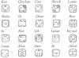

  
[Intangible Textual Heritage](../../../index)  [Native
American](../../index)  [Maya](../index)  [Index](index) 
[Previous](ybac37)  [Next](ybac39) 

------------------------------------------------------------------------

[Buy this Book at
Amazon.com](https://www.amazon.com/exec/obidos/ASIN/0486236226/internetsacredte)

------------------------------------------------------------------------

*Yucatan Before and After the Conquest*, by Diego de Landa, tr. William
Gates, \[1937\], at Intangible Textual Heritage

------------------------------------------------------------------------

p. 59

# YUCATAN

### BEFORE AND AFTER THE CONQUEST

#### PART TWO

### SEC. XXXIV. COUNT OF THE YUCATECAN YEAR. CHARACTERS OF THE DAYS. THE FOUR BACABS AND THEIR NAMES. GODS OF THE 'UNLUCKY' DAYS.

The sun does not sink or go away far enough in this land of Yucatan for
the nights to become longer than the days; thus in their full maximum,
from San Andrés to Santa Lucia \[Nov. 30 to Dec. 13\] they are equal,
and then they begin to lengthen. To know the hour of the night the
natives governed themselves by the planet Venus, the Pleiades and the
Twins. During the day they had terms for midday, and for different
sections from sunrise to sunset, according to which they recognized and
regulated their hours for work.

They had their perfect year like ours, of 365 days and 6 hours, which
they divided into months in two ways. In the first the months were of 30
days and were called **U**, which signifies the moon, and they counted
from the rising of the new moon until it disappeared.

In the other method the months had 20 days, and were called **uinal
hunekeh**; of these it took eighteen to complete the year, plus five
days and six hours. Out of these six hours they made a day every four
years, so that they had a 366-day year every fourth time. [\*](#fn_32)

For these 360 days they had 20 letters or characters by which to
designate them, without assigning names to the five supplementary
days, [†](#fn_33) as being

p. 60

sinister and unlucky. The letters are as follows, each with its name
above to understand their correlation with ours.

[  
Click to enlarge](img/06000.jpg)  
  

I have already related that the Indian method of counting was from five
to five, and four fives making 20; thus then from these 20 characters
they take the first of each set of five, so that each of these serves
for a year as do our Dominical letters, being the initials days of the
various 20-day months (or **uinals**). Thus:

 

Among the multitude of gods worshipped by these people were four whom
they called by the name **Bacab**. These were, they say, four brothers
placed by God when he created the world, at its four corners to sustain
the heavens lest they fall. They also say that these **Bacabs** escaped
when the world was destroyed by the deluge. To each of these they give
other names, and they mark the four points of the world where God placed
them holding up the sky, and also assigned one of the four Dominical
letters to each, and to the

p. 61

place he occupies; also they signalize the misfortunes or blessings
which are to happen in the year belonging to each of these, and the
accompanying letters.

The evil one, who has in this as in many other cases deceived them,
fixed for them the services and offerings hat had to be made in order to
evade these misfortunes. Thus if they failed to occur, they said it was
because of the ceremonies performed; but if they did come to pass, the
priests made the people believe that it was because of some error or
fault in the ceremonies,

|                       |
|-----------------------|
|  |

The first of these Dominical letters, then, is **Kan**. The year served
by this letter had as augury that Bacab who was otherwise called
**Hobnil**, **Kanal-bacab**, **Kan-pauahtun**, **Kan-xibchac**. To him
belonged the South.

|                         |
|-------------------------|
|  |

The second letter, or **Muluc**, marked the East, and this year had as
its augury the Bacab called **Can-sicnal**, **Chacal-bacab**,
**Chac-pauahtun**, **Chac-xibchac**.

|                      |
|----------------------|
|  |

The third letter is **Ix**, and the augury for this year was the Bacab
called **Sac-sini**, **Sacal-bacab**, **Sac-pauahtun**, **Sac-xibchac**,
marking the North.

|                         |
|-------------------------|
|  |

The fourth letter is **Cauac**, its augury for that year being the Bacab
called **Hosan-ek**, **Ekel-bacab**, **Ek-pauahtun**, **Ek-xibchac**;
this one marked the West.

In whatever ceremony or solemnity these people celebrated for their
gods, they always began by driving away the evil spirit, in order the
better to perform it. This exorcism was at times by prayers and
benedictions they had for this purpose, and at other times by services,
offerings and sacrifices which they performed for that end. In order to
celebrate the solemnity of the New Year with the greatest rejoicing and
dignity, these people, with their false ideas, made use of the five
supplementary days, which they regarded as 'unlucky,' and which preceded
the first day of their new year, in order to put on a great fiesta for
the above Bacabs and the evil one, to whom they gave four other names,
as they had done to the Bacabs; these names were: **Kan-uvayeyab**,
**Chac-uvayeyab**, **Sac-uvayeyab**, **Ek-uvayeyab**. [\*](#fn_34) These ceremonies and fetes being over,
and the evil one driven away, as we shall see, they began their new
year.

------------------------------------------------------------------------

### Footnotes

[59:\*](ybac38.htm#fr_32) We now know that the
Mayas knew the *exact* length of the true solar year as 365.2420 days,
that is with a minus error of 0.0002, while our present Gregorian
calendar has it as 365.2425, or a plus error of 0.0003. Also that they
knew and recorded it on their monuments more than a thousand years
before the Spaniards came, and while Europe still had the yet more
incorrect method used in Landa's time, of an even day added each four
years.

Every kind of guess has been made as to how the Aztecs and Mayas handled
the leap-year correction, until very recent researches have proved
beyond doubt that the Mayas, at least, solved it by first establishing a
purely mathematical 'time unit' of 360 days, without fractions, and then
adjusted not only the various lunar and planetary risings and periods,
but also the solar year itself, with its seasons.

We also know that they knew the moon's period accurately, as 29.5209
days, but we find no evidence on the monuments or in the Maya records of
any use of a 30-day month, in the ordinary sense.

[59:†](ybac38.htm#fr_33) This is incorrect; the
five last days of the year bore their names regularly, as shown
elsewhere by Landa himself in describing the common 52-year cycle used
for mundane matters p. 60 by both Mayas and
Aztecs, or 52 × 365 days, the 2nd, 3rd and 4th years of each 4-year
'lustrum' beginning with the 6th, 11th and 16th in order of the twenty.
Had the last 'five days been actually *nameless*, every year would have
begun on the same day of the twenty. This also would have thrown their
Long Count, or chronological order of days, completely out of order.

Throughout the following pages we have substituted the standard type
forms of the characters for the days and months or uinals, for the
shapes found in the Landa manuscript, there being no question of their
identity. See the present writer's *Outline Dictionary of Maya Glyphs*.

[61:\*](ybac38.htm#fr_34) In the above names the
words *chac*, *sac*, *ek*, *kan* mean respectively red, white, black and
Yellow, the four colors assigned in this order to the East, North, West
and South. It is delightful to note Landa's naive persistence that they
always exorcised the evil one in order to worship him. **Uvayeyab**
simply means 'the couch of the year.'

------------------------------------------------------------------------

[Next: XXXV. Festivals of the 'Unlucky' Days. Sacrifices For the
Beginning of the New Year Kan](ybac39)
