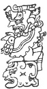

  
[Intangible Textual Heritage](../../../index)  [Native
American](../../index)  [Maya](../index)  [Index](index) 
[Previous](ybac38)  [Next](ybac40) 

------------------------------------------------------------------------

[Buy this Book at
Amazon.com](https://www.amazon.com/exec/obidos/ASIN/0486236226/internetsacredte)

------------------------------------------------------------------------

*Yucatan Before and After the Conquest*, by Diego de Landa, tr. William
Gates, \[1937\], at Intangible Textual Heritage

------------------------------------------------------------------------

p. 62

### SEC. XXXV. FESTIVALS OF THE 'UNLUCKY' DAYS. SACRIFICES FOR THE BEGINNING OF THE NEW YEAR KAN.

In all the towns of Yucatan it was the custom to have at each of the
four entrances to the town two heaps of stones, one in front of the
other; that is, at the east, west, north and south; and here they
celebrated the two festivals of the 'unlucky' days, in the following
manner.

For the year whose Dominical letter was

<table data-align="RIGHT">
<colgroup>
<col style="width: 100%" />
</colgroup>
<tbody>
<tr class="odd">
<td data-valign="CENTER"><a href="img/06200.jpg"> 
Click to enlarge</a> 
 
</td>
</tr>
</tbody>
</table>

**Kan**, the augury was **Hobnil**, and they say that both of these
ruled the South. In this year, then, they made an image or clay figure
of the demon they called **Kan-uvayeyab** and carried it to the piles of
stone they had erected at the South. They chose a leading man of the
town, at whose house was celebrated this fiesta on these days, and then
they made a statue of a demon whom they called **Bolon-tz’acab**, which
they set at the house of the principal, erected in a public spot to
which all might come. [\*](#fn_35)

This being done, the chiefs, the priest and the men of the town,
assembled and having the road clean and prepared, with arches and green
branches, as far as the two heaps of stone where the statue was, there
they gathered most devoutly; on arriving there the priest incensed the
statue with forty-nine grains of ground maize, mixed with incense; then
the nobles put their incense into the brazier of the idol, and incensed
it. The ground maize alone was called **sacah**, and that of the lords
**chahalté**.

Thus incensing the image, they cut off the head of a fowl, and presented
it as an offering. When all had done this, they placed the image on a
wooden standard called **kanté**, placing on his shoulders an angel as a
sign of water and of a good year, and these angels they painted so as to
make them frightful in appearance. Then they carried it with much
rejoicing and dancing to the house of the principal, where there was the
other statue of **Bolon-tz’acab**.

p. 63

\[paragraph continues\] From the house of
this principal they brought out to the road, for the chiefs and the
priest, a drink made of 415 grains of toasted maize (which they call
**picula kakla**, of which all drank. On arrival at the house they set
the image they were carrying in front of the statue of the demon they
had there, and then made many offerings of food and drink, of meat and
fish; these offerings were given to whatever strangers there were there;
and to the priest they gave a leg of venison.

Others drew blood by cutting their ears and anointing therewith a stone
image they had there, of the demon **Kanal-acantun**. They molded a
heart of bread and another of calabash seeds, and offered those to the
image of the demon **Kan-uvayeyab**. They kept this statue and image
through those fateful days, and perfumed them with their incense, and
with the ground maize and incense. They believed that if they did not
perform these ceremonies, certain sicknesses would come on them in the
ensuing year. When these fatal days were over they took the statue of
**Bolon-tz’acab** to the temple, and the image to the eastern entrance
where the next year they would go for it; there they left it and went to
their houses to do what was their part in celebrating the new year.

These ceremonies over, and the evil spirit exorcised according to their
deluded beliefs, they looked on the coming year as a good one, because
it was ruled by the character **Kan** and the bacab **Hobnil**; and of
him they said that in him there was no sin as in his brothers, and
because of that no evils would come upon them. But since they often did
so come, the evil one provided ceremonies therefor, so that when they
happened they might throw the blame on the ceremonies or celebrants; and
thus they continued always deluded and blind.

It was then commanded to make an idol called **Itzamná-kauil**, and
place it in the temple. Then in the temple court they burned three

|                    |
|--------------------|
|  |

balls of a milk or resin they called **kik** (rubber), while sacrificing
a dog or a man; this they did keeping the same procedure I have
described in chapter 100 (Sec. xxvii), except that in this case the
method of the sacrifice differed. In the temple court they erected a
great pile of stones, and then placed the dog or the man to be
sacrificed on something much higher, from which they threw him, tied,
upon the pile below; there the attendants seized him and with great
swiftness drew out his heart, raised it to the new idol, and offered it
between two plates. They offered other gifts of food, and in this
festival there danced old women of the town, chosen therefor, clothed in
certain vestures. They say that an angel descended and received this
sacrifice.

------------------------------------------------------------------------

### Footnotes

[62:\*](ybac39.htm#fr_35) The illustration is a
page of the Dresden codex, showing the **Kan-uvayeyab** ceremonies at
the East.

------------------------------------------------------------------------

[Next: XXXVI. Sacrifices for the New Year of the Character Muluc. Dances
of the Stilt-Walkers. Dance of the Old Women With Terracotta
Dogs](ybac40)
