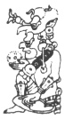
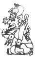
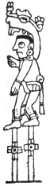

  
[Intangible Textual Heritage](../../../index)  [Native
American](../../index)  [Maya](../index)  [Index](index) 
[Previous](ybac39)  [Next](ybac41) 

------------------------------------------------------------------------

[Buy this Book at
Amazon.com](https://www.amazon.com/exec/obidos/ASIN/0486236226/internetsacredte)

------------------------------------------------------------------------

*Yucatan Before and After the Conquest*, by Diego de Landa, tr. William
Gates, \[1937\], at Intangible Textual Heritage

------------------------------------------------------------------------

p. 64

### SEC. XXXVI. SACRIFICES FOR THE NEW YEAR OF THE CHARACTER MULUC. DANCES OF THE STILT-WALKERS. DANCE OF THE OLD WOMEN WITH TERRACOTTA DOGS.

In the year whose dominical letter was **Muluc** the augury was
**Cansicnal**. On this occasion the chiefs and the priest selected a
president to care for the festival, after which election they made an
image of the demon as they had done in the previous year, and which they
called **Chac-uvayeyab**, and carried this to the piles of stone at the
East, where they had left the other

|                    |
|--------------------|
|  |

one the year before. They also made a statue of the idol called
**Kinchahau**, and placed it in the house of the president in a
convenient place; from there, with the road all cleaned and dressed,
they all proceeded together for their accustomed devotions before

|                    |
|--------------------|
|  |

the god **Chac-uvayeyab**.

On arriving the priest perfumed it with 53 grains of the ground maize,
with the incense, which they call **sacah**. The priest gave this to the
chiefs, who put in the brazier more incense, of the kind called
**chahalté**; then they cut off a fowl's head, as before, and taking the
image on a wooden standard called **chacté**, they carried it very
devoutly, while dancing certain war-dances they call **holcan-okot**,
**batel-okot**. During this they brought to the road for the chiefs and
principal men their drink made from 380 grains of maize, toasted as
before.

When they had arrived at the house of the president they put this image
in front of the statue of **Kinch-ahau**, and made all their offerings
to it, which were then distributed like the rest. They offered to the
image bread formed like the yolks of eggs, others like deer's hearts,
and another made of dissolved peppers. Many of them drew blood from
their ears, and with it anointed the stone they had there, of the god
**Chac-acantun**. They took boys and forcibly drew blood from their
ears, by blows. They kept this statue and the image until the fatal days
were passed, meanwhile burning their incense. When the days were over,
they took the image to the part of the North, where next year they had
to go to seek it; the other they took to the temple, and then went to
their houses to care for the works of the new year If they did not do
all these things, they feared the coming especially of eye troubles.

The dominical letter of this year being **Muluc**, the Bacab
**Can-sicnal** ruled, whence they held it a favorable year, for they
said he was the best and greatest of these Bacab gods; for this they put
him first in their prayers. Yet for all this the evil one caused them to
make an idol called **Yaxcoc-ahmut**, which they placed in the temple
and took away the old images; then they erected in the temple court a
stone block on which they burned their incense, and a ball

p. 65

of the resin or milk **kik**, with a prayer there to the idol, asking
relief for the ills they feared for the coming year; these were a
scarcity of water, buds (*hijos*) on the maize, and the like. To gain
this protection the evil one ordained offerings of squirrels and an
unembroidered cloth, which was to be woven by old women whose office it
was to appease **Yaxcoc-ahmut**.

|                    |
|--------------------|
|  |

In spite of this being held a good year, they were still menaced with
many other evils and bad signs, if they did not perform the sacrifices
ordained. These were having dances on tall stilts, with offerings of
heads of turkeys, bread and drinks made of maize. They had to offer clay
dogs with bread on their backs, the old women dancing with them in their
hands, and sacrificing a virgin puppy with black back.

The devotees had to draw their blood and anoint the stone of
**Chac-acantun** with it. This ceremony and sacrifice they regarded a!
acceptable to their god **Yaxcoc-ahmut**.

------------------------------------------------------------------------

[Next: XXXVII. Sacrifices For the New Year With the Sign Ix. Sinister
Prognostics, and Manner of Conjuring Their Effects](ybac41)
