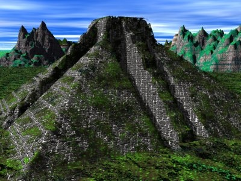

  
[Intangible Textual Heritage](../../index)  [Native American](../index) 

------------------------------------------------------------------------

[Buy this Book at
Amazon.com](https://www.amazon.com/exec/obidos/ASIN/B002E9HIF0/internetsacredte)

------------------------------------------------------------------------

<table width="75%">
<colgroup>
<col style="width: 50%" />
<col style="width: 50%" />
</colgroup>
<tbody>
<tr class="odd">
<td width="50%" data-valign="TOP"></td>
<td width="50%" data-valign="CENTER"><h1 id="the-myths-of-mexico-and-peru" data-align="CENTER">The Myths of Mexico and Peru</h1>
<h2 id="by-lewis-spence" data-align="CENTER">by Lewis Spence</h2>
<h4 id="section" data-align="CENTER">[1913]</h4></td>
</tr>
</tbody>
</table>

------------------------------------------------------------------------

[Contents](#contents)    [Start Reading](mmp00)    [Text
\[Zipped\]](mmp.txt.gz)

------------------------------------------------------------------------

|                                                                                                                           |
|---------------------------------------------------------------------------------------------------------------------------|
|  |

This is Lewis Spence's recounting of the mythology of the Aztec and
Inca.

------------------------------------------------------------------------

 [Title Page](mmp00)  
[Illustrations](mmp01)  
[Preface](mmp02)  
[Contents](mmp03)  
[Chapter I: The Civilisation of Mexico](mmp04)  
[Chapter II: Mexican Mythology](mmp05)  
[Chapter III: Myths and Legends of the Ancient Mexicans](mmp06)  
[Chapter IV: The Maya Race and Mythology](mmp07)  
[Chapter V: Myths of the Maya](mmp08)  
[Chapter VI: The Civilisation of Old Peru](mmp09)  
[Chapter VII: The Mythology of Peru](mmp10)  
