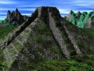
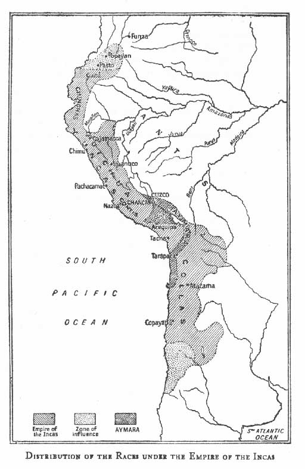

  
[Intangible Textual Heritage](../../index)  [Native American](../index) 
[Index](index)  [Previous](mmp00)  [Next](mmp02) 

------------------------------------------------------------------------

[Buy this Book at
Amazon.com](https://www.amazon.com/exec/obidos/ASIN/B002E9HIF0/internetsacredte)

------------------------------------------------------------------------

  
*The Myths of Mexico and Peru*, by Lewis Spence, \[1913\], at Intangible
Textual Heritage

------------------------------------------------------------------------

   
Map of the Valley of Mexico

   
Ethnographic Map of Mexico

   
Detail of Ethnographic Map of Mexico

   
Empire of the Incas

------------------------------------------------------------------------

[Next: Preface](mmp02)
