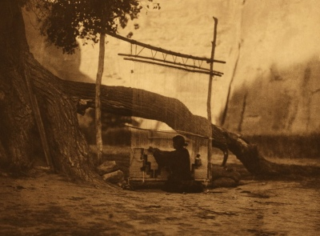

  
[Intangible Textual Heritage](../../../index)  [Native
American](../../index)  [Navajo](../index) 

------------------------------------------------------------------------

[Buy this Book at
Amazon.com](https://www.amazon.com/exec/obidos/ASIN/B002EQAH5Q/internetsacredte)

------------------------------------------------------------------------

<table width="75%">
<colgroup>
<col style="width: 50%" />
<col style="width: 50%" />
</colgroup>
<tbody>
<tr class="odd">
<td width="50%" data-valign="TOP"></td>
<td width="50%" data-valign="CENTER"><h1 id="spider-woman" data-align="CENTER">Spider Woman</h1>
<h3 id="a-story-of-navajo-weavers-and-chanters" data-align="CENTER">A Story of Navajo Weavers and Chanters</h3>
<h2 id="by-gladys-a.-reichard" data-align="CENTER">by Gladys A. Reichard</h2>
<h4 id="section" data-align="CENTER">[1932]</h4></td>
</tr>
</tbody>
</table>

------------------------------------------------------------------------

[Contents](#contents)    [Start Reading](sws00)    [Page
Index](pageidx)    [Text \[Zipped\]](sws.txt.gz)

------------------------------------------------------------------------

|                                                                                                                           |
|---------------------------------------------------------------------------------------------------------------------------|
|  |

Gladys Reichard was born in Bangor, PA on July 17, 1893. She got a B.A.
from Swarthmore, then studied under Franz Boas at Columbia University.
She taught at Barnard College. Reichard was one of the foremost
authorities on the Navajo; she spent 25 years doing research on the
Navajo reservation. She eventually learned to speak the complex Navajo
language fluently. We are fortunate that this, her ethnography of Navajo
weavers and herders, Spider Woman fell into the public domain. In this
book, Reichard explores the intersection between the fiber arts,
mythology, and sand painting, all told in first person. It succeeds as
an ethnographic technical document and, although completely factual,
reads like a novel. But this is also significant because it is a woman
anthropologist exploring the world of Navajo women, their material and
spiritual culture. Reichard died on July 25th, 1955 in Flagstaff, AZ.

------------------------------------------------------------------------

 [Title Page](sws00)  
[Acknowledgments](sws01)  
[Table of Contents](sws02)  
[Illustrations](sws03)  
[Chapter I: White-Sands](sws04)  
[Chapter II: Established](sws05)  
[Chapter III: Tension](sws06)  
[Chapter IV: Sand-Paintings](sws07)  
[Chapter V: Sympathy](sws08)  
[Chapter VI: Marie Learns to Weave](sws09)  
[Chapter VII: Results](sws10)  
[Chapter VIII: At the Well](sws11)  
[Chapter IX: Taking Counsel](sws12)  
[Chapter X: Design](sws13)  
[Chapter XI: Rain](sws14)  
[Chapter XII: Understanding](sws15)  
[Chapter XIII: Self-Reliance](sws16)  
[Chapter XIV: Criticism](sws17)  
[Chapter XV: Dan](sws18)  
[Chapter XVI: Sheep Dipping](sws19)  
[Chapter XVII: House Guardian](sws20)  
[Chapter XVIII: Wedding](sws21)  
[Chapter XIX: Shooting Chant](sws22)  
[Chapter XX: Communion of Suffering](sws23)  
[Chapter XXI: The Gods Invited](sws24)  
[Chapter XXII: The Holy Twins](sws25)  
[Chapter XXIII: Sun's House](sws26)  
[Chapter XXIV: The Gods Accept](sws27)  
[Chapter XXV: Effects](sws28)  
[Chapter XXVI: The Kinni's-Sons](sws29)  
[Chapter XXVII: Standards](sws30)  
[Chapter XXVIII: White-Sands Desolated](sws31)  
[Chapter XXIX: War Dance](sws32)  
[Chapter XXX: Killing the Ghost](sws33)  
[Chapter XXI: Marie's Little Lamb](sws34)  
[Chapter XXXII: Tragedy](sws35)  
[Chapter XXXIII: Death](sws36)  
[Chapter XXXIV: Collecting Plants](sws37)  
[Chapter XXXV: Father's Sister](sws38)  
[Chapter XXXVI: Degree In Weaving](sws39)  
[Index](sws40)  
