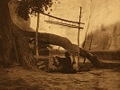

  
[Intangible Textual Heritage](../../../index)  [Native
American](../../index)  [Navajo](../index)  [Index](index) 
[Previous](sws32)  [Next](sws34) 

------------------------------------------------------------------------

[Buy this Book at
Amazon.com](https://www.amazon.com/exec/obidos/ASIN/B002EQAH5Q/internetsacredte)

------------------------------------------------------------------------

  
*Spider Woman*, by Gladys A. Reichard, \[1934\], at Intangible Textual
Heritage

------------------------------------------------------------------------

p. 240

### XXX

#### KILLING THE GHOST

The crowd, including the participants
from Sunrise and the little girls who carry the trophy, is large enough
the second night to make the Dance a complete success. But at daybreak
the next day the place takes on the appearance of a fair. Covered wagons
stand about, more drive up in a spirited fashion. There is no counting
of the horsemen in their wide sombreros, cerise neckerchiefs and Irish
green shirts. Horses stand in quiet groups, reins slung over a twig of
sagebrush, as their riders file in one door of the shade, eat what seems
to be their fill, and file out again, only to appear at the table at the
other end where their appetites seem equally good.

After a time the interest in the ceremonial shade dominates the
attention. The men mount their horses and stand ready. The people on
foot gather in a wide space not far from the shade where the patients
are. Even the cooks pull the meat to the side of the fires, cover
surplus food against marauding dogs, and stand modestly outside the
shade, hands protecting eyes, as they watch. Plenty of time has been
given for warning, but suddenly one large band of horsemen rides
fiercely up and attacks another. In the second band is the boy holding
the trophy stick. There are shots from blank cartridges and warwhoops;
dust rises in dense clouds from the charging hoofs. Very exciting is the
attack made by the Sunrise

p. 241

party upon ours with the trophy—as brief and meaningful as it is
amusing.

The horsemen collect themselves leisurely and remain mounted in a throng
near the ceremonial shade. The guests congregate now for another
distribution of gifts. It is our turn to honor the Sunrise party. I
thought they had a large crowd yesterday morning, but I find I had no
idea what a crowd is. The space before the hut is so full that the
donors can hardly make their way in with their offerings. I see Tom
carry in a blanket of unusual weave which Maria Antonia has had about
for over a year. Finally the gifts fly out from the top of the shade.
This time they are thrown hit or miss. Everybody gets some little thing,
nobody seems to have a large accumulation. Tom tells me he gave the
blanket with a number of other things to the man who gave him the steer.

As soon as the last gumdrop has had a welcome the highly populated flat
quiets down. Many go to the trading-post half a mile away to trade or to
watch others trade. Women settle with their babies in the shadow of
their wagons, at home here as anywhere. If there is shade, so much the
better, if not, they throw towels over their heads or draw up their
blankets. The sun is hot, and a fierce wind is blowing; blankets form a
bulwark against drifting sand.

It seems now that nothing is going on. I know, however, from previous
experience that this morning a rite of great importance to the patients,
and as far as they are individually concerned, their last one, is to be
performed. I ask Tom to tell me when the "blackening" is to be done. He
soon warns me, and I repair to the small open shade outside the
ceremonial shelter. I expect to find Maria Antonia here attended by
women, but she is not in sight. Nine sit formally in a semicircle,

p. 242

in the center of which is the little girl holding the trophy. I motion
for permission to sit down at the corner of the shade, for there is
silence when I arrive. The women begin to talk quietly. Since they are
from Sunrise only one knows about me, none is acquainted with me. This
one explains my presence, "She is Red-Point's granddaughter. She is just
like a Navajo." Whereupon all smile benignly upon me.

Once in a while a man brings out some grease which the trophy-bearer
rubs over a particular part of her face or anatomy, or some herb
medicine which she must chew or drink. Her mother instructs her how to
use each and is intolerant of slowness or of carelessness in holding the
trophy stick. In about an hour warning conies from the shade, and the
women all pull their blankets over their eyes. An old man nearly blind
emerges and limps falteringly to the east so far that I can see only
that he moves in a fumbling way, not what he is doing. Then the patients
come out, one, two, three, four, blackened out of all semblance to
themselves, blackened thus to keep the ghosts from recognizing them.
This medicine is dangerous indeed, and an attendant bids me bend my
curious head, cover my shifting eyes. The patients go to the east and
return. They dress, and the rite is ended. They will keep the charcoal
on for two days before they may wash.

Later I ask Marie why her mother was blackened in the ceremonial shade
with the men. "Always when I saw this before, the men were inside and
women blackened the women under a blanket in the outside shade."

"That is because one of the men was married," she replies. "This man is
not married, so it is all right for all to be blackened inside together.
His first wife died, and he does not live with his second any more."

p. 243

I note also that this sing omitted the "naming." If people want to have
sacred names which they have given to their children bestowed thus
publicly, the old man may shout them as he points to the east and they
are an additional aid in driving out the alien ghost.

------------------------------------------------------------------------

[Next: Chapter XXI: Marie's Little Lamb](sws34)
