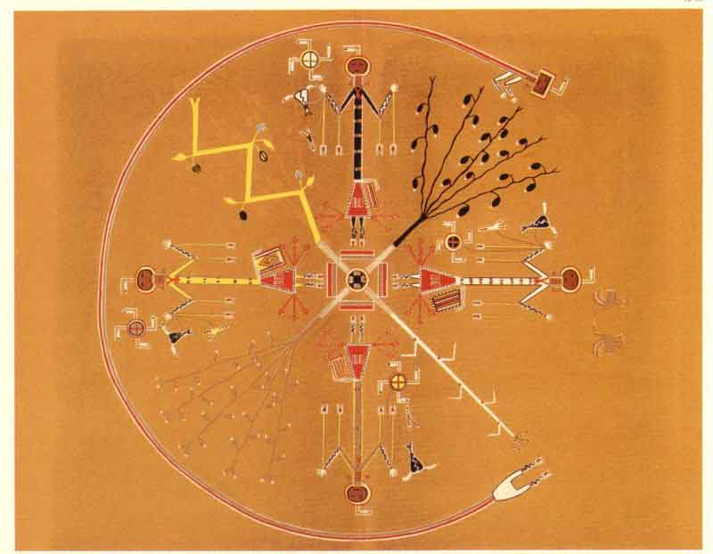

[Intangible Textual Heritage](../../../index)  [Native
American](../../index)  [Navajo](../index) 

------------------------------------------------------------------------

<table width="100%">
<colgroup>
<col style="width: 50%" />
<col style="width: 50%" />
</colgroup>
<tbody>
<tr class="odd">
<td data-valign="VCENTER"></td>
<td data-valign="VCENTER"><h1 id="the-mountain-chant" data-align="CENTER">THE MOUNTAIN CHANT</h1>
<h5 id="a-navajo-ceremony." data-align="CENTER">A NAVAJO CEREMONY.</h5>
<h2 id="by-washington-matthews" data-align="CENTER">BY WASHINGTON MATTHEWS</h2>
<h4 id="section" data-align="CENTER">[1887]</h4></td>
</tr>
</tbody>
</table>

[System of transliteration.](xlit)

------------------------------------------------------------------------

This is a description of a Navajo shamanistic healing ceremony. It
centers around a recitation of a cycle of myths about a Navajo culture
hero, Dsilyídje Qaçàl. His journey takes him to the land of the gods and
goddesses, where he learns powerful magic. The narrative is compelling
and compares well with the Homeric
[Odyssey](../../../cla/homer/ody/index), which it resembles both
thematically and stylistically. The ceremony incorporates dance, song,
prayer, sand-painting, drama, sculpture, conjuring, and even a bit of
farce. Of note are the beautiful plates of [the ephemeral
sand-paintings](tmc04).

------------------------------------------------------------------------

[Title Page](tmc00)  
[Introduction.](tmc01)  
[Myth of the Origin of Dsilyídje Qaçàl.](tmc02)  
[The Ceremonies of Dsilyídje Qaçàl.](tmc03)  
[The Great Pictures of Dsilyídje Qaçàl.](tmc04)  
[Sacrifices of Dsilyídje Qaçàl.](tmc05)  
[Original Texts and Translations of Songs.](tmc06)  
[Other Songs and Extracts.](tmc07)  
[Addendum: The Suppressed Sections from the 1884 Edition of the Mountain
Chant](tmc08)  
