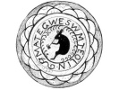

  
[Intangible Textual Heritage](../../../index)  [Native
American](../../index)  [Northeast](../index)  [Index](index) 
[Previous](al00)  [Next](al02) 

------------------------------------------------------------------------

[Buy this Book at
Amazon.com](https://www.amazon.com/exec/obidos/ASIN/B002DPU8XY/internetsacredte)

------------------------------------------------------------------------

  
*The Algonquin Legends of New England*, by Charles G. Leland, \[1884\],
at Intangible Textual Heritage

------------------------------------------------------------------------

p. iii

# PREFACE.

WHEN I began, in the summer of 1882, to collect among the Passamaquoddy
Indians at Campobello, New Brunswick, their traditions and folk-lore, I
expected to find very little indeed. These Indians, few in number,
surrounded by white people, and thoroughly converted to Roman
Catholicism, promised but scanty remains of heathenism. What was my
amazement, however, at discovering, day by day, that there existed among
them, entirely by oral tradition, a far grander mythology than that
which has been made known to us by either the Chippewa or Iroquois
Hiawatha Legends, and that this was illustrated by an incredible number
of tales. I soon ascertained that these were very ancient. The old
people declared that they had heard from their progenitors that all of
these stories were once sung; that they themselves remembered when many
of them were poems. This was fully proved by discovering manifest traces
of poetry in many, and finally by receiving a long Micmac tale which had
been sung by an Indian. I found that all the relaters of this lore were
positive as to the antiquity of the narratives, and distinguished
accurately

p. iv

between what was or was not pre-Columbian. In fact, I came in time to
the opinion that the original stock of all the Algonquin myths, and
perhaps of many more, still existed, not far away in the West, but at
our very doors; that is to say, in Maine and New Brunswick. It is at
least certain, as the reader may convince himself, that these Wabanaki,
or Northeastern Algonquin, legends give, with few exceptions, in full
and coherently, many tales which have only reached us in a broken,
imperfect form, from other sources.

This work, then, contains a collection of the myths, legends, and
folk-lore of the principal Wabanaki, or Northeastern Algonquin, Indians;
that is to say, of the Passamaquoddies and Penobscots of Maine, and of
the Micmacs of New Brunswick. All of this material was gathered directly
from Indian narrators, the greater part by myself, the rest by a few
friends; in fact, I can give the name of the aboriginal authority for
every tale except one. As my chief object has been simply to collect and
preserve valuable material, I have said little of the labors of such
critical writers as Brinton, Hale, Trumbull, Powers, Morgan, Bancroft,
and the many more who have so ably studied and set forth red Indian
ethnology. If I have rarely ventured on their field, it is because I
believe that when the Indian shall have passed away there will come far
better ethnologists than I am, who will be much more obliged to me for
collecting raw material than for cooking it.

p. v

Two or three subjects have, it is true, tempted me into occasional
commenting. The manifest, I may say the undeniable, affinity between the
myths and legends of the Northeastern Indians and those of the Eskimo
could hardly be passed over, nor at the same time the identity of the
latter and of the Shaman religion with those of the Finns, Laplanders,
and Samoyedes. I believe that I have contributed material not devoid of
value to those who are interested in the study of the relations of the
aborigines of America with the Mongoloid races of the Old World. This is
a subject which has been very little studied through the relations of
these Wabanaki with the Eskimo.

A far more hazardous venture has, been the indicating points of
similarity between the myths or tales of the Algonquins and those of the
Norsemen, as set forth in the Eddas, the Sagas, and popular tales of
Scandinavia. When we, however, remember that the Eskimo once ranged as
far south as Massachusetts, that they did not reach Greenland till the
fourteenth century, that they had for three centuries intimate relations
with Scandinavians, that they were very fond of legends, and that the
Wabanaki even now mingle with them, the marvel would be that the
Norsemen had not left among them traces of their tales or of their
religion. But I do not say that this was positively the case; I simply
set forth in this book a great number of curious coincidences, from
which others may draw their own conclusions. I confess that I cannot
account for these resemblances

p. vi

save by the so-called "historical theory" of direct transmission; but if
any one can otherwise explain them I should welcome the solution of what
still seems to be, in many respects, a problem.

I am, in fact, of the opinion that what is given in this work confirms
what was conjectured by David Crantz, and which is thus expressed in his
History of Greenland (London, 1767): "If we read the accounts which have
been given of the most northerly American Indians and Asiatic Tartars,
we find a pretty great resemblance between their manner of life, morals,
usages, and notions and what has been said in this book of the
Greenlanders, only with this difference: that the farther the savage
nations wandered towards the North, the fewer they retained of their
ancient conceptions and customs. As for the Greenlanders, if it be true,
as is supposed, that a remnant of the old Norway Christians incorporated
themselves and became one people with them, the Greenlanders may thence
have heard and adopted some of their notions, which they may have
new-modeled in the coarse mould of their own brain."

Among those who have greatly aided me in preparing this work I deem it
to be a duty to mention MISS ABBY ALGER, of Boston, to whom it is
cordially dedicated; the REV. SILAS T. RAND, Of Hantsport, Nova Scotia,
who lent me a manuscript collection of eighty-five Micmac tales, and
communicated to me, with zealous kindness, much information by letter;
and MRS. W. WALLACE BROWN, of Calais, Maine. It

p. vii

was through this lady that I derived a great proportion of the most
curious folk-lore of the Passamaquoddies, especially such parts as
coincided with the Edda. With these I would include MR. E. JACK, of
Fredericton, New Brunswick. When it is remembered that there are only
forty-two of the Hiawatha Legends of Schoolcraft, out of which five
books have been made by other authors, and that I have collected more
than two hundred, it will be seen how these friends must have worked to
aid me.

------------------------------------------------------------------------

[Next: Authorities](al02)
