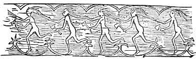

  
[Intangible Textual Heritage](../../../index)  [Native
American](../../index)  [Northeast](../index)  [Index](index) 
[Previous](al05)  [Next](al07) 

------------------------------------------------------------------------

[Buy this Book at
Amazon.com](https://www.amazon.com/exec/obidos/ASIN/B002DPU8XY/internetsacredte)

------------------------------------------------------------------------

  
*The Algonquin Legends of New England*, by Charles G. Leland, \[1884\],
at Intangible Textual Heritage

------------------------------------------------------------------------

p. 15

 

# THE ALGONQUIN LEGENDS OF NEW ENGLAND.

# GLOOSKAP THE DIVINITY.

### Of Glooskap's Birth, and of his Brother Malsum the Wolf.

Now the great lord Glooskap, who was worshiped in after-days by all the
Wabanaki, or children of light, was a twin with a brother. As he was
good, this brother, whose name was Malsumsis, or Wolf the younger, was
bad. Before they were born, the babes consulted to consider how they had
best enter the world. And Glooskap said, "I will be born as others are."
But the evil Malsumsis thought himself too great to be brought forth in
such a manner, and declared that he would burst through his mother's
side. [1](#fn_1) And as they planned it so it
came to pass. Glooskap

p. 16

as first came quietly to light, while Malsumsis kept his word, killing
his mother.

The two grew up together, and one day the younger, who knew that both
had charmed lives, asked the elder what would kill him, Glooskap. Now
each had his own secret as to this, and Glooskap, remembering how
wantonly Malsumsis had slain their mother, thought it would be misplaced
confidence to trust his life to one so fond of death, while it might
prove to be well to know the bane of the other. So they agreed to
exchange secrets, and Glooskap, to test his brother, told him that the
only way in which he himself could be slain was by the stroke of an
owl's feather, [1](#fn_2) though this was not
true. And Malsumsis said, "I can only die by a blow from a fern-root."

It came to pass in after-days that Kwah-beet-a-sis, the son of the Great
Beaver, or, as others say, Miko the Squirrel, or else the evil which was
in himself, tempted Malsumsis to kill Glooskap; for in those days all
men were wicked. So taking his bow he shot Ko-ko-khas the Owl, and with
one of his feathers he struck Glooskap while sleeping. Then he awoke in
anger, yet craftily said that it was not by an owl's feather, but by a
blow from a pine-root, that his life would end.

 

   
GLOOSKAP KILLING HIS BROTHER, THE WOLF

 

p. 17

Then the false man led his brother another day far into the forest to
hunt, and, while he again slept, smote him on the head with a pine-root.
But Glooskap arose unharmed, drove Malsumsis away into the woods, sat
down by the brook-side, and thinking aver all that had happened, said,
"Nothing but a flowering rush can kill me." But the Beaver, who was
hidden among the reeds, heard this, and hastening to Malsumsis told him
the secret of his brother's life. For this Malsumsis promised to bestow
on Beaver whatever he should ask; but when the latter wished for wings
like a pigeon, the warrior laughed, and scornfully said, "Get thee
hence; thou with a tail like a file, what need hast thou of wings?"

Then the Beaver was angry, and went forth to the camp of Glooskap, to
whom he told what he had done. Therefore Glooskap arose in sorrow and in
anger, took a fern-root, sought Malsumsis in the deep, dark forest, and
smote him so that he fell down dead. And Glooskap sang a song over him
and lamented.

The Beaver and the Owl and the Squirrel, for what they did and as they
did it, all come again into these stories; but Malsumsis, being dead,
was turned into the Shick-shoe mountains in the Gaspe peninsula.

 

For this chapter and parts of others I am indebted to the narrative of a
Micmac Indian, taken down by Mr. Edward Jock; also to another version in
the Rand MS. The story is, in the main-points, similar to that given by
David Cusick in his History of the

p. 18

\[paragraph continues\] Six Nations, of
Enigorio the Good Mind, and Enigonhahetgea, Bad Mind, to which I shall
refer anon.

It is very evident that in this tradition Glooskap represents the Good
principle, and Malsumsis, the little wolf,--that is the Wolf who is the
Younger, rather than little or small,--the Evil one. Malsum typifies
destruction and sin in several of these tales. He will arise at the last
day, when Glooskap is to do battle with all the giants and evil beasts
of olden time, and will be the great destroyer. Malsum is the Wolf
Fenris of this the true Indian Edda.

For a further comment on this birth of the twins and its resemblance to
a passage in the Edda, the reader is referred to the notes on the next
chapter.

------------------------------------------------------------------------

### Footnotes

[15:1](al06.htm#fr_1) The reader of Rabelais
cannot fail to recall here the remarks of the author as to the
extraordinary manner in which it pleased the giant Gargantua to come
into the world. The Armenians believe that Christ was born through the
right side of the Virgin. The Buddhists say the same of Buddha's birth.
(Heth and Moab, London, 1883.) Another and as I believe the correct
account declares that Malsum the Wolf was born from his mother's armpit.

[16:1](al06.htm#fr_2) There are different
readings of this incident. In Mr. Rand's manuscript the alleged means of
Glooskap's death is described as being a cat-tail flag
(*haw-kwee-usqu'*, Passamaquoddy), while a handful of bird's down is the
bane of Malsum the Wolf. The termination *sis* is a diminutive, here
meaning the younger.

------------------------------------------------------------------------

[Next: How Glooskap made the Elves and Fairies, and then Man of an Ash
Tree, and last of all, Beasts, and of his Coming at the Last Day](al07)
