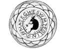

  
[Intangible Textual Heritage](../../../index)  [Native
American](../../index)  [Northeast](../index)  [Index](index) 
[Previous](al09)  [Next](al11) 

------------------------------------------------------------------------

[Buy this Book at
Amazon.com](https://www.amazon.com/exec/obidos/ASIN/B002DPU8XY/internetsacredte)

------------------------------------------------------------------------

  
*The Algonquin Legends of New England*, by Charles G. Leland, \[1884\],
at Intangible Textual Heritage

------------------------------------------------------------------------

p. 36

### Of the Dreadful Deeds of the Evil Pitcher, who was both Man and Woman, and how she fell in love with Glooskap, and, being scorned, became his Enemy. Of the Toads and Porcupines, and the Awful Battle of the Giants.

(Passamaquoddy.)

When Glooskap came into the world it abounded in giants, monsters,
sorcerers and witches, fiends and devils. Among the witches there was
one whom the Passamaquoddy call Pook-jin-skwess, or the Pitcher. [1](#fn_17) And they have a legend that she once fell
in love with Glooskap when he was young and had not gained the power of
his riper age. He fled before her, and she pursued him. It was a
dreadful flight, since to make rapid steps both took the form of giants
by their *m'téoulin* (P.), or magic power. It was like an awful storm in
winter, the wind chasing the cloud; it was like a frightful tempest in
summer, the lightning chasing the thunder. As the snow lay deep, both
had snow-shoes on. When they came to the shore Glooskap leaped from the
main-land to the island of Grand Manan, [2](#fn_18) and so escaped her. Now the snow-shoes of
Glooskap were *sams'ook* (P.), or round, while those of Pook-jin-skwess
were long and pointed, [3](#fn_19) and the marks
of them as they jumped are to be seen deep in the rocks to this day.

p. 37

When Glooskap came to the camp, which was at Ogumkegéak (M.), now called
Liverpool, he found none. But there lay the *witch-kwed-lakun-cheech*
(M.), or birch-bark dish of Martin, and from it, or, as another legend
states, from an old main and woman who dwelt hard by, he learned that
Win-pe and the families had been gone for seven years, along a road
guarded by wicked and horrible beings, placed by Win-pe to prevent the
Great Master from finding him. For it was a great triumph for him to
keep Glooskap's friends as slaves, and all the land spoke thereof.

And these monsters were Pook-jin-skwess, or the Evil Pitcher herself, in
many forms; for she could be man or woman, [1](#fn_20) or many of them, and also several girls,
when she willed it. Now it is a great part of Indian *m'téoulin* (P.) to
know what one's enemies are planning and plotting, and all their tricks
and darkened paths, and in this Glooskap went beyond them all, for
before his time every one went his own way, even in wickedness. But
Glooskap first of all threw out his soul unto others.

And when he came to Ogumkeok he found a hut,

p. 38

and in it, seated over a fire, the ugliest old hag he had ever seen,
trembling in every limb, as if near death, dirty, ragged, and loathsome
in all ways. Looking up at him with bleared eyes, she begged him to
gather her a little firewood, which he did. And then she prayed him to
free her from the *wah gook* (M.), or vermin, with which she was
covered, and which were maddening her with their bites. These were all
devils in disguise, the spirits of foul poison, such as she deemed must
kill even the Master. Now Glooskap, foreseeing all this, had taken with
him, as he came, from a bog many cranberries. And bidding
Pook-jin-skwess bend over, he began to take from her hair the hideous
vermin, and each, as he took it, became a horrid porcupine or
toad. [1](#fn_21) Then the hag asked, "Have you
found one?" "I have," replied the Master. "*Bâsp*!" (M.) "Crush it!" was
her answer, and Glooskap crushed a cranberry; and she, hearing the
noise, thought that he had done as she bid, and that the poison on his
fingers would penetrate to his life. But he put the imps, one by one,
under the

p. 39

wooden platter, which lay before him. As this went on he put the witch
to sleep. When she awoke he was gone. The foul porcupines and toads were
swarming all over the ground, having upset their hive. And filled with
fury at being made a jest of, since it was a great despite that he had
not even found it worth while to kill her when asleep, she burst out
into her own form, which was beautiful as sin, wild as the devil, and
gathering up all her imps, and making herself far more magical by
fiercer will, went onward to encounter him again.

Then Glooskap came to a narrow pass in the hills. Here were two terrible
beasts, as one story has it, or two monstrous dogs, [1](#fn_22) as it is told in another. And they
attacked him; but he set his own at them, and they, growing to
tremendous size, killed the others. His dogs were so trained that when
called to come off they went on, and the more they were bid to be quiet
the more they bit.

Soon he came to the top of a high hill, and looking thence over all the
land saw afar off a large wigwam, and knew in his heart that an enemy
dwelt therein. And coming to it he found an old man and his two
daughters. [2](#fn_23) Now the girls came out
greeting

p. 40

him with very pleasant glances, wooing softly and sweetly; they offered
him a string of sausages, such as the Indians make from the entrails of
the dear by only turning them inside out. For the fat, which clings to
the outside, fills the skin. When these are washed and dried and smoked,
many deem them delicious. But these which the girls offered, as girls
do, to show their love, by casting the string round the neck of the
favored youth, were enchanted, and had they once put the necklace upon
him he would have been overpowered. However, they knew not of this new
magic which the Master had brought into the land, by which one can read
the heart; so, as they sidled up unto him with smiles and blandishments,
waving in the wind as they danced their garlands of enchanted sausages,
he looked as if he wanted to be won. And when his dogs growled at them
he cried, "*Cuss*!" (M.), which means *Stop*! but which the dogs only
knew as "Hie, at them!" So they flew at the witches, and these flashed
up like fire into their own dreadful forms of female fiends. Then there
was a terrible tumult, for never before in the land of the Wabanaki had
there been such a battle. All the earth and rocks around were torn up.
All the while the Master cried to the dogs, "Stop! These are

 

   
GLOOSKAP SETTING HIS DOGS ON THE WITCHES.

 

p. 41

my sisters. Come off, ye evil beasts! Let them alone' Cease, oh cease!"
Yet the more he exhorted them to peace the more they inclined to war,
and the more fiercely they fought, until the witches fled.

Then he entered the wigwam where the old sorcerer sat, waiting for him
as food. And the Master said, "Are you hungry? Or do you love sausages?
Here they are!" Instantly casting the links around his neck, he was
taken, and Glooskap slew him with one blow.

Then, going on, he reached the Strait of Camsoke [1](#fn_24) (M.), or Canso, and to cross over again
sang the song which wins the whales, and one of these rising, carried
him to the opposite shore. Thence he made the circle of Oona-mah-gik,
keeping round by the southern coast, and coming to the old camps where
his enemy had been. From the *witch-kwed-lakun-cheech*, or birch-bark
dish, left by Martin, he learned how long they had been gone. [2](#fn_25) When he came to Uk-tu-tun (M., Cape North)
he found they had rowed to Uk-tuk-amqw (M., Newfoundland), and had left
three days before.

p. 42

Then again he sang, and once more a whale carried him over. And now he
knew that he was indeed coming to what he sought, for in the deserted
camp he found the embers of a fire, still smoking. Advancing rapidly, he
saw near the next camp Martin, seeking wood to burn. The youth and the
old Dame Bear had been most cruelly treated by Win-pe, and they were
nearly starved, but Martin's clothes were good. [1](#fn_26) And Martin was so sunk in sorrow that he
did not hear Glooskap call him, and not till the Master threw a small
stick at him did he look up, and even then he thought it had fallen from
a tree. Then, seeing him, he cried out with joy; but Glooskap, who was
hiding in the woods, bade him be silent. "Wait till it is dark," he
said, "and I will go to your wigwam. Now you may go home and tell your
grandmother."

In the other story (M.) it is narrated that as Martin with the
grandmother were on the road, and Dame Bear bore him as almost a babe on
her back, he turned his head and saw Glooskap following them, and cried
out,--

"Where, oh where,  
Where is my brother?  
He who fed me often  
On the marrow of the moose!"

p. 43

And she replied,--

"Alas for thee, boy!  
He is far, far away;  
You will see him no more."

But the little fellow, seeing him again, sang as before, and Dame Bear,
turning her head and beholding her Master, was so moved that she fainted
and fell to the ground. Then Glooskap raised her in his arms, and when
she had recovered she related how cruelly they had been treated by
Win-pe. And Glooskap said, "Bear with him yet a little while, for I will
soon pay him in full for what he has done."

Then the Master bade the old woman go back to the camp with Martin, and
say nothing. It was the youth's duty to go for water and tend the baby
in its swinging cot. And Glooskap told him all that he should do. When
he should bring water he must mix with it the worst filth, and so offer
it to Win-pe, the sorcerer.

And even as he ordered it was done, and Martin meekly offered the foul
drink to the evil man, who at the smell of it cried aloud, "*Uk say*!"
(M., Oh, horror!) and bade him bring a cleaner cup. But Martin, bearing
the babe, threw it into the fire, and, running to the spot where
Glooskap hid, cried out, "*Nse-sako*! *nse-sako*!" (M., My brother! my
brother!) Win-pe, pursuing him, said, "Cry out to him; your brother
cannot help you now. He is far away from here, on the island where I
left him. Cry out well, for now you must die!" All this had been done
that Win-pe's

p. 44

power might be put to sleep by anger, and his mind drawn to other
things. And the Master rose before him in all his might, and stepped
forward, while Win-pe drew backward a pace to recover his strength. And
with great will the bad man roused all the magic within him, and as it
came, he rose till his head was above the tallest pine; and truly in
those days trees were giants beyond those of this time. But the lord of
men and beasts laughed as he grew till his head was far above the clouds
and reached the stars, and ever higher, till Win-pe was as a child at
his feet. And holding the man in scorn, and disdaining to use a nobler
weapon, he tapped the sorcerer lightly with the end of his bow, like a
small dog, and he fell dead.

------------------------------------------------------------------------

### Footnotes

[36:1](al10.htm#fr_17) It is not impossible that
this well-known Indian witch gave her name to Moll Pitcher, the famous
fortune-teller of Lynn.

[36:2](al10.htm#fr_18) A leap of about nine
miles.

[36:3](al10.htm#fr_19) The Penobscots give the
long shoes to Glooskap.

[37:1](al10.htm#fr_20) In the *Tales and
Traditions of the Eskimo*, we are told that a woman named Arnakuak,
being apparently gifted by magic with the ability to change her sex, had
her daughter-in-law, Ukuamak, for a wife, and, having eloped with her,
was followed and killed by her own son. As this is almost immediately
followed by a story of a man who gave birth to a child, it would appear
that the idea was common to both Eskimo and Indians. Only the wicked
magicians in Indian tales change their sex, like Loki in the Edda.

[38:1](al10.htm#fr_21) In the Eskimo mythology,
*Arnarkuagsâk*, the old woman of the sea, is tormented by vermin about
her head. These are really the souls of still-born or murdered infants,
who have become imps. The first thing which the *angakòk* or sorcerer,
who visits her must do is to free her from these pests. The descent of
the sorcerer to this mother of all the monsters of the sea, who are at
the same time giants, when they choose to assume the human form, recalls
that of Odin to Hela. Both make this journey to hell, not for
themselves, but in the interests of mankind.

[39:1](al10.htm#fr_22) The Indians had dogs
before the coming of the whites. The y were wolf-like.

[39:2](al10.htm#fr_23) In another account, an
old sorceress and her daughters also an old man and his wife and
daughters. According to two versions, these are all separate wizards,
but the whole spirit of the Passamaquoddy legends make them
Pook-jin-skwess alone. p. 40 In the story of
the Rabbit and Lusifee the sorcerer singly twice assumes the form of an
old man and his two daughters. There is yet another story, in which a
magician thus triples himself with two daughters. It is, I believe,
Eskimo, but I cannot distinctly remember as to this.

[41:1](al10.htm#fr_24) Camsoke means, "There is
a high bluff on the opposite side of the river."--S. T. Rand.

[41:2](al10.htm#fr_25) As the gypsy leaves his
*patteran*, or sign, so the Indian makes marks which set forth clearly
enough how long he has camped at any place, and how many were in the
party, etc. It may be supposed that Martin, not daring to attract
Win-pe's attention, effected this by a few secret scratches. Thus three
lines and a crescent or moon would mean three nights.

[42:1](al10.htm#fr_26) There is a reason for
this singular detail. Nancy Jeddore, the Indian from whom Mr. Rand
learned one version of this legend, informed him that the Martin, thin
at all times, always has a fine fur, however starved he may be. Dying
with hunger, he is always well dressed.

------------------------------------------------------------------------

[Next: How the Story of Glooskap and Pook-jin-skwess, the Evil Pitcher,
is told by the Passamaquoddy Indians](al11)
