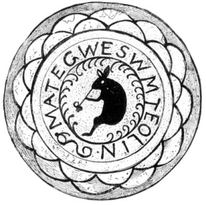

  
[Intangible Textual Heritage](../../../index)  [Native
American](../../index)  [Northeast](../index) 

------------------------------------------------------------------------

[Buy this Book at
Amazon.com](https://www.amazon.com/exec/obidos/ASIN/B002DPU8XY/internetsacredte)

------------------------------------------------------------------------

<table width="75%">
<colgroup>
<col style="width: 50%" />
<col style="width: 50%" />
</colgroup>
<tbody>
<tr class="odd">
<td width="50%" data-valign="TOP"></td>
<td width="50%" data-valign="CENTER"><h1 id="the-algonquin-legends-of-new-england" data-align="CENTER">The Algonquin Legends of New England</h1>
<h2 id="by-charles-g.-leland" data-align="CENTER">by Charles G. Leland</h2>
<h4 id="section" data-align="CENTER">[1884]</h4></td>
</tr>
</tbody>
</table>

------------------------------------------------------------------------

[Contents](#contents)    [Start Reading](al00)    [Page
Index](pageidx)    [Text \[Zipped\]](al.txt.gz)

------------------------------------------------------------------------

|                                                                                                                           |
|---------------------------------------------------------------------------------------------------------------------------|
|  |

This is Charles Lelands' able retelling of the Algonquin mythology,
particularly tales of the culture hero, Glooskap.

------------------------------------------------------------------------

 [Title Page](al00)  
[Preface](al01)  
[Authorities](al02)  
[Contents](al03)  
[List of Illustrations](al04)  
[Introduction](al05)  

### Glooskap The Divinity

[Of Glooskap's Birth, and of his Brother Malsum the Wolf](al06)  
[How Glooskap made the Elves and Fairies, and then Man of an Ash Tree,
and last of all, Beasts, and of his Coming at the Last Day](al07)  
[Of the Great Deeds which Glooskap did for Men; how he named the
Animals, and who they were that formed his Family.](al08)  
[How Win-pe the Sorcerer, having stolen Glooskap's Family, was by him
pursued, and how Glooskap for a Merry Jest cheated the Whale. Of the
Song of the Clams, and how the Whale smoked a Pipe](al09)  
[Of the Dreadful Deeds of the Evil Pitcher, who was both Man and Woman,
and how she fell in love with Glooskap, and, being scorned, became his
Enemy. Of the Toads and Porcupines, and the Awful Battle of the
Giants](al10)  
[How the Story of Glooskap and Pook-jin-skwess, the Evil Pitcher, is
told by the Passamaquoddy Indians](al11)  
[How Glooskap became friendly to the Loons, and made them his
Messengers](al12)  
[How Glooskap made his Uncle Mikchich the Turtle into a Great Man, and
got him a Wife. Of Turtles' Eggs, and how Glooskap vanquished a Sorcerer
by smoking Tobacco.](al13)  
[How Glooskap sailed through the great Cavern of Darkness](al14)  
[Of the Great Works which Glooskap made in the Land](al15)  
[The Story of Glooskap as told in a few Words by a Woman of the
Penobscots](al16)  
[How Glooskap, leaving the World, all the Animals mourned for him, and
how, ere he departed, he gave Gifts to Men](al17)  
[How Glooskap had a great Frolic with Kitpooseagunow, a Mighty Giant who
caught a Whale](al18)  
[How Glooskap made a Magician of a Young Man, who aided another to win a
Wife and do Wonderful Deeds](al19)  
[How a Certain Wicked Witch sought to cajole the Great and Good
Glooskap, and of her Punishment](al20)  
[Of other Men who went to Glooskap for Gifts](al21)  
[Of Glooskap and the Three Other Seekers](al22)  
[Of Glooskap and the Sinful Serpent](al23)  
[The Tale of Glooskap as told by another Indian. Showing how the Toad
and Porcupine lost their Noses](al24)  
[How Glooskap changed Certain Saucy Indians into Rattlesnakes](al25)  
[How Glooskap bound Wuchowsen, the Great Wind-Bird, and made all the
Waters in all the World Stagnant](al26)  
[How Glooskap conquered the Great Bull-Frog, and in what Manner all the
Pollywogs, Crabs, Leeches, and other Water Creatures were
created](al27)  
[How the Lord of Men and Beasts strove with the Mighty Wasis, and was
shamefully defeated](al28)  
[How the great Glooskap fought the Giant Sorcerers at Saco, and turned
them into Fish](al29)  
[How Glooskap went to England and France, and was the first to make
America known to the Europeans.](al30)  
[How Glooskap is making Arrows, and preparing for a Great Battle. The
Twilight of the Indian Gods.](al31)  
[How Glooskap found the Summer](al32)  
[The Legend of Glooskap](al33)  

### The Merry Tales of Lox, The Mischief Maker

[Of the Surprising and Singular Adventures of two Water Fairies who were
also Weasels, and how they each became the Bride of a Star. Including
the Mysterious and Wonderful Works of Lox, the Great Indian Devil, who
rose from the Dead](al34)  
[Of the Wolverine and the Wolves, or how Master Lox Froze to
Death](al35)  
[How Master Lox played a Trick on Mrs. Bear, who lost her eyesight and
had her eyes opened](al36)  
[How Lox came to Grief by trying to catch a Salmon](al37)  
[How Master Lox as a Raccoon killed the Pear and the Black Cats, and
performed other Notable Feats of Skill, all to his Great
Discredit](al38)  
[How Lox deceived the Ducks, cheated the Chief, and beguiled the
Bear](al39)  
[The Mischief Maker. A Tradition of the Origin of the Mythology of the
Senecas. A Lox Legend](al40)  
[How Lox told a Lie](al41)  

### The Amazing Adventures of Master Rabbit

[I. How Master Rabbit sought to rival Keeoony, the Otter](al42)  
[II. How Mahtigwess, the Rabbit dined with the Woodpecker Girls, and was
again humbled by trying to rival them](al43)  
[III. Of the Adventure with Mooin, the Bear; it being the Third and Last
Time that Master Rabbit made a Fool of himself](al44)  
[IV. Relating how the Rabbit became Wise by being Original, and of the
Terrible Tricks which he by Magic played Loup-Cervier, the Wicked Wild
Cat](al45)  
[V. How Master Rabbit went to a Wedding and won the Bride](al46)  
[VI. How Master Rabbit gave himself Airs](al47)  
[VII. The Young Man who was Saved by a Rabbit and a Fox](al48)  

### The Chenoo Legends

[I. The Chenoo, or the, Story of a Cannibal with an Icy Heart](al49)  
[The Story of the Great Chenoo, as told by the Passamaquoddies](al50)  
[The Girl-Chenoo](al51)  

### Thunder Stories

[Of the Girl who married Mount Katahdin, and how all the Indians brought
about their own Rain](al52)  
[How a Hunter visited the Thunder Spirits who dwell in Mount
Katahdin](al53)  
[The Thunder and Lightning Men](al54)  
[Of the Woman who married the Thunder, and of their Boy](al55)  

### At-o-sis, the Serpent

[How Two Girls were changed to Water-Snakes, and of Two Others that
became Mermaids](al56)  
[Ne Hwas, the Mermaid](al57)  
[Of the Woman who loved a Serpent who lived in a Lake](al58)  
[The Mother of Serpents](al59)  
[Origin of the Black Snakes](al60)  

### The Partridge

[The Adventures of the Great Hero Pulowech, or the Partridge](al61)  
[The Story of a Partridge and his Wonderful Wigwam](al62)  
[How the Partridge built Good Canoes for all the Birds, and a Bad One
for Himself](al63)  
[The Mournful Mystery of the Partridge-Witch; setting forth how a Young
Man died from Love](al64)  
[How one of the Partridge's Wives became a Sheldrake-Duck, and why her
Feet and Feathers are Red](al65)  

### The Invisible One

[The Invisible One](al66)  

### Story of the Three Strong Men

[Story of the Three Strong Men](al67)  

### The Weewillmekq'

[I. How a Woman Lost a Gun for Fear of the Weewillmekq'](al68)  
[II. Muggahmaht'adem, the Dance of Old Age, or the Magic of the
Weewillmekq'](al69)  
[III. Another Version of the Dance of Old Age?](al70)  

### Tales of Magic

[M'téoulin, or Indian Magic](al71)  
[Tumilkoontaoo, or the Broken Wing](al72)  
[Fish-Hawk and Scapegrace](al73)  
[The Giant Magicians](al74)  
