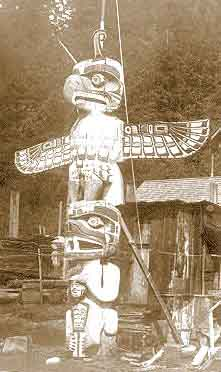

|                                                                                                                                  |                                                                |
|----------------------------------------------------------------------------------------------------------------------------------|----------------------------------------------------------------|
|  | Northwestern Native Americans |

------------------------------------------------------------------------

This index has links to resources at Intangible Textual Heritage about
the religion, mythology, folklore and spiritual practices of Native
Americans of the Northwest region, which stretches from Northern
California to British Columbia and Southern Alaska.

------------------------------------------------------------------------

 [Coos Texts](coos/index)  
by Leo Frachtenberg. \[1913\]  
(Columbia University Contributions to Anthropology,
Vol. I.) 

 [Chinook
Texts](chinook/index)   by Franz Boas.
\[1894\]  
(U.S. Bureau of American Ethnology Bulletin, no
20.) 

 [Kwakiutl Tales](kt/index)  
by Franz Boas. \[1910\]  
(Columbia University Contributions to Anthropology,
Vol. II.) 

 [Haida Songs](hs/index)   by
John R. Swanton. \[1912\]  
(Publications of the American Ethnological Society
Volume III, Part 1.) 

 [Tsimshian Texts (Nass River
Dialect)](nass/index)   by Franz Boas.
\[1902\]  
(U.S. Bureau of American Ethnology Bulletin no.
27.) 

 [Tsimshian Texts (New
Series)](tst/index)   by Franz Boas.
\[1912\]  
(Publications of the American Ethnological Society
Volume III, Part 2.) 

 [Tlingit Myths and
Texts](tmt/index)   by John R. Swanton.
\[1909\]  
(U.S. Bureau of American Ethnology Bulletin no.
39.) 

 [The Thunder Bird Tootooch
Legends](ttb/index)   by W. L. Weber.
\[1936\]   The symbols of the
totem pole interpreted. 

 [Many Swans: Sun Myth of the North
American Indians](../sunmyth)   by Amy
Lowell \[1920\] 
