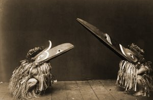

  
[Intangible Textual Heritage](../../../index)  [Native
American](../../index)  [Northwest](../index) 

------------------------------------------------------------------------

<table width="75%">
<colgroup>
<col style="width: 50%" />
<col style="width: 50%" />
</colgroup>
<tbody>
<tr class="odd">
<td data-valign="CENTER" width="50%"></td>
<td data-valign="CENTER" width="50%"><h1 id="tsimshian-texts" data-align="CENTER">Tsimshian Texts</h1>
<h5 id="nass-river-dialect" data-align="CENTER">(Nass River Dialect)</h5>
<h2 id="by-franz-boas" data-align="CENTER">By Franz Boas</h2>
<h4 id="section" data-align="CENTER">[1902]</h4></td>
</tr>
</tbody>
</table>

------------------------------------------------------------------------

The Tsimshian are a tribe of Native Americans residing on the coast of
British Columbia. This was the first set of Tsimshian texts with English
translations that Boas published. The companion book, [Tsimshian Texts
(New Series)](../tst/index), published in 1912, is also available at
Intangible Textual Heritage.

Boas notes that these were 'only moderately well told'. In several
cases, the narratives duplicate stories documented elsewhere in the
Northwest region. However, these texts stand by themselves and make
interesting reading. Boas' Tsimshian collection techniques have been
criticized in recent years, but the extensive parallels with other
bodies of folklore, both regionally and globally, leave no doubt that
these stories are authentic.

*Note about the picture: The Edward Curtiss photograph (above) is
actually of a Kwakiutl ceremony, a neighboring tribe. However it is very
typical of the region.*

------------------------------------------------------------------------

[Title Page](nass00)  
[Contents](nass01)  
[Introduction](nass02)  
[Txä'msEm and Lô<u>g</u>ôbolā'](nass03)  
[Txä'msEm](nass04)  
[Txä'msEm](nass05)  
[The Stone and the Elderberry Bush](nass06)  
[The Porcupine and the Beaver](nass07)  
[The Wolves and the Deer](nass08)  
[The Stars](nass09)  
[Rotten-feathers](nass10)  
[K\*?ēLku](nass11)  
[The Sealion Hunters](nass12)  
[Smoke-hole](nass13)  
[Ts?ak\*](nass14)  
[Growing-Up-Like-One-Who-Has-A-Grandmother](nass15)  
[Little-eagle](nass16)  
[She-Who-Has-A-Labret-On-One-Side](nass17)  
[The Grizzly Bear](nass18)  
[Squirrel](nass19)  
[Witchcraft](nass20)  

### Supplementary Stories

[The Origin of the G\*ispawaduwE'da](nass21)  
[Asi-hwî'l](nass22)  
[The Grouses](nass23)  
[TsEgu'ksku](nass24)  
[Rotten-Feathers (continued)](nass25)  

### Abstracts

[Txä'msEm And Lô<u>g</u>ôbolā'](nass26)  
[Txä'msEm](nass27)  
[Txä'msEm](nass28)  
[The Stone and the Elderberry Bush](nass29)  
[The Porcupine and the Beaver](nass30)  
[The Wolves and the Deer](nass31)  
[The Stars](nass32)  
[Rotten-feathers](nass33)  
[K\*?ēLku](nass34)  
[The Sealion Hunters](nass35)  
[Smoke-hole](nass36)  
[Ts?ak\*](nass37)  
[Growing-Up-Like-One-Who-Has-A-Grandmother](nass38)  
[Little-Eagle](nass39)  
[She-Who-Has-A-Labret-On-One-Side](nass40)  
[The Grizzly Bear](nass41)  
[The Squirrel](nass42)  
[The Origin Of The G\*ispawaduwE'da](nass43)  
[Asi-hwî'l](nass44)  
[The Grouses](nass45)  
