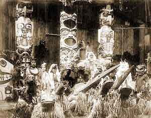

[Intangible Textual Heritage](../../../index)  [Native
American](../../index)  [Northwest](../index) 

------------------------------------------------------------------------

<table width="75%">
<colgroup>
<col style="width: 50%" />
<col style="width: 50%" />
</colgroup>
<tbody>
<tr class="odd">
<td data-valign="CENTER" width="50%"></td>
<td data-valign="CENTER" width="50%"><h1 id="tlingit-myths-and-texts" data-align="CENTER">Tlingit Myths and Texts</h1>
<h2 id="john-r.-swanton" data-align="CENTER">John R. Swanton</h2>
<h4 id="bureau-of-american-ethnology-bulletin-39" data-align="CENTER">Bureau of American Ethnology Bulletin 39</h4>
<h4 id="section" data-align="CENTER">[1909]</h4></td>
</tr>
</tbody>
</table>

------------------------------------------------------------------------

[Contents](#contents)    [Start Reading](tmt000)

------------------------------------------------------------------------

This is a massive study of the myths and legends of the Tlingit, Native
Americans of southern Alaska. These texts include a lengthly cycle of
stories about Raven, the trickster figure of the Northwest, the
equivalent of the better known Coyote of the Southwest. Another major
thread that runs through these stories is the typical Northwestern
preoccupation with wealth and status. The land was abundant with marine
life, wildlife and other resources. The Tlingit, along with other
cultures in the region, had developed a very high level of material
wealth, as well as levels of social inequality not found elsewhere in
North America. For this reason, many of the stories are parallel to
European folklore (without being derivative in the slightest way), in
which a low-status person achieves wealth and respect by supernatural
intervention or a series of epic trials.

On the other hand, the Tlingit were also avid believers in the Potlatch
system, by which wealth was distributed by the rich at festivals, in
order to reinforce their status. Hence there are also stories in this
collection in which altruism and sharing wealth are rewarded.

Usually in 19th century ethnographies the texts are presented without
any clue as to the cultural context in which they were told. This
collection diverges from this sometimes maddening practice. The function
of stories is often described in an footnote by the informant, for
instance, as fables for young people. In another instance at the end of
the book the myth cycle is retold, [woven into a grieving
ceremony](tmt133).

--J.B. Hare

------------------------------------------------------------------------

[Title Page](tmt000)  
[Letter of Transmittal](tmt001)  
[Contents](tmt002)  
[Phonetic Key](tmt003)  
[Introduction](tmt004)  

### Myths Recorded in English at Sitka

[1. Raven](tmt005)  
[2. The Big Clam](tmt006)  
[3. English Version of the Story of the Four Brothers](tmt007)  
[4. Origin of the Killer Whale](tmt008)  
[5. KAka'](tmt009)  
[6. The Land-Otter Sister](tmt010)  
[7. The Land-Otter Son](tmt011)  
[8. The Wolf-Chief's Son](tmt012)  
[9. Wolverine-man](tmt013)  
[10. The Halibut People](tmt014)  
[11. Stories of the Monster Devilfish and The Cry-Baby](tmt015)  
[12. The Woman Who Was Killed by a Clam](tmt016)  
[13. Root-stump](tmt017)  
[14. The Protracted Winter](tmt018)  
[15. Beaver and Porcupine](tmt019)  
[16. The Poor Man Who Caught Wonderful Things](tmt020)  
[17. The Finding of the Blue Paint, And How a Certain Creek Received Its
Name](tmt021)  
[18. Various Adventures Near Cross Sound](tmt022)  
[19. Kâts!](tmt023)  
[20. The Unsuccessful Hunters](tmt024)  
[21. Origin of Iceberg House](tmt025)  
[22. The Woman Taken Away by the Frog People](tmt026)  
[23. How the Frogs Honored the Dead](tmt027)  
[24. The Brant Wives](tmt028)  
[25. Story of the Puffin](tmt029)  
[26. Story of the Wain-House People](tmt030)  
[27. The Alsek River People](tmt031)  
[28. The Youthful Warrior](tmt032)  
[29. The First War In The World](tmt033)  
[30. How Protestant Christianity Was First Heard of at Sitka](tmt034)  

### Myths Recorded in English at Wrangell

[31. Raven, Part I](tmt035)  
[31. Raven, Part II](tmt036)  
[31. Raven, Part III](tmt037)  
[31. Raven, Part IV](tmt038)  
[31. Raven, Part V](tmt039)  
[31. Raven, Part VI](tmt040)  
[31. Raven, Part VII](tmt041)  
[31. Raven, Part VIII](tmt042)  
[31. Raven, Part IX](tmt043)  
[31. Raven, Part X](tmt044)  
[31. Raven, Part XI](tmt045)  
[31. Raven, Part XII](tmt046)  
[31. Raven, Part XIII](tmt047)  
[31. Raven, Part XIV](tmt048)  
[31. Raven, Part XV](tmt049)  
[31. Raven, Part XVI](tmt050)  
[31. Raven, Part XVII](tmt051)  
[31. Raven, Part XVIII](tmt052)  
[31. Raven, Part XIX](tmt053)  
[31. Raven, Part XX](tmt054)  
[31. Raven, Part XXI](tmt055)  
[32. Kakê'q!utê](tmt056)  
[33. Origin of the <u>G</u>onaqAdê't](tmt057)  
[34. A Story of the <u>G</u>onaqAdê't](tmt058)  
[35. Origin of the L!<u>ê</u>'nAx<u>x</u>î'dAq](tmt059)  
[36. The Thunders](tmt060)  
[37. Origin of the Screech Owl](tmt061)  
[38. Little Felon](tmt062)  
[39. Origin of the Fern Root and the Ground Hog](tmt063)  
[40. The Halibut That Divided the Queen Charlotte Islands](tmt064)  
[41. The Image That Came to Life](tmt065)  
[42. Djîyî'n](tmt066)  
[43. The Self-Burning Fire](tmt067)  
[44. The Giant of Tâ'sna](tmt068)  
[45. The Woman Who Married a Land Otter](tmt069)  
[46. The Land-Otters' Captive](tmt070)  
[47. The Man Fed From the Sky](tmt071)  
[48. The Salmon Sack](tmt072)  
[49. Roots](tmt073)  
[50. The Mucus Child](tmt074)  
[51. The Salmon Chief](tmt075)  
[52. The Jealous Uncle](tmt076)  
[53. The Man who Married the Eagle](tmt077)  
[54. The Brant Wife](tmt078)  
[55. The Duck Helper](tmt079)  
[56. The Boy who Shot the Star](tmt080)  
[57. The Boy and the Giant](tmt081)  
[58. The Boy with Arrows on his Head](tmt082)  
[59. GAmnâ'tck!<u>î</u>](tmt083)  
[60. The Hîn-ta<u>y</u>î'c<u>î</u>](tmt084)  
[61. The East and North Winds](tmt085)  
[62. The Big Beaver](tmt086)  
[63. Beaver and Porcupine](tmt087)  
[64. The Man who Entertained the Bears](tmt088)  
[65. Mountain Dweller](tmt089)  
[66. How The Sitka K<u>î</u>ksA'd<u>î</u> Obtained The Frog](tmt090)  
[67. Qâq!Atcgû'k](tmt091)  
[68. The Beaver of Killisnoo](tmt092)  
[69. Story Of The Grizzly-Bear Crest Of The Te'qoed<u>î</u>](tmt093)  
[70. Story of the Eagle Crest of the NexA'd<u>î</u>](tmt094)  
[71. Story Of The Killer-Whale Crest Of The
DAqL!awe'd<u>î</u>](tmt095)  
[72. Story of the Nan<u>y</u>aâ'<u>y</u>î Crests](tmt096)  
[73. Story of the Frog Crest of the K<u>î</u>ksA'd<u>î</u> Of
Wrangell](tmt097)  
[74. Story of the Kâ'gwAntân Crests](tmt098)  
[75. Migration of the <u>G</u>ânAxA'd<u>î</u> to Tongass](tmt099)  
[76. The Woman Who Married the Frog](tmt100)  
[77. The Girl Who Married The L!AL!](tmt101)  
[78. The Woman Who Married a Tree](tmt102)  
[79. The Girl Who Married the Fire Spirit](tmt103)  
[80. Orphan](tmt104)  
[81. The Dead Basket-Maker](tmt105)  
[82. The Crying-for Medicine](tmt106)  
[83. The Runaway Wife](tmt107)  
[84. The Rejected Lover](tmt108)  
[85. The Faithless Wife](tmt109)  
[86. The Woman Who Married the Dead Man](tmt110)  
[87. The Returned From Spirit Land](tmt111)  
[88. The Sky Country](tmt112)  

### Texts

[89. The Origin of Copper](tmt113)  
[90. The Man Who Was Abandoned](tmt114)  
[91. The Shaman Who Went Into The Fire, and the Heron's Son](tmt115)  
[31. Raven, Part XXII](tmt116)  
[92. Mountain Dweller](tmt117)  
[93. Kâhâ's!<u>î</u>, The Strong Man](tmt118)  
[94. The L!ê'nAx<u>x</u>î'dAq](tmt119)  
[95. Origin Of The Frog Crest Among The KîksA'd<u>î</u>](tmt120)  
[96. How the KîksA'd<u>î</u> Came to Sitka](tmt121)  
[97. The Four Brothers](tmt122)  
[98. The K<u>î</u>ksA'd<u>î</u> Woman Who Was Turned Into An
Owl](tmt123)  
[99. Moldy-end](tmt124)  
[100. Moldy-end](tmt125)  
[101. Qâq!Atcgû'k](tmt126)  
[102. The Sea-Lion Hunt](tmt127)  
[103. The War in the Spruce Canoe](tmt128)  
[104. Story of the Kâ'gwAntân](tmt129)  
[105. Story Of The Kâ'ck!e Qoan](tmt130)  
[106. Origin of a Low-Caste Name](tmt131)  
[The Tobacco Feast](tmt132)  
[Speeches Delivered at a Feast When a Pole was Erected for the
Dead](tmt133)  
[Words of Songs Taken in Connection with Graphophone Records](tmt134)  

### Abstracts of Myths

[Myths Recorded in English at Sitka](tmt135)  
[Myths Recorded in English at Wrangell](tmt136)  
