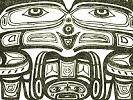

  
[Intangible Textual Heritage](../../../index)  [Native
American](../../index)  [Northwest](../index)  [Index](index) 
[Previous](ttb13)  [Next](ttb15) 

------------------------------------------------------------------------

  
*The Thunder Bird Tootooch Legends*, by W.L. Webber, \[1936\], at
Intangible Textual Heritage

------------------------------------------------------------------------

p. 27

 

### The Ill-Jow

The **Ill-Jow** is a hand-hammered amulet of **pil chickamin** (Native
Copper) or of a silver coin held together with a thread of sinew or
cotton through the small holes in the flange of the charm.

The **Ill-Jow** comes from the Haida Indians of the Queen Charlotte
Islands, British Columbia. It is a symbol of the Spirit of Theft, a
bringer of good fortune to its owner. The spirit would oft-times get
behind a person's back and cunningly make a thief or robber out of his
victim. To ward off this spirit and curtail his desire, the victim,
possessing the "Good Medicine" Charm, would be guided in the paths of
uprightness. If strict attention were paid to the charm it would
overcome the evil. If this was done the victim was assured of prosperity
and great riches would be his.

The **Ill-Jow** must come into the possession of the owner by theft.
When obtained it is to be stuffed with threads, hair, bits of blanket or
other small articles pilfered from others. The stuffed charm should be
hidden among one's personal belongings, clothing or such, although it
may be carried on the person. It should not be used for adornment and
should be carried in a small bag for the purpose to prevent its coming
under the human vulgar gaze. The **Ill-Jow** is to be resurrected
occasionally and petitioned to give it **Skookum** (Strength and
Courage) to promote the success of any project that is toward. The charm
must be guarded with the utmost secrecy. Among the Indians who harbor
this amulet it is considered a disgrace to let the other members of the
tribe know, or even surmise that the "Medicine Charm" has been adopted.
Once the charm has been secured it can never be passed to another to be
disposed of. It should be thrown into a body of water or dropped into a
deep well.

To gain possession of this talisman have some unsuspecting person barter
for it or purchase it as for himself.

------------------------------------------------------------------------

[Next: Ho-Xhok, The Crane](ttb15)
