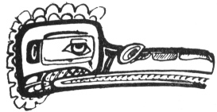

  
[Intangible Textual Heritage](../../../index)  [Native
American](../../index)  [Northwest](../index)  [Index](index) 
[Previous](ttb14)  [Next](ttb16) 

------------------------------------------------------------------------

  
*The Thunder Bird Tootooch Legends*, by W.L. Webber, \[1936\], at
Intangible Textual Heritage

------------------------------------------------------------------------

p. 28

 

### Ho-Xhok, (HO-HOOK), THE CRANE

Among the Kwakiutl Indians, the **Ho-Xhok** was recognized as a fabulous
bird, and always associated with the Thunder Bird. **Ho-Xhok** is
represented as having a beak similar to that of a crane. This
supernatural bird was the size of a man and could change herself into a
human being by the power of his will. She is often placed with the
Thunder Bird on the Totem Poles. At the Winter ceremonies of the Indian
secret societies, this character would be portrayed with the utmost
care. A great many rehearsals would be held in order to make the
performance as realistic as possible and deceive the audience by sleight
of hand.

The mask of the **Ho-Xhok** used at these winter feasts was made of red
cedar, three to four feet in length. From it hung wooden carvings of
human skulls on strips of cedar bark. In addition, the wearer would have
on a cedar bark neck ring, cedar bark cuffs and leggings, a breach clout
and a Chilkat blanket.

A legend of the tribes affiliated with the Kwakiutls gives this version:
A number of women went to a nearby island to dig fern roots and the
tender sprouts for food. While they were there a small fire was made to
warm some dried whale meat. The smell of it and the human odor attracted
the attention of **Ho-Xhok** who was as the top of a tall tree. As he
came down he sharpened his beak on the bark of the branches. Upon
reaching the ground he covered his beak and assumed the form of a man.
When he came to the women they spread a mat for their guest on which was
some whale meat. **Ho-Xhok** became angry and said: I do not eat whale
meat, I only eat the brains of man." He then uncovered his beak and
broke a woman's skull open and ate her brain.

One of the woman's companions who was hiding, slipped away in a canoe to
the **tenas town** (village) and told the **Tyee** (Chief) of the tribe
what had happened. The tribe held council and resolved to make war on
**Ho-Xhok**. The chief came to the place where the slain woman lay and
took her blood and rubbed it on himself. He then took a cedar board and
fastened it to the tree, making a trap. Putting some whale meat on the
fire he waited for **Ho-Xhok** to come down the tree again. As
**Ho-Xhok** came down, sharpening his ruddy beak on the bottom of the
tree, his beak stuck in the trap. The Chief called upon his Totem Spirit
to give him strength and then ran and killed the fabulous bird by
breaking off his bill and pushing him into the fire. This act liberated
the tribe and gave the Chief and his daughters the right to use
**Ho-Xhok** for their family crest and to pass it on to future
generations.

------------------------------------------------------------------------

[Next: Shwah Kuk, The Frog](ttb16)
