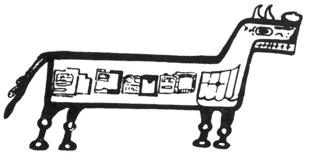

  
[Intangible Textual Heritage](../../../index)  [Native
American](../../index)  [Northwest](../index)  [Index](index) 
[Previous](ttb17)  [Next](ttb19) 

------------------------------------------------------------------------

  
*The Thunder Bird Tootooch Legends*, by W.L. Webber, \[1936\], at
Intangible Textual Heritage

------------------------------------------------------------------------

p. 31

 

### Le-Loo, THE WOLF

The Wolf was the sacred animal spirit of the **Shaman** (Medicine Man)
and his **Tillicums** (Family). The Wolf people are one of the oldest
clans of the primitive Northwest Indians.

The legend of the Nootka Indians, of Vancouver Island, Is as follows:
They thought that if they could secure the young Wolf and take from him
some inner part to rub on the outer side of their canoes, it would bring
them great luck when whaling. Great whale hunters of this tribe were
supposed to have secured the charm.

The ancestors of the tribes who lived along the Skeena, known to them as
**Coola Chuck Snase** (The River of the Mist), acquired the Wolf crest
by befriending the animal and for this service it became their guardian
spirit.

Long ago, when winter snows were deep, a wolf came to a Chief's house
one morning. He was in great pain and could not eat. The old Chief said
to his nephews: "See whether there is anything hurting the Wolf." They
did this and, finding a piece of bone caught in his throat, they removed
it. Then more snow came and hunger stalked among the people. The Wolf
returned in the form of a man and beckoned them to follow him. He led
the Indians to a place where he had killed many caribou for their use.

The Wolf represents the genius of the land. He is carved on many totem
poles. The Nootkans weave the symbol in their grass baskets and it is
used on many other articles of their **mamook** (handicraft).

Members of the Wolf Clan are always welcome at the ceremonial Winter
dances as they are keen for any game. One of their theme songs is: "He
who steps upon the high places of the Earth."

------------------------------------------------------------------------

[Next: Wolalee, The Salmon](ttb19)
