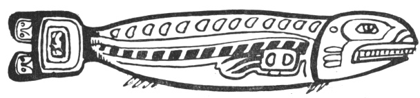

  
[Intangible Textual Heritage](../../../index)  [Native
American](../../index)  [Northwest](../index)  [Index](index) 
[Previous](ttb18)  [Next](ttb20) 

------------------------------------------------------------------------

  
*The Thunder Bird Tootooch Legends*, by W.L. Webber, \[1936\], at
Intangible Textual Heritage

------------------------------------------------------------------------

p. 32

 

### Wolalee, THE SALMON

The Salmon is a symbol of abundance as it furnished the Indians with
their principal food. The Indians have many beliefs about its origin,
also as to how to prolong its migration. The ancient Thompson tribes who
fished at Hell Gate along the Fraser River, believed that the Salmon
must never be cut across the grain, for the living fish would then leave
the waters, also that the head and entrails were to be cast back into
the river in order to propagate its species.

A legend of the Kwakiutls tells of **Tootooch** (Thunder Bird's) hunger
for salmon. In order to obtain them he married the Salmon Creek Woman,
but she concealed her fish and told him that there were no more. But
after she fed her child **Tootooch** saw the salmon crumbs between his
teeth.

Then there began a **Skookum hyak cooley** (Salmon run) up the river.
Thunder Bird helped her to catch them for their Winter food. He kept on
eating so many of the salmon that the **Salmon Klootchman** (Salmon
Woman) became alarmed for the welfare of her child. "He is eating the
inside of the house out," she thought. Packing up what remained and
taking her child, she left him without spear or net. Thunder Bird was
never able to find his wife again which grieved him very much, so he
started on new adventures. Coming to a town along the river he saw the
Salmon House floating by. It was filled with live Salmon. He tried in
vain to pull it to the shore but could not. Seeking aid, he spied an old
man who was passing, using a magic walking stick made from the tentacle
of an octopus. Thunder Bird bargained with the old man for the loan of
his walking stick and he had to promise him some of the Salmon.

Receiving the stick he pointed it toward the house and the stick
stretched itself out, the suckers of the octopus fastening themselves to
the house with a death-like grip. Thunder Bird tried again to pull it to
the shore but, try as he would, he did not have enough strength. Then he
said to the rocks, "Get up and help me."

But the rocks did not move so to punish them he said: "You shall lie
like that on the ground forever."

Close by were some trees. In a mild tone he asked them for help and they
attached their branches to the stick and, by swaying to and fro with the
aid of the wind, they were able to pull the house to the shore.

Jumping into the house, Thunder Bird found many salmon. After eating his
fill, he told the balance of the fish to go up the different creeks and
propagate their kind.

------------------------------------------------------------------------

[Next: Chet-Woot, The Bear](ttb20)
