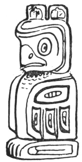

  
[Intangible Textual Heritage](../../../index)  [Native
American](../../index)  [Northwest](../index)  [Index](index) 
[Previous](ttb26)  [Next](ttb28) 

------------------------------------------------------------------------

  
*The Thunder Bird Tootooch Legends*, by W.L. Webber, \[1936\], at
Intangible Textual Heritage

------------------------------------------------------------------------

p. 40

 

### Kwel-Kwel, THE OWL

This crest is used by the Tsimshian and Nootka Tribes for ornamenting
objects pertaining to the clan and illustrating certain incidents in
their legendary history.

A great Chief had a son who was always crying. His father sent him out
of the house saying: "The White Owl shall fetch you." The boy went out
with his **Kahpho** (sister). The White Owl came and carried the girl to
the top of a lightning-stripped hemlock. The people could hear her
crying but were unable to climb the tree to get her down. When she
ceased to cry she was married to the Owl. They had a child, a son.

When the son grew up it was the desire of his mother to send him to her
people. A head-dress of the owl was made for him by his mother and then
his father composed a song for him. The Owl then carried them both back
to his wife's home in the village.

When the girl's mother saw her grandson she was very frightened but she
was assured by her daughter that he was her grandson. The Owl and the
boy's mother then flew away.

When the boy became of age, his grand-parents gave a **Hiu Muckamuck**
(feast) in his honor, and presents were distributed among the guests.
This gave him and his descendants the right to use the Owl crest on
their totem.

The Owl is regarded with reverence. The Nootka Indians of the West Coast
of Vancouver Island believe that the spirits of all Medicine Men pass at
death into the Owl Spirit.

The Indian never answers an owl when he says "Hoo Hoo", for, if the
Indian should answer: "Who? Who" the Owl would then reply: "You, you".
This would mean that the Indian would shortly die.

------------------------------------------------------------------------

[Next: Skam-m, The Halibut](ttb28)
