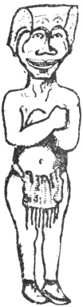

  
[Intangible Textual Heritage](../../../index)  [Native
American](../../index)  [Northwest](../index)  [Index](index) 
[Previous](ttb29)  [Next](ttb31) 

------------------------------------------------------------------------

  
*The Thunder Bird Tootooch Legends*, by W.L. Webber, \[1936\], at
Intangible Textual Heritage

------------------------------------------------------------------------

p. 43

 

### Quil-Tum-Tum

This symbol and legend comes from the Indian tribes of Vancouver Island.
It tells of **Quil-Tum-Tum**, the Earth's first man, surrounded by the
Kingdom of Nature; the trees, flowers, foaming creeks, blue skies and
towering mountains. This all intrigued him, yet he was lonely. He wished
for a companion to share these gifts and to comfort him so he said to
himself: "I will create an image of my own likeness and add to it a form
more beautiful than my own; something that will be the envy of all the
realm of Nature. He then went about it, [whittling](errata.htm#19) a
stick of timber a little less than his own height. Throughout the rainy
weather, night and day he toiled, cutting and scraping with crude knives
of stone and shell. He hunted magic herbs in the forest to make flesh
and skin to cover the carving which felt warm, but try as he would his
carving would not take motion though he rolled it in his blankets and
stood it on its head. Tired, vexed and hungry, he found there was no
food left to eat in his boxes. Leaving a crude, half-made basket by the
fire, he went in search of food.

While he was away, the birds came, robin, flicker, grouse and
woodpecker. They all looked in and admired his wooden image, all
agreeing that the only way that they could help was for them to fly and
tell everyone what **Quil-Tum-Tum** was trying to do. It was Flicker who
told the two maidens with lonely hearts who lived by a stream where it
emptied into the sea.

They came to **Quil-Tum-Tum's** lodge of cedar shakes, sewn together
with spruce root cords. They admired the industry of his hands but
laughed at his idea of making a woman out of a stick of wood, no matter
how beautiful the carving. The two maidens kept the fire burning and
hid, waiting his return.

Upon **Quil-Tum-Tum's** return with food, he was surprised and happy to
find the fire burning and the basket finished. He tried again to bring
his treasured carving to life but he finally had to cease and go hunting
again to rest his thoughts.

On returning he found the two maidens sitting by the fire where his
carving was burning. At first he was angry, when they began to laugh he
offered them the deer he had brought. They then stirred the fire and
cooked him the finest meal he had ever eaten. He liked the two maidens
so well that he married them and from them come the tribes that now live
on Vancouver Island.

From that day to this there has never been a carving of a woman used as
a Totem.

------------------------------------------------------------------------

[Next: Kwaie’tek, The Sea Gull](ttb31)
