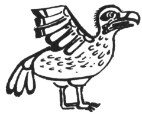

  
[Intangible Textual Heritage](../../../index)  [Native
American](../../index)  [Northwest](../index)  [Index](index) 
[Previous](ttb30)  [Next](ttb32) 

------------------------------------------------------------------------

  
*The Thunder Bird Tootooch Legends*, by W.L. Webber, \[1936\], at
Intangible Textual Heritage

------------------------------------------------------------------------

p. 44

 

### Kwaie’tek, THE SEA GULL

This folk tale of the Sea Gull comes from the Haida Indians of the Queen
Charlotte Islands. If it had not been for Sea Gull there would not have
been any fish in the waters of the Pacific Northwest.

A Powerful Grandmother who lived in a great inlet controlled the tides
by lying on her back and raising her legs up and down. In her house were
many boxes filled with the fishes that now inhabit these waters. Raven,
on his travels alighted on the beach and, taking off his mask, became
human. As usual, he was very hungry and this time for **Oolichan**
(Candle fish). He was doubtful as to whether he would be able to obtain
any from the Grandmother so he said to her very pleasantly, "I am cold
and tired."

The Grandmother asked him where he had been. "Out fishing for oolichan,"
he replied. Grandmother then said: "You old liar, you had better keep
away from my house." This reply disturbed Raven. He would have to use
more tact. He then went down to the beach, as the tide was out, and
there he saw Sea Gull and the Crane. Sea Gull was in the act of
swallowing a dead oolichan, one that Grandmother had thrown away. Raven
was anxious to get hold of the dead fish to see what would happen so he
thought the best way to do it would be to start a fight between Sea Gull
and Crane. He told Sea Gull that Crane did not think much of him and
called him a tattle tale who, with that big mouth of his, was always
making a lot of noise when anything to eat was in sight. He then told
Crane that Sea Gull said he had a long beak which was always being stuck
into other people's business. At that Crane became angry and went and
kicked Sea Gull in the stomach, causing him to belch up the
**oolichan**, which Raven promptly picked up. He then rubbed the scales
off the fish on his hat and went back to Grandmother, telling her that
she did not have all the fish in the sea as there were more down on the
beach than she ever had. At this she became vexed and, when the tide
came in, she opened all her fish boxes and emptied them into the water.

And that is the reason for all the different kinds of fish being in the
waters today. Sea Gull, ever since that day, has always been known as
"Tattle tale."

------------------------------------------------------------------------

[Next: Mateeh, The Goat](ttb32)
