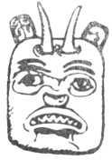

  
[Intangible Textual Heritage](../../../index)  [Native
American](../../index)  [Northwest](../index)  [Index](index) 
[Previous](ttb31)  [Next](ttb33) 

------------------------------------------------------------------------

  
*The Thunder Bird Tootooch Legends*, by W.L. Webber, \[1936\], at
Intangible Textual Heritage

------------------------------------------------------------------------

p. 45

 

### Mateeh, THE GOAT

Temlaham, along the Skeena River, was a vast empire of towering
timber-covered mountains, scarred deep with **Klip Chuck** (deep
canyons), through which rushed foaming rivers teeming with salmon. The
fertile valleys as well as the mountain tops were inhabited by
innumerable wild animals. In this beautiful land dwelt the ancestors of
the Goat Clan. The Sky Spirit, who controlled their destinies, commanded
that they

should conserve the wild life. If they did this, the promised land was
to be theirs forever.

The herds of wild animals multiplied so fast that the people forgot the
edict of the Sky Spirit and began to slaughter them recklessly and for
sport, leaving carcasses to rot and decay. Deer and mountain goats were
needlessly killed, leaving their young to shift for themselves.

One day, while in search of game, a young hunter came upon a deserted
kid whose mother had been killed. Taking the animal in his arms he made
his way down the steep mountain side and at last to his house. He nursed
the little animal back to health and became so attached to it that he
would not allow anyone to ill-treat or abuse it.

As time went on there appeared in the Indian camp some **Hulcima
Tillicum** (Strangers) in whose honor a potlatch was held. Unknown to
the Indians, these strangers were mountain goats in human guise and they
invited their hosts to come to their lodge, high up in the mountain,
where they also would give a feast and show the Indians their mask
dance. The Indians agreed to visit the strangers’ camp but were very
much humiliated when the young hunter insisted on taking his young pet
goat with him. When the guests were all seated and the feasting had
begun, the Goat people said they would prepare for their dance.

Leaving their guests they went outside. Suddenly there was heard a
terrible rumbling of falling and sliding rocks which crashed upon the
lodge, carrying it over the cliffs. The pet goat, who had sensed this
danger beforehand, led his master away and, when the danger had passed,
continued to guide him around the steep cliffs until they finally
arrived at the foot of the mountain. All the other Indians perished in
the disaster.

In gratitude for the generosity of the young mountain goat, the family
of the young hunter adopted the animal as a crest and totem for
themselves and future generations.

------------------------------------------------------------------------

[Next: Skana, The Black Fish](ttb33)
