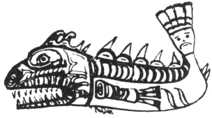

  
[Intangible Textual Heritage](../../../index)  [Native
American](../../index)  [Northwest](../index)  [Index](index) 
[Previous](ttb37)  [Next](ttb39) 

------------------------------------------------------------------------

  
*The Thunder Bird Tootooch Legends*, by W.L. Webber, \[1936\], at
Intangible Textual Heritage

------------------------------------------------------------------------

p. 51

 

### Gal-Quith, THE COD FISH

At the time of this legend, the tribe of **Boya-lith**, of the
Bella Bella Indians, were in the throes of a famine. During this period,
a young man by the name of Cha-gum-cha-kas, decided to go out and see
what he could do for his people. Asking another young man of the tribe
to go out with him on this venture, the two started out early the
following morning in a canoe and headed for the outmost islands of the
Pacific Coast, known to the Indians as **Che-Che-Kwas** and later known
to the white man as the Gander Islands.

They anchored in a tiny bay, sheltered from all winds, and there they
slept. **Cha-gum-cha-kas** was suddenly awakened by a persistent
knocking on the bottom of the canoe. Looking over the side he saw that
it was codfish slapping the side of the canoe with its tail as it swam
around. Catching the codfish on its next round, he tore it to pieces and
threw the pieces overboard. He lay down again and, before the stars
could wink twice, was sound asleep. When he awoke again he found himself
in very strange surroundings, he saw that he was in a house decorated
with things that grow in the sea.

**Cha-gum-cha-kas** woke his companion and they both stepped out of the
canoe, as it was resting on dry land and, as they did so, two guards
stepped out of their box and escorted them to the presence of the Big
Chief. Standing beside the Chief, his apparel all torn to pieces, was
the Chief's son, for it happened that the codfish the hunter had torn to
pieces was the son of the Chief. So **Cha-gum-cha-kas** told his story
and apologized with the deepest concern. The Chief then announced that
there would be four days of feasting for the strangers and at the last
feast both hunters were made Chiefs. **Cha-gum-cha-kas** as Chief
**Gal-quith** and his friend as Chief **Boya**. On their departure the
Big Chief filled their canoe with all the sea-food it would carry, for
he knew of the famine prevailing among the tribe of the strangers.

Thus, when the two hunters awoke they found they had been away four
years and not, as they had thought, four days. Preparations were made
for a great feast, for they had been given up for lost. After telling
all that had befallen them they were recognized as the two leading
Chiefs of the tribe for they had acquired powers by which they were able
to keep their people well fed with all sea foods. Both Chiefs took the
Codfish and Halibut for their crests.

------------------------------------------------------------------------

[Next: Maht-Maht, The Duck](ttb39)
