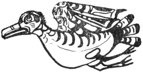

  
[Intangible Textual Heritage](../../../index)  [Native
American](../../index)  [Northwest](../index)  [Index](index) 
[Previous](ttb38)  [Next](ttb40) 

------------------------------------------------------------------------

  
*The Thunder Bird Tootooch Legends*, by W.L. Webber, \[1936\], at
Intangible Textual Heritage

------------------------------------------------------------------------

p. 52

 

### Maht-Maht, THE DUCK

When Mallard Duck's son was to be married, all the ducks and water-fowl
of creation, including Thunder Bird, were invited to the Wedding Feast
at "Place-in-which-feathers-fly-about," a camp where these **Kula kula
Tillicums** (Bird families) lived. Small fish were served at the feast.
Feast bowls, containing mussels and clam soup were placed at each plate.
Near the plate, a spoon made from a split mountain goat's horn was laid.
The spoons were greatly admired, especially by the ducks.

In the course of the feast Mallard Duck was asked to relate some
adventure he had been through so, in order to have a joke at the expense
of Thunder Bird, he fearlessly told the guests that while flying one
day, he had seen Thunder Bird roll a log over on Butterfly and flatten
him out. He went on to say that Thunder Bird had then cut Butterfly open
and eaten the food that he removed from his stomach. This story made
Thunder Bird angry. He got up and kicked Mallard Duck into the fire,
scorching the feathers on his breast. That is why all Mallard ducks are
marked on the breast.

During the excitement the other ducks tucked the spoons under their
wings and flew away and, when they were well out over the water, they
wiped them off and stuck them on their bills. Ever since then these
ducks had bills shaped like goat-horn spoons.

Both the Mallard and the Sawbill Duck are used in decoration, especially
in the woven grass baskets and mats of Vancouver Island.

------------------------------------------------------------------------

[Next: Qa-Yel, The Great Raven](ttb40)
