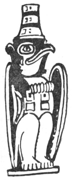

  
[Intangible Textual Heritage](../../../index)  [Native
American](../../index)  [Northwest](../index)  [Index](index) 
[Previous](ttb39)  [Next](ttb41) 

------------------------------------------------------------------------

  
*The Thunder Bird Tootooch Legends*, by W.L. Webber, \[1936\], at
Intangible Textual Heritage

------------------------------------------------------------------------

p. 53

 

### Qa-Yel, THE GREAT RAVEN

The Indians of Alaska and British Columbia believed that the Great Raven
was the **Saghalie Tyee**, Creator of the Universe and Master of the
Tides; that he existed before his birth; that he would never grow old
and that he could transform himself into anything in the world. It is
supposed that he lived in Skyland at the head of the Nass River. He is
always spoken of as being a Grandfather, living before the Great Flood.
He is often confused with Young Raven, the mythical character who
created the psychology of the Indians.

According to an old legend, the Raven was married and had a handsome
daughter. He was extremely jealous of his wife and would not let his
daughter marry for fear one of her children, or her husband, might kiss
and love his wife.

Raven's duties were many and as a Creator he had to make everything in
this world: the mountains, the trees, the blades of grass and whatever
else there is in nature. When away at these tasks he would keep his wife
imprisoned in a big basket suspended from the rafters of his lodge,
leaving a number of Flickers to keep watch and see if by any chance the
basket was disturbed. If so, they would fly and warn their master.

Then Young Raven was born and gave the mortals light by casting the sun
into the heavens. One day, seeking further adventure, he opened the
basket and let out Raven's wife. This made Old Raven very angry and he
called Young Raven "a meddlesome blunderer." Raven then put on his tall,
jointed, magic, dance hat. This made him amphibious. He then called on
the tides to rise.

Young Raven stole the skin of a magic loon which he gave to his mother
so that she might wear it to dive and win and thus avoid death while the
rising water was flooding the house. Young Raven flew out of the smoke
hole, blacking his coat of feathers forever. After flying for a long
time trying to find a place to land he was compelled to come back to
rest on the Great Raven's hat as it was the only visible thing. Finally
he took his mother on his back and flew to the sky which he pierced with
his beak and hung on until the waters receded. The strain on his hill,
from holding on so long, gave it its peculiar curve.

Among the best known totem poles on which the Great Raven is figured, is
Chief Shake's at Wrangell, Alaska. He is also carved on black slate and
wooden totems of the Haidas of the Queen Charlotte Islands, British
Columbia.

------------------------------------------------------------------------

[Next: The Thunder Bird Totem Pole](ttb41)
