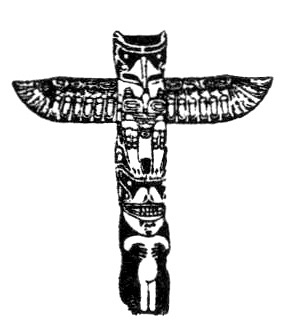

  
[Intangible Textual Heritage](../../../index)  [Native
American](../../index)  [Northwest](../index)  [Index](index) 
[Previous](ttb45) 

------------------------------------------------------------------------

  
*The Thunder Bird Tootooch Legends*, by W.L. Webber, \[1936\], at
Intangible Textual Heritage

------------------------------------------------------------------------

p. 64

### THE THUNDER BIRD TOTEM POLE

### Stanley Park, Vancouver, Canada.

On the Knight Inlet of British Columbia there dwells a portion of the
Kwakiutl Indian Tribe. Among them the Thunder Bird is known as
**Ts-o-na**. This legend tells of the origin of their Totem Pole.

**Tsona** resided in Skyland, above the snowy peaks that border the
inlet. One day he decided to live with the mortals of the earth, and be
like them. Donning his Thunder Bird garments, he flew out of the door of
the Upper World. When looking down from a mountain, he spied a berrying
place by a river. There he would build a large community house for
himself and his tribe. When the new lodge was finished he realized that
it would have to be well guarded, for in those days the fish, birds and
animals by the aid of their strong minds could change themselves into
human beings. Since some of them had many evil ways he had, for his
protection, the Grizzly Bears for guards.

One day as the bears were in search of food, they came upon a hungry
stranger dressed in seal skins, who later became a slave to Thunder
Bird.

Shortly after **Dos-nog-wa**, the powerful Stoneman, came to visit
**Tsona** in his war canoe of a hundred men, for they were travelling
around the world. **Tsona** offered them his friendship and the
hospitality of his house and food. Before each guest was set a carved
bowlful of oolichan grease in which to dip their fish and other
eatables. These dishes were beautifully carved with the owner's crest,
and one peculiar thing about them was that no matter how much of the
grease was used, they were always full. Stoneman and his men were
completely mystified by the unusual significance of this and the things
that adorned the inside of Thunder Bird's household. When they got up to
leave, they took what they had been using. As **Tsona** protested, they
took him prisoner, and led him to their canoe. When they put out to sea,
the clouds gathered, the wind blew, the water swirled and danced, and a
storm was upon them. Thunder Bird's eyes blazed with fire more dazzling
than the sun. Torrents of rain soon flooded the war canoe with water
that washed it from end to end. The Indians had never experienced a
storm like this before, and they became alarmed, expecting at any moment
to be capsized into the sea. **Dosnogwa** offered to return Thunder Bird
his freedom and his property, if he would calm the angry waves. He
realized that he was in the hands of a supernatural power stronger than
the self within him: one he could not defy or define. As they returned
Thunder Bird to his home, the storm ceased. The day's splendour burst
its glory once more upon the green things of the earth and the
surrounding mountains. Never did the Indians forget their visions of the
marvellous powers they had witnessed that day.

Across the shining waters of the inlet, by the mouth of a salmon river,
there lived the great chief, **Sisa-Kaulas**,
'Everybody-Paddling-Toward-Him.' Among his family of many children there
was a plump

p. 65

and pretty girl who **Tsona** had admired many times. He was filled with
love for her, and finally he asked one day for her hand in marriage.

The Chief, to test his courage and sincerity, compelled him to walk
around a hot fire, and also demanded that he give presents to him. A
feast was held, and during it the Chief gave **Tsona** more valuable
gifts than he had received, and bestowed upon him a crest and other
honors. These, as always, would be delivered after the first child was
born.

Should the first-born child be a son, the value of the gifts would be
increased many times. This would give the wife the privilege of being
independent, and of returning to her former home if she desired, or if
the Chief requested. She was also required to send her children to live
with their grandparents that they might learn their customs. Her eldest
son would finally inherit the chiefship of her brother.

Tsona's eldest son dwelt in the home of his grandparents until he had
attained manhood. He then began to build his own lodge and erect a totem
pole as a crest, one that could be handed down to future generations in
remembrance that it was Tsona who was the first man in the tribe to
symbolize the Thunder Bird and bring peace and good will among all
people. Accordingly he placed the Thunder Bird on the top, while beneath
it was the Grizzly Bear holding the captive slave.

When the lodge was completed, a big feast was held. Presents were given
to all the invited guests, who extended to him more favors of
importance.

Two totem poles, symbolic of this ceremony are now erected in Stanley
Park, close to the Lumberman's Arch. They may be seen from passing ships
that ply the ocean's lanes. Strangers from many lands stand before this
shrine of a fading glory gazing at these wooden carvings, these customs
of a changing race.

 

The Lightning Symbol of the Thunder Bird.

 

 

 

 

 
