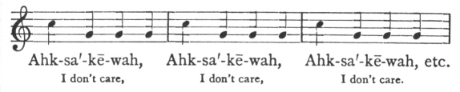

  
[Intangible Textual Heritage](../../../index)  [Native
America](../../index)  [Plains](../index)  [Index](index) 
[Previous](blt28)  [Next](blt30) 

------------------------------------------------------------------------

[Buy this Book at
Amazon.com](https://www.amazon.com/exec/obidos/ASIN/0803271093/internetsacredte)

------------------------------------------------------------------------

*Blackfoot Lodge Tales*, by George Bird Grinnell, \[1892\], at
Intangible Textual Heritage

------------------------------------------------------------------------

p. 159

### OLD MAN DOCTORS

A pis´kun had been built, and many buffalo had been run in and killed.
The camp was full of meat. Great sheets of it hung in the lodges and on
the racks outside; and now the women, having cut up all the meat, were
working on the hides, preparing some for robes, and scraping the hair
from others, to make leather.

About this time, Old Man came along. He had come from far and was very
tired, so he entered the first lodge he came to and sat down. Now this
lodge belonged to three old women. Their husbands had died or been
killed in war, and they had no relations to help them, so they were very
poor. After Old Man had rested a little, they set a dish of food before
him. It was dried bull meat, very tough, and some pieces of belly fat.

"*Hai'-yah ho*!" cried Old Man, after he had tasted a piece. "You treat
me badly. A whole pis´kun of fat buffalo just killed; the camp red with
meat, and here these old women give me tough bull meat and belly fat to
eat. Hurry now! roast me some ribs and a piece of back fat."

"Alas!" exclaimed one old woman. "We have no good food. All our helpers
are dead, and we take what others leave. Bulls and poor cows are all the
people leave us."

"Ah!" said Old Man, "how poor! you are very poor. Take courage now. I
will help you. To-morrow they will run another band into the pis´kun. I
will be there. I will kill the fattest cow, and you can have it all."

Then the old women were glad. They talked to one

p. 160

another, saying, "Very good heart, Old Man. He helps the poor. Now we
will live. We will have marrow guts and liver. We will have paunch and
fat kidneys."

Old Man said nothing more. He ate the tough meat and belly fat, and
rolled up in his robe and went to sleep.

Morning came. The people climbed the bluffs and went out on to the
prairie, where they hid behind the piles of rock and bushes, which
reached far out from the cliff in lines which were always further and
further apart. After a while, he who leads the buffalo was seen coming,
bringing a large band after him. Soon they were inside the lines. The
people began to rise up behind them, shouting and waving their robes.
Now they reached the edge of the bluff. The leaders tried to stop and
turn, but those behind kept pushing on, and nearly the whole band dashed
down over the rocks, only a few of the last ones turning aside and
escaping.

The lodges were now deserted. All the people were gone to the pis´kun to
kill the buffalo and butcher them. Where was Old Man? Did he take his
bow and arrows and go to the pis´kun to kill a fat cow for the poor old
women? No. He was sneaking around, lifting the door-ways of the lodges
and looking in. Bad person, Old Man. In the chiefs lodge he saw a little
child, a girl, asleep. Outside was a buffalo's gall, and taking a long
stick he dipped the end of it in the gall; and then, reaching carefully
into the lodge, he drew it across the lips of the child asleep. Then he
threw the stick away, and went in and sat down. Soon the girl awoke and
began to cry. The gall was very bitter and burned her lips.

"Pity me, Old Man," she said. "Take this fearful thing from my lips."

"I do not doctor unless I am paid," he replied. Then said the girl: "See
all my father's Weapons hanging there.

p. 161

\[paragraph continues\] His shield, war
head-dress, scalps, and knife. Cure me now, and I will give you some of
them."

"I have more of such things than I want," he replied. (What a liar! he
had none at all.)

Again said the girl, "Pity me, help me now, and I will give you my
father's white buffalo robe."

"I have plenty of white robes," replied Old Man. (Again he lied, for he
never had one.)

"Old Man," again said the girl, "in this lodge lives a widow woman, my
father's relation. Remove this fearful thing from my lips, and I will
have my father give her to you."

"Now you speak well," replied Old Man. "I am a little glad. I have many
wives" (he had none), "but I would just as soon have another one."

So he went close to the child and pretended to doctor her, but instead
of that, he killed her and ran out. He went to the old women's lodge,
and wrapped a strip of cowskin about his head, and commenced to groan,
as if he was very sick.

Now the people began to come from the pis´kun, carrying great loads of
meat. This dead girl's mother came, and when she saw her child lying
dead, and blood on the ground, she ran back crying out: "My daughter has
been killed! My daughter has been killed!"

Then all the people began to shout out and run around, and the warriors
and young men looked in the lodges, and up and down the creek in the
brush, but they could find no one who might have killed the child.

Then said the father of the dead girl: "Now, to-day, we will find out
who killed this child. Every man in this camp—every young man, every old
man—must come and jump across the creek; and if any one does not jump
across, if he falls in the water, that man is the one who did the
killing."

p. 162

All heard this, and they began to gather at the creek, one behind
another; and the women and children went to look on, for they wanted to
see the person who had killed the little child. Now they were ready.
They were about to jump, when some one cried out, "Old Man is not here."

"True," said the chief, looking around, "Old Man is not here." And he
sent two young men to bring him.

"Old Man!" they cried out, when they came to the lodge, "a child has
been killed. We have all got to jump to find out who did it. The chief
has sent for you. You will have to jump, too."

"*Ki'-yo!*" exclaimed the old women. "Old Man is very sick. Go off, and
let him alone. He is so sick he could not kill meat for us to-day."

"It can't be helped," the young men replied. "The chief says every one
must jump."

So Old Man went out toward the creek very slowly, and very much scared.
He did not know what to do. As he was going along he saw a
*ni'-po-muk-i* [1](#fn_27) and he said: "Oh my
little brother, pity me. Give me some of your power to jump the creek,
and here is my necklace. See how pretty it is. I will give it to you."

So they traded; Old Man took some of the bird's power, and the bird took
Old Man's necklace and put it on.

Now they jump. *Wo'-ka-hi!* they jump way across and far on to the
ground. Now they jump; another! another! another! Now it comes Old Man's
turn. He runs, he jumps, he goes high, and strikes the ground far beyond
any other person's jump. Now comes the *ni'-po-muk-i. "Wo'-ka-hi!*" the
men shout. "*Ki'-yo!*" cry the women, "the bird has fallen in the
creek." The warriors are running to kill him. "Wait! Hold on!" cries the
bird. "Let me speak a few words. Every one knows I am a good jumper. I
can jump further than any one; but Old Man asked me for some of

p. 163

my power, and I gave it to him, and he gave me this necklace. It is very
heavy and pulled me down. That is why I fell into the creek."

Then the people began to shout and talk again, some saying to kill the
bird, and some not, when Old Man shouted out: "Wait, listen to me.
What's the use of quarrelling or killing anybody? Let us go back, and I
will doctor the child alive."

Good words. The people were glad. So they went back, and got ready for
the doctoring. First, Old Man ordered a large fire built in the lodge
where the dead girl was lying. Two old men were placed at the back of
the lodge, facing each other. They had spears, which they held above
their heads and were to thrust back and forth at each other in time to
the singing. Near the door-way were placed two old women, facing each
other. Each one held a *puk'-sah-tchis,* [1](#fn_28)—a maul,—with which she was to beat time to
the singing. The other seats in the lodge were taken by people who were
to sing. Now Old Man hung a big roll of belly fat close over the fire,
so that the hot grease began to drip, and everything was ready, and the
singing began. This was Old Man's song:—

 

|                   |                   |                      |
|-------------------|-------------------|----------------------|
| Ahk-sa´-kē-wah,   | Ahk-sa´-kē-wah,   | Ahk-sa´-kē-wah, etc. |
| I don't care,     | I don't care,     | I don't care.        |

\[paragraph continues\] And so they sung
for a long time, the old men jabbing their spears at each other, and the
old women pretending to hit each other with their mauls.

After a while they rested, and Old Man said: "Now I want every one to
shut their eyes. No one can look. I am going to begin the real
doctoring." So the people shut

p. 164

their eyes, and the singing began again. Then Old Man took the dripping
hot fat from the fire, gave it a mighty swing around the circle in front
of the people's faces, jumped out the door-way, and ran off. Every one
was burned. The two old men wounded each other with their spears. The
old women knocked each other on the head with their mauls. The people
cried and groaned, wiped their burned faces, and rushed out the door;
but Old Man was gone. They saw him no more.

------------------------------------------------------------------------

### Footnotes

[162:1](blt29.htm#fr_27) The chickadee.

[163:1](blt29.htm#fr_28) A round or oblong
stone, to which a handle was bound by rawhide thongs, used for breaking
marrow bones, etc.

------------------------------------------------------------------------

[Next: The Rock](blt30)
