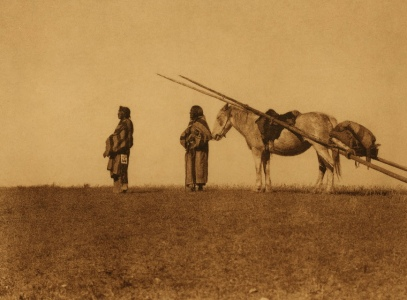

  
[Intangible Textual Heritage](../../../index)  [Native
America](../../index)  [Plains](../index) 

------------------------------------------------------------------------

[Buy this Book at
Amazon.com](https://www.amazon.com/exec/obidos/ASIN/0803271093/internetsacredte)

------------------------------------------------------------------------

<table width="75%">
<colgroup>
<col style="width: 50%" />
<col style="width: 50%" />
</colgroup>
<tbody>
<tr class="odd">
<td width="50%" data-valign="TOP"></td>
<td width="50%" data-valign="CENTER"><h1 id="blackfoot-lodge-tales" data-align="CENTER">Blackfoot Lodge Tales</h1>
<h2 id="by-george-bird-grinnell" data-align="CENTER">by George Bird Grinnell</h2>
<h4 id="section" data-align="CENTER">[1892]</h4></td>
</tr>
</tbody>
</table>

------------------------------------------------------------------------

[Contents](#contents)    [Start Reading](blt00)

------------------------------------------------------------------------

|                                                                                                                           |
|---------------------------------------------------------------------------------------------------------------------------|
|  |

------------------------------------------------------------------------

 [Title Page](blt00)  
[Contents](blt01)  
[Note](blt02)  
[Indians And Their Stories](blt03)  

### Stories Of Adventure

[The Peace With The Snakes](blt04)  
[The Lost Woman](blt05)  
[Adventures Of Bull Turns Round](blt06)  
[Kŭt-o´-yis](blt07)  
[The Bad Wife](blt08)  
[The Lost Children](blt09)  
[Mik-a´pi—Red Old Man](blt10)  
[Heavy Collar And The Ghost Woman](blt11)  
[The Wolf-Man](blt12)  
[The Fast Runners](blt13)  
[Two War Trails](blt14)  

### Stories Of Ancient Times

[Scarface](blt15)  
[Origin of the I-kun-uh´-kah-tsi](blt16)  
[Origin Of The Medicine Pipe](blt17)  
[The Beaver Medicine](blt18)  
[The Buffalo Rock](blt19)  
[Origin Of The Worm Pipe](blt20)  
[The Ghosts’ Buffalo](blt21)  

### Stories Of Old Man

[The Blackfoot Genesis](blt22)  
[The Dog And The Stick](blt23)  
[The Bears](blt24)  
[The Wonderful Bird](blt25)  
[The Race](blt26)  
[The Bad Weapons](blt27)  
[The Elk](blt28)  
[Old Man Doctors](blt29)  
[The Rock](blt30)  
[The Theft From The Sun](blt31)  
[The Fox](blt32)  
[Old Man And The Lynx](blt33)  

### The Story Of The Three Tribes

[The Past And The Present](blt34)  
[Daily Life And Customs](blt35)  
[How The Blackfoot Lived](blt36)  
[Social Organization](blt37)  
[Hunting](blt38)  
[The Blackfoot In War](blt39)  
[Religion](blt40)  
[Medicine Pipes And Healing](blt41)  
[The Blackfoot Of To-day](blt42)  
[Index](blt43)  
