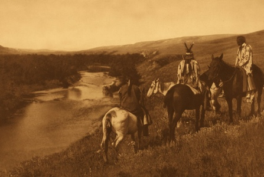

  
[Intangible Textual Heritage](../../../index)  [Native
American](../../index)  [Plains](../index) 

------------------------------------------------------------------------

[Buy this Book at
Amazon.com](https://www.amazon.com/exec/obidos/ASIN/B002E9HLW0/internetsacredte)

------------------------------------------------------------------------

<table width="75%">
<colgroup>
<col style="width: 50%" />
<col style="width: 50%" />
</colgroup>
<tbody>
<tr class="odd">
<td width="50%" data-valign="TOP"> 
The Piegan, by Edward Curtiss [ca 1900] (Public Domain Image)</td>
<td width="50%" data-valign="CENTER"><h1 id="the-old-north-trail" data-align="CENTER">The Old North Trail</h1>
<h2 id="by-walter-mcclintock" data-align="CENTER">by Walter McClintock</h2>
<h4 id="section" data-align="CENTER">[1910]</h4></td>
</tr>
</tbody>
</table>

------------------------------------------------------------------------

[Contents](#contents)    [Start Reading](ont00)    [Page
Index](pageidx)    [Text \[Zipped\]](ont.txt.gz)

------------------------------------------------------------------------

|                                                                                                                           |
|---------------------------------------------------------------------------------------------------------------------------|
|  |

Walter McClintock went to Montana with a US Forestry Service expedition
in 1896. He spent the next four years living on the land with the
Blackfeet, one of the most northern of the Great Plains tribes. He was
adopted into the tribe by the Chief Mad Dog, and got a chance to learn
their traditions firsthand. The book presents Blackfeet folklore and
religious traditions in context. The narrative of his gradual adoption
into Blackfeet society is a classic Western tale, but it is also a
classic of 19th century ethnography. Unfettered by modern
anthropological protocols and given total access by his hosts,
McClintock produced the primary source on the Blackfeet just after the
collapse of their traditional way of life.

Production Note: Due to the number of illustrations in this book, images
are presented at about half of the usual resolution. We apologize for
the reduced quality, which is needed to control the cost of hosting this
book in its entirety.

------------------------------------------------------------------------

 [Title Page](ont00)  
[Preface](ont01)  
[Contents](ont02)  
[Introduction](ont03)  
[Chapter I. My Introduction to the Blackfeet](ont04)  
[Chapter II. My Adoption By Mad Wolf](ont05)  
[Chapter III. Hunting in the Rocky Mountains](ont06)  
[Chapter IV. A Rocky Mountain Blizzard](ont07)  
[Chapter V. Mad Wolf Gives the Beaver Medicine Ceremonial](ont08)  
[Chapter VI. Legend of the Beaver Medicine](ont09)  
[Chapter VII. My Rocky Mountain Goat Hunt](ont10)  
[Chapter VIII. Winter On the Plains](ont11)  
[Chapter IX. Ghost Stories](ont12)  
[Chapter X. Reminiscences of Father De Smet](ont13)  
[Chapter XI. Sun Worship](ont14)  
[Chapter XII. Beginning of the Sun-Dance](ont15)  
[Chapter XIII. Marriage Customs](ont16)  
[Chapter XIV. Forming the Sun-Dance Camp](ont17)  
[Chapter XV. Painted Tipis](ont18)  
[Chapter XVI. The Sun-Dance Camp](ont19)  
[Chapter XVII. Evening Scenes in the Camp](ont20)  
[Chapter XVIII. An Initiation Into the Medicine Pipe Society](ont21)  
[Chapter XIX. Ceremonial Transferring the Medicine Pipe](ont22)  
[Chapter XX. Dance of the Kisapa Society](ont23)  
[Chapter XXI. Ceremonial of the Sun-Dance](ont24)  
[Chapter XXII. Raising the Centre Pole](ont25)  
[Chapter XXIII. Inside the Sun-Lodge](ont26)  
[Chapter XXIV. Along the Old North Trail](ont27)  
[Chapter XXV. Spotted Eagle's Mythical Stories of Old Man](ont28)  
[Chapter XXVI. Onesta And The Bear Spear](ont29)  
[Chapter XXVII. Camp of the Bloods](ont30)  
[Chapter XXVIII. Camp of Brings-down-the-Sun](ont31)  
[Chapter XXIX. Proper Names](ont32)  
[Chapter XXX. Onesta Gives the Crow Beaver Ceremonial](ont33)  
[Chapter XXXI. The Rival Leaders](ont34)  
[Chapter XXXII. Events in the Life of Brings-down-the-Sun](ont35)  
[Chapter XXXIII. The Old North Trail](ont36)  
[Chapter XXXIV. Blackfeet Societies](ont37)  
[Chapter XXXV. The Mutsaix (Society of Brave Dogs)](ont38)  
[Chapter XXXVI. Legends of the Friendly Medicine Grizzly and the
Friendly Medicine Wolf](ont39)  
[Chapter XXXVII. Brings-down-the-Sun Talks About Birds And The
Stars](ont40)  
[Chapter XXXVIII. Legend of Poïa, the Christ Story of the
Blackfeet](ont41)  
[Chapter XXXIX. The Present and Future of the Blackfeet](ont42)  
[Appendix I. Black Feet Indian Songs](ont43)  
[Appendix II. Notes](ont44)  
[Appendix II (continued): Catalog of Botanical Collection](ont45)  
[Appendix II (continued): Genealogical Table of Brings-down-the-Sun's
Family](ont46)  
[Index](ont47)  
