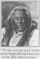
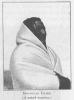
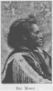

  
[Intangible Textual Heritage](../../../index)  [Native
American](../../index)  [Plains](../index)  [Index](index) 
[Previous](ont16)  [Next](ont18) 

------------------------------------------------------------------------

[Buy this Book at
Amazon.com](https://www.amazon.com/exec/obidos/ASIN/B002E9HLW0/internetsacredte)

------------------------------------------------------------------------

  
*The Old North Trail*, by Walter McClintock, \[1910\], at Intangible
Textual Heritage

------------------------------------------------------------------------

p. 192

### CHAPTER XIV

#### FORMING THE SUN-DANCE CAMP

Mad Wolf announces time for moving to the Sun-dance
camp.—Care of the sacred woman and the loading of her travois.—My
journey with Mad Wolf and his clan.—An interesting and impressive
procession.—Mad Wolf selects a site for the Sun-dance camp.—Formation of
the camp according to clans.—Origin of clan names.—Pitching the Sacred
Tipi.—Guests in my tipi.—Arrival of Running Crane with prominent chiefs
from the south.—Visitors from many Indian tribes.—Mad Dog society as
police.

IN response to the summons to prepare for the Sun-dance, the Indians
north of Willow Creek continued to gather around the lodge of Mad Wolf,
until the camp was widely spread upon the plain. For many days the sun
had been hot, and the people waited impatiently for the signal to move
to the fourth and last camp. Finally, when the evening sun was
approaching the summits of the Rockies, Mad Wolf stepped from the sacred
tipi. His strong voice rang far out over the quiet plain with the
announcement:

"Hear, my children! The grass is now green and long
upon the prairies, and the time has come, when we should move together
to the big flat near Willow Creek for the Sun-dance. Be prepared to
start at the rising of the sun! Let everyone go!

He sent a messenger to Badger Creek, where the southern division of the
tribe had assembled, and were waiting under Seco-mo-muckon (Running
Crane), to instruct them also to move at the appointed time to Willow
Creek. On the following morning, the occupants

p. 193

of the sacred tipi were astir before daybreak. All the labour of moving
was performed by the chosen assistants of Gives-to-the-Sun. She sat
apart, behind the sacred travois, [1](#fn_17) on
a buffalo robe and a pillow stuffed with antelope hair. With head bowed
in prayer, she faced towards the south, the direction in which they
would move for the last camp. I heard Natokoma

  [  
Click to enlarge](img/19300.jpg)  
“GIVES-TO-THE-SUN SAT APART, BEHIND THE SACRED TRAVOIS, HER HEAD BOWED
IN PRAYER.”  

uttering a prayer, while placing the sacred travois before her, and then
again while loading it with the ceremonial clothes of Gives-to-the-Sun.
These were a buckskin dress, decorated with elk tusks, beaded leggings
and moccasins, the medicine bonnet and robe of soft-tanned elk skin;
together with parfleches of sacred tongues, juniper branches and the
medicine

p. 194

bundles to be used in the Sun-dance ceremonial. Gives-to-the-Sun's own
saddle horse was hitched to the sacred travois, which, as well as the
harness, was painted red. She had become so weak and exhausted by
fasting and close confinement that it was necessary for O-mis-tai-pokah
and his wife to lift her into the saddle. The fasting of those who took
a prominent part in the

  [  
Click to enlarge](img/19400.jpg)  
GIVES-TO-THE-SUN MOUNTED ON THE TRAVOIS HORSE.  

ceremonial was believed to excite the pity of the Great Spirit and to be
of the greatest importance for securing a favourable answer to prayer.

All eyes were now fixed upon Mad Wolf's lodge, waiting for the signal to
move. When it was taken down, the entire camp became a scene of
confusion. Mad Wolf mounted his horse, singing a chant. He rode with
O-mis-tai-pokah to a ridge near by and was closely followed by Natokoma
and Gives-to-the-Sun with the

p. 195

sacred travois. There they waited till the rest were ready to start.
Then Mad Wolf slowly led the way,

  [  
Click to enlarge](img/19500.jpg)  
NATOKEMA AND GIVES-TO-THE-SUN WAITING WITH THE SACRED TRAVOIS.  

following no trail, but directing his course southward across the open
plains. He was followed by many well-known chiefs, among whom I
recognised White Grass, Isso-koyi-kinni (Heavy Breast),

<table data-align="RIGHT">
<colgroup>
<col style="width: 100%" />
</colgroup>
<tbody>
<tr class="odd">
<td data-valign="CENTER"><a href="img/19501.jpg"> 
Click to enlarge</a> 
“O-MIS-TAI-PO-KAH WITH 
LONG GREY HAIR FALLING 
OVER HIS SHOULDERS.” 
</td>
</tr>
</tbody>
</table>

Ear Rings, Bull Child, Double Runner, Three Bears, Morning Plume, Bear
Child, Maka, Stock-stchi, Blessed Weasel, Cream Antelope and Medicine
Weasel. I rode with the clan of Hard Top Knots, the relatives and
friends of Mad Wolf. Near by were Kionama and Menake; also Onesta and
Nitana with their families. Directly in front rode Anatapsa, my pretty
Indian niece (Mad Wolf's granddaughter), with Dives-under-water,

p. 196

a granddaughter of the head chief. They were both astride the same horse
and greatly interested me, because of their vigorous conversation in the
sign language. Anatapsa, gaily dressed, sat in front, her long black
hair flying in the wind. Her blanket of brilliant scarlet fell loosely
from her shoulders,

  [  
Click to enlarge](img/19600.jpg)  
GIVES-TO-THE-SUN'S OWN HORSE WAS HITCHED TO THE SACRED TRAVOIS.  

confined at the waist by a belt heavily beaded. Her small feet, clad in
dainty moccasins, were continually kicking the horse's sides to urge him
forward. Dives-under-water, clothed in a robe of soft-tanned fawn skin
with beaded stripes, was seated behind. She was deaf and dumb but full
of life and skilled in the sign language. Her busy hands moved
gracefully

p. 197

while talking with Anatapsa. From their mischievous looks and frequent
peals of laughter, I knew their jokes were at the expense of those
around them.

I passed a travois bearing three aged squaws. They were berating their
horse, a raw-boned, old cripple,

  [  
Click to enlarge](img/19700.jpg)  
ANATAPSA AND DIVES-UNDER-WATER RODE ASTRIDE THE SAME HORSE.  

trying to urge him from a slow walk, so that they could keep pace with
the procession. One was vigorously beating him with a stick, but it was
in vain, for he hobbled placidly along, with eyes closed and head

p. 198

hanging down, unmindful both of the stick and their execrations. The way
led across rich meadows brilliant with roses and wild flowers, winding
in and out among the ridges and through deep ravines.

Leaving the line, I rode ahead and climbed a high ridge, where I could
have a better view of the interesting and impressive procession of Mad
Wolf and his

  [  
Click to enlarge](img/19800.jpg)  
“THE TWO NOBLE CHIEFS WERE IN THE LEAD AND WERE FOLLOWED BY THE MEDICINE
WOMEN WITH THE SACRED TRAVOIS.”  

tribe, moving slowly across the plains. When the line crossed the summit
of the ridge, the dark forms outlined against the sky made a striking
picture. The two noble chiefs were in the lead, Mad Wolf gazing straight
ahead, tall, erect, and with head thrown proudly back, and
O-mis-tai-po-kah at his side, much older, somewhat stooped, his long
grey hair falling over his shoulders. They were closely followed by the
medicine women, with the sacred travois and its mysterious bundles, the

p. 199

poles crossing in front, high above the horse's head and their butt ends
dragging behind on the ground. There was a long line of warriors, with
rifles and war bonnets of eagles’ feathers, and bearing the sacred Spear
and Shield and also the Medicine Pipe. Bells fastened to the legs of the
riders and around their horses’ necks

  [  
Click to enlarge](img/19900.jpg)  
THE THREE CHIEFS.  

jingled at every step. Then came a number of travois, laden with lodges
and supplies in charge of squaws. In the rear were groups of old men,
women, children and young girls. Each family had its pack of dogs, all
as gaunt and hungry-looking as prairie wolves. To the south lay Willow
Creek and the broad plain selected by Mad Wolf for the camp, resembling
an enormous

p. 200

arena with hills rising on all sides. It was covered with long prairie
grass, still green from the many rains of spring. At one end was a small
lake, and beyond, as far as the eye could reach, were green rounded
ridges, closely following each other like great billows of the ocean. I
overtook the procession while it was stopping

  [  
Click to enlarge](img/20000.jpg)  
“THERE WAS A LONG LINE OF WARRIORS WITH RIFLES AND WAR-BONNETS AND
BEARING THE SACRED SPEAR AND SHIELD.”  

at Willow Creek for the fourth and last time, as required by the Sun
ceremonial.

Mad Wolf slowly advanced to the centre of the plain and all waited while
he selected a site for the Sun lodge. There was no confusion. The site
having been chosen, the camp circle was formed in an orderly manner,
according to the different clans or blood relatives. Each family knew
where they belonged, and took their accustomed positions. Mad Wolf as
leader of the Nee-ah-kinna clan (Hard Top Knots), with his followers,
occupied the north side of the plain. The

p. 201

\[paragraph continues\] Hard Top Knots
were so named because of the peculiar arrangement of the hair of the
chief, who founded the clan. 

<table data-align="RIGHT">
<colgroup>
<col style="width: 100%" />
</colgroup>
<tbody>
<tr class="odd">
<td data-valign="CENTER"><a href="img/20100.jpg"> 
Click to enlarge</a> 
MOUNTAIN CHIEF. (A noted warrior.) 
</td>
</tr>
</tbody>
</table>

There were also the Small Robes, Worm People, and Grease Melters, the
last so called because they covered their roasted meats with melted
grease. The Lone Eaters were so named, because one of their chiefs had
been accustomed to rise early with his family and finish breakfast,
before the rest of the tribe were astir, to avoid inviting guests. When
his peculiarity was noticed, his clan became known as the Lone 

<table data-align="LEFT">
<colgroup>
<col style="width: 100%" />
</colgroup>
<tbody>
<tr class="odd">
<td data-valign="CENTER"><a href="img/20101.jpg"> 
Click to enlarge</a> 
BIG MOON. 
</td>
</tr>
</tbody>
</table>

Eaters. The Don't Laughs name had its origin in the eccentricity of one
of their women who shunned men and was never known to smile. But to the
astonishment of the tribe she suddenly fell in love with a young man and
eloped with him. After this incident, the clan took the name, Don't
Laughs. The name of the Skunks had its rise in an occurrence which
caused much

p. 202

amusement in the tribe. A young man wanted to marry an Indian maiden,
but his suit was refused, because of his slovenly habits. She made a
song and sang it publicly with the words, "Young men appear well at a
distance, but when you are close to them, they smell like skunks." From
that time his band

  [  
Click to enlarge](img/20200.jpg)  
PITCHING THE SACRED TIPI.  

was named Ah-pi-ki-yix = Bad Smelling Animals (or Skunks).

Mad Wolf sat apart smoking, until everything was finished, but speaking
to no one. Gives-to-the-Sun, too weak from fasting and the exertion of
the journey to sit upright, leaned with bowed head and covered face
against Natokema. The women assistants pitched her sacred tipi, before
they attended to the wants of their own families. They scattered green
branches

p. 203

around the outside as a sign that Gives-to-the-Sun, the sacred woman,
must not i)e disturbed. The medicine

  [  
Click to enlarge](img/20300.jpg)  
ARRIVAL OF RUNNING CRANE LEADING THE SOUTHERN DIVISION OF THE TRIBE.  

bundles were placed inside and the sacred travois, with cottonwood
branches, against the back of the lodge.

  [  
Click to enlarge](img/20301.jpg)  
TEARS-IN-HER-EYES IN HER BLACKFOOT CRADLE.  

\[paragraph continues\] My tipi was shared
by Kionama and Menake, Indian friends, who later went with me on my
expedition into

p. 204

the north, with their daughter Sinopa (Kit-fox), two sons, Emonissi
(Otter) and Seeyea, and Isto-kopena (Tears-in-her-eyes), a baby six
months old. Tears-in-her-eyes was a niece of Mad Wolf's.

When her mother died, soon after her birth, she was nursed by
sympathetic squaws, but continued to waste

  [  
Click to enlarge](img/20400.jpg)  
CHIEF OF THE MAD DOGS.  

away, and would have died, had it not been for the motherly Menake.
Under her watchful care she changed into a happy, healthy child, so
pretty and lovable, that everyone was delighted to show her attention.
Her cradle was a little hammock made of blankets, ingeniously folded
over buckskin thongs and swung from the lodge poles. In the evening
Menake rocked her to sleep, singing a Blackfoot cradle song.

p. 205

\[paragraph continues\] When buffaloes
were numerous, the udders from dead buffalo cows have been taken for
suckling babies, which had lost their mothers. There is a Blackfoot
woman, now living, who was thus kept alive on buffalo milk.

Seco-mo-muckon (Running Crane) appeared later in the morning, leading
the Indians from the south. He

  [  
Click to enlarge](img/20500.jpg)  
MAD DOG LODGES (BLACKFEET POLICE).  

took his position on the south side of the plain, opposite to Mad Wolf.
With him were Neno-kyio (Bear Chief), Morning Eagle, Little Plume,
Nena-estoke (Mountain Chief), Little Dog, Spotted Eagle, O-muck-ah-tose
(Big Moon), Shoots-in-the-air, Brocky, Big Beaver, Flat Tail, Curly
Bear, Stomick-onesta (Bull Calf), Elk Horn, Black Bear, Strangling Wolf,
Kattana (No Chief), and

p. 206

\[paragraph continues\] White Man. During
the day, the Indians continued to come from all directions, until they
numbered about two thousand. There were representatives from many
leading tribes of the north-west, the Nez Perce, Sarcees, North
Blackfeet, Bloods, Crees, Assinniboines, Gros Ventres, Flatheads,
Bannocks, Kutenai, Pend d’Oreilles, Mandans and Sioux. The camp was
formed in an enormous circle, with the site for the sacred Sun-lodge in
the centre. Many tipis of the leading chiefs were strikingly decorated.
They were pitched, for the most part, in the inner circle, the most
conspicuous part of the encampment, while the small and inferior tipis
were relegated to the outskirts of the great circle. The three lodges of
the Mad Dog Society (Blackfeet police) were grouped near the centre of
the great circle. To them the chiefs looked for the enforcement of their
orders and the policing of the encampment. In moving camp, they saw that
none lagged behind, and in making camp, that every lodge was in its
proper place, and that the great circle was symmetrically formed. I have
never seen an equally large gathering of white men where there was as
little disturbance. Although I was continually present, I saw no
fighting in the great encampment, and it was a rare occurrence to hear
even angry words. In their largest lodge, the Mad Dogs kept their
weapons and society clothes, and assembled to feast and to dress for
their dances, which took place both day and night.

  [  
Click to enlarge](img/20600.jpg)  
INNER CIRCLE OF PAINTED TIPIS  

------------------------------------------------------------------------

### Footnotes

[193:1](ont17.htm#fr_21) See
[Appendix](ont44.htm#an_193).

------------------------------------------------------------------------

[Next: Chapter XV. Painted Tipis](ont18)
