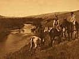

  
[Intangible Textual Heritage](../../../index)  [Native
American](../../index)  [Plains](../index)  [Index](index) 
[Previous](ont31)  [Next](ont33) 

------------------------------------------------------------------------

[Buy this Book at
Amazon.com](https://www.amazon.com/exec/obidos/ASIN/B002E9HLW0/internetsacredte)

------------------------------------------------------------------------

  
*The Old North Trail*, by Walter McClintock, \[1910\], at Intangible
Textual Heritage

------------------------------------------------------------------------

p. 395

### CHAPTER XXIX

#### PROPER NAMES

Various methods used in obtaining proper
names.—Interesting illustrations of naming children.—Manner of changing
men's names.—Women's names.—Names for strangers.—Names for
animals.—Extended use of sign language among plains-tribes.

IT is a wonderful provision of nature, which preserves the identity of
the individual by infinite variations and combinations of facial
features and other characteristics. All races of men emphasise this
individuality still further by giving to such human entity a proper
name. The various methods, by which this is done, furnish an interesting
field of investigation. I found it so with the Blackfeet, but was not
able to make an exhaustive study of the subject. I, however, discovered
that the queer and fantastic proper names of the Blackfeet, which seem
to most people either curious, or amusing, have often been improperly
rendered into English equivalents which fail to express the Indian
ideas.

I met with a reluctance among the Blackfeet to tell their names, which
was prompted by a superstitious fear of the bad luck, or misfortune that
might follow.

In common with other Indian tribes, the Blackfeet have no patronymics to
denote ancestry, or surnames to designate family. It was, however,
sometimes the case, that a distinguished name would be handed down from
father to son. Thus Brings-down-the-Sun, having

p. 396

received in infancy the name of his distinguished father, Running Wolf,
and being proud of the name, and the brave deeds it stood for, gave the
same name to his son.

The Blackfeet used great care in the selection of appropriate proper
names, being guided by certain customs and employing a variety of
methods in obtaining them. Parents ordinarily entrusted the task of
naming their children to

<table data-align="LEFT">
<colgroup>
<col style="width: 100%" />
</colgroup>
<tbody>
<tr class="odd">
<td data-valign="CENTER"><a href="img/39600.jpg"> 
Click to enlarge</a> 
NITANA. 
</td>
</tr>
</tbody>
</table>

others, usually to an old person, because they believed this would
favour their reaching old age. When names were formally given, it was
with the prayer that they might live to be old. They had a superstition
against the choosing of children's names by young persons.

Names were often given because of some physical mark, or characteristic.
The use of horses and the capture of horses from other tribes having
been a prominent feature of their life, it was but natural that the word
horse was used in a great variety of name combinations.

Dreams were depended upon for suggestions; which were said to come from
the "Dream People," and they were also received from the animals. When
Onesta's wife, Nitana, was once sleeping on the bank of the Missouri
River, she heard, in a dream, a strange voice calling "Go away from
there, Green Snake Woman, do not disturb that sleeping person!" and then
again, "Go

p. 397

away from there, Green Snake Woman, do not waken that person!" When she
awoke, she saw, by a strange coincidence, a rattlesnake near by with
head erect, as if calling to her children. The young snakes were
crawling beside their mother, and all went off together. When Nitana was
afterwards asked to name her sister's

  [  
Click to enlarge](img/39700.jpg)  
TWO SISTERS—GREEN SNARE WOMAN AND BLUE SNAKE WOMAN.  

little girls, she gave them the names of the rattlesnake's children.

Spotted Eagle, the medicine man, once dreamed that he was walking under
the ground, following a man, whose comrade called him "Walking
Underneath." The first male child Spotted Eagle was asked to name he
called "Walking Underneath."

When Brings-down-the-Sun lay watching a family of beavers at their work,
he heard the mother beaver calling her children by the names,
Sa-ko-wai-stai (Last

p. 398

\[paragraph continues\] Diver) and
Sa-kowa-et-sosin (Last-one-to-swim-in-with-the-willows, referring to the
beavers’ food). When the chief was asked by a relative to name two of
his boys, he gave them the names of the beaver children.

Another custom was to name a child in honour of a

 
[  
Click to enlarge](img/39800.jpg)  
LAST-ONE-TO-SWIM-IN-WITH-THE-WILLOWS AND HIS SISTERS.  

medicine animal, or bird, thereby invoking their protection, or the gift
of their supernatural qualities for the child. This had its counterpart
in the custom of the Pilgrim Fathers of New England of choosing
Christian names from Biblical characters and qualities and even sacred
phrases. It resembles, too, the more modern custom, which many observe,
of giving the names of the saints to their children.

p. 399

The name of the wife of Curly Bear, who is still alive, although now an
old woman, had a singular origin in a religious act of her father. Many
years ago, during a scourge of smallpox, her father prayed to the Sun,
offering his girl baby as a propitiatory sacrifice to ward off the
"great sickness" with the prayer, "Take her, O Sun! and leave the rest
of my family!" But they all died save this baby. She alone was spared.
From that day her name has been "Given Away."

Running Fisher and his wife (Lone-Charge-Woman) became discouraged
because of the death of all their children, although they had carefully
complied with the customary precautions and observances, to insure their
living to old age. When another child, a girl, was born, they decided
upon a different method. They named her Sis-toi-tsi-ma
(Something-that-is-given-away). They allowed her to run wild, hoping by
that method to escape the bad luck that had befallen their other
children. She is alive to-day and the mother of a family.

Other names of girl babies that I met with were:—

A-sa-na-ki = Cries-all-the-time.

Ska-na-sa-ne = Cries-early-in-the-morning.

A-na-to-ki = Pretty Head.

So-ya-ksi-wa-wa-kas = Water-spider-woman.

Sit-so-a-ki = Good-looking-water-bird.

Sit-a-ka-poki = Stays-in-different-lodges.

A-ka-no-kim = Everybody-down-on.

also Blue Wings and Born-with-teeth.

\[paragraph continues\] The names of
females were not changed after childhood as was the case with males. A
boy's name was frequently changed when he became 16 or 18 years old and
his character was sufficiently developed to make

p. 400

some trait prominent, or give promise of his after life. But, when he
reached manhood, his name might be changed again to commemorate some
deed of valour, or notable event.

"Behind-the-ear" was so named, because he shot an enemy behind the ear,
and Many-white-horses, because his herd was composed entirely of white
horses. Brings-down-the-Sun told me that his present name originated in
a dream, in which the Sun God came down and stood beside him and said,
"I take you for my friend, and I bestow upon you my supernatural power."
When he related his dream to his people, they changed his name from
Running Wolf to Natosin Nepe-e or Brings-down-the-Sun.

When a man distinguished himself as a warrior, in the face of the enemy,
it was customary for him to name his girls in honour of his exploits.
But they had a superstitious belief that if his claims were false, the
child would die.

The following names of women will illustrate:

A-kops-iso = Took-many-things-with-a-scalp; Kills-many;
Strikes-on-a-horse; Catches-the-enemy; and Catches-two-horses.

Mad Wolf named his daughter Strikes-on-both-sides, because as he said,
"when captured by the enemy, I saved her life by striking them down on
both sides of her."

The wife of Big Eyes was named by her father, Its-ue-nikki =
Kills-close-to-the-lake, because he killed an enemy in a fight close to
a lake. I found many names of women, the first syllable of which was
either "Strikes" or "Kills."

Strangers were given names from some peculiarity of their personal
appearance. When Arthur Nevin, the musical composer, went with me among
the Blackfeet,

p. 401

they called him "Don't-lace-his-moccasins," not because of any
carelessness in tying his shoes, but because he was said to resemble a
Blood Indian of that name. They called the author, A-pe-ech-eken = White
Weasel, because I was a blonde. They called Father De Smet "Long Teeth"
because of a peculiarity of his mouth. "Long Knives" is their name for
United States cavalrymen equipped with sabres; "Red Coats" for the
Canadian mounted police; "Black Robes" for Catholic priests, and "White
Ties" for Protestant missionaries.

Names for animals are in like manner similarly expressive, although
sometimes difficult of rendering into equivalent English words.

Beaver; Ksis-stukki = Cuts-trees-with-his-teeth.

Buffalo; Ee-neu-ah = Black Horns.

Badger; Me-sin-ski = Striped Face.

Deer (White-tail); Au-a-tu-yi = Wags-his-tail.

Coyote; Kis-see-noh-o = Bastard; or E-muck-o-tis-ah-pi-ce-yi = Small
Wolf.

Mule; O-muck-stow-ki = Big-Ears.

Horse; Pono-kom-i-ta = Elk Dog.

Pono-kom-i-ta (horse) is a compound word composed of Ponoka = Elk, and
Emita = dog. Its etymology seems to have been as follows. The elk was
known and named by the Blackfeet long before the appearance of horses.
When horses were introduced, and because they resembled the elk in form,
they applied to the new animal their name for elk, but differentiated
it, by affixing their name for dog, expressing its use, the dog having
been their beast of burden before horses were known.

Further illustrations of the appropriateness of Blackfeet names for
things will be found in Brings-down-the-Sun's

p. 402

topography of the Old North Trail
(pp.[434](ont36.htm#page_434)-[440](ont36.htm#page_440)); in his
discourses on the names and habits of birds (pp.
[481](ont40.htm#page_481)-[484](ont40.htm#page_484)); and on the names
of the different moons, the constellations and signs in the heavens (pp.
[486](ont40.htm#page_486)-[488](ont40.htm#page_488)).

They also had phrases and proverbs tersely expressing both wisdom and
humour.

The phrase, "Ik-is-kaks-ksisi," = "His nose is short for good nature,"
describes a man who loses his temper quickly.

The phrase, "Ah-kit-kats-a-pin-soye," = His eyes are dry from looking
around so much," or, more literally, "He has been looking around so
much, that he winks his eyes as if they were dry," describes a
sight-seer, or one absorbed and staring at the sights around him.

The art of talking by sign language, *i.e.* by a combination of facial
expressions and bodily movements, which is natural to man, attained a
high degree of perfection among the plains-tribes. Having different
vocal languages, their contact, when coming together in war or in
hunting buffalo, of necessity developed the use of gesture-speech in the
remote past. A tradition of the Arapahoe tells us that the original
Arapahoe, the creator of all things, "taught them to talk with their
hands." Iron Hawk, a Sioux chief, said to Captain W. P. Clark, "the sign
language was the gift of the Great Spirit. He gave the whites the power
to read and write and convey information in this way. He gave us the
power to talk with our hands and arms and to send information to a
distance with the mirror, blanket and pony, and when we meet with
Indians who have a different spoken language from ours, we can talk to
them with signs." Alex. Henry, a partner of the North Western Company
(Montreal),

p. 403

records in his journal (1806), "It is surprising how dexterous these
natives of the plains are, in the art of communicating their ideas by
signs. They will hold conference for several hours together upon
different subjects and, during the whole time, not a single word will be
pronounced on either side, and still they appear to understand each
other perfectly."

The Blackfeet, because of their central location on the

  [  
Click to enlarge](img/40300.jpg)  
VISITING INDIANS CONVERSING IN SIGN LANGUAGE.  
(Second from left end is making sign for buffalo by crooking
forefingers.)  

\[paragraph continues\] Buffalo range, and
frequent contact with other tribes, had constant use for sign language
and were very proficient. I attended one of their large camps where
representatives from 16 different tribes were present. Although unable
to understand each other's spoken language, they talked freely and
rapidly together in gesture speech. Each evening the visiting Indians
withdrew to a ridge, overlooking the big camp, where I

p. 404

watched, with great interest, their graceful and expressive gestures,
while conversing with the Blackfeet chiefs in the sign language. I
learned the equivalent ideas representing the names of the following
tribes present and saw them expressed by signs readily understood by
all.

Arapahoe = Spotted People, because they had many spotted, or pinto
horses.

Blackfeet = Black moccasins, because the bottoms of their moccasins were
black.

Blood = Streak-across-the-mouth, a peculiar way the Bloods had of
painting.

Cheyenne = People-who-part-their-hair-in-the-middle.

Crow = Bird flying.

Flathead = Peculiar shape of the head.

Gros Ventres (of the prairies), = Big Bellies, because they eat so much.

Kutenai = Mountain People, People-who-live-in-the-mountains.

Mandans = People-who-live-in-dirt-lodges.

Nez Perce = Users-of-black-paint.

Pend d’Oreille = Paddling People, or River-people-using-canoes.

Piegan = Users-of-paint-on-the-cheeks.

Sioux = Cut Throats, from the olden-time tradition that they cut off the
heads of their victims in battle.

Snake = A crawling serpent.

As an illustration of the Indian's method of conveying ideas by signs, I
quote the manual equivalents for some of the above mentioned tribal
names, for which I am indebted to "Indian Sign Language," by Captain W.
P. Clark, Second Cavalry, United States Army.

p. 405

Sioux = Concept.—Cutting off heads.

Sign: Hold right hand, back up, in front of left shoulder, height of
throat, index finger extended and pointing to left, other fingers and
thumb closed, move the hand horizontally to the right, index passing
near throat.

Blackfeet. Concept = Black Moccasins.

Sign: For moccasins, pass spread thumbs and index fingers over feet and
toes to ankles, right hand over right foot, left hand over left foot,
palms of hands towards and close to feet. For black, point to something
black in colour.

Crow. Concept = Bird flying.

Sign: Bring extended hands, backs nearly up, in front, a little higher
than and slightly to right and left of shoulders; move the hands
simultaneously a little downwards, slightly outwards, and a trifle to
right and left, indicating motion of wings.

Flathead. Concept = Peculiar shape of head.

Sign: Press the upper part of forehead and head with palms of hands,
fingers extended and touching, tips of fingers touching above head.

Nez Perce. Concept = Powder, because of their excessive use of a bluish
black paint.

Sign: Hold extended left hand in front of body, back down, and rub tips
of fingers and thumb of right hand just over left palm.

Snake. Concept = Motion of a snake.

Sign: Hold right hand, back to right, in front of right shoulder about
height of waist, first and second fingers extended, touching and
pointing to front, and, by wrist action, give a wavy sinuous motion to
extended fingers.

------------------------------------------------------------------------

[Next: Chapter XXX. Onesta Gives the Crow Beaver Ceremonial](ont33)
