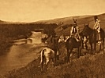

  
[Intangible Textual Heritage](../../../index)  [Native
American](../../index)  [Plains](../index)  [Index](index) 
[Previous](ont42)  [Next](ont44) 

------------------------------------------------------------------------

[Buy this Book at
Amazon.com](https://www.amazon.com/exec/obidos/ASIN/B002E9HLW0/internetsacredte)

------------------------------------------------------------------------

  
*The Old North Trail*, by Walter McClintock, \[1910\], at Intangible
Textual Heritage

------------------------------------------------------------------------

p. 513

### APPENDIX I

#### BLACK FEET INDIAN SONGS

  [  
Click to enlarge](img/51300.jpg)  
LOVE SONG  

([p. 242](ont20.htm#page_242))

 

  [  
Click to enlarge](img/51301.jpg)  
WOLF SONG  

([p. 243](ont20.htm#page_243))

Blackfeet songs are generally sung without
words.

p. 514

  [  
Click to enlarge](img/51400.jpg)  
SIOUX DANCE  

([p. 243](ont20.htm#page_243))

 

  [  
Click to enlarge](img/51401.jpg)  
WAR SONG  

([p. 277](ont23.htm#page_277))

 

  [  
Click to enlarge](img/51402.jpg)  
SIOUX CELEBRATION SONG  

([p. 280](ont23.htm#page_280) and [282](ont23.htm#page_282))

 

  [  
Click to enlarge](img/51403.jpg)  
RIDING SONG  

([p. 281](ont23.htm#page_281))

 

p. 515

  [  
Click to enlarge](img/51500.jpg)  
NIGHT SONG  

([p. 281](ont23.htm#page_281))

 

  [  
Click to enlarge](img/51501.jpg)  
TRIBAL HYMN, “RAISING THE POLE”  

([p. 308](ont25.htm#page_308))

 

  [  
Click to enlarge](img/51502.jpg)  
CHILDREN'S GAME SONG  

([p. 391](ont31.htm#page_391))

 

------------------------------------------------------------------------

[Next: Appendix II. Notes](ont44)
